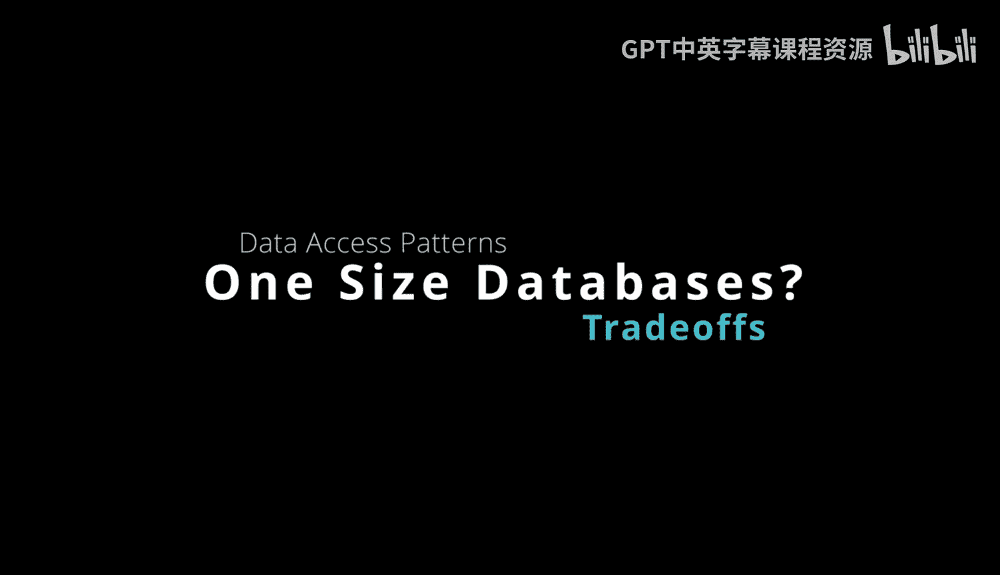

# 杜克大学《Rust编程2-3（数据工程、DevOps）｜Rust programming》中英字幕 p88 88_04_09_数据库选型无通用方案.zh_en -BV11y411z7Dn_p88-

Here we have a classic diagram from the CTO of Amazon Benoerogels。

 and he talks about how there are different types of databases for different problems。

 And in this particular scenario， we start with the relational database。

 you can see that it is designed for strong consistency transactions。

 and so there are services on AWS that provide this， including Amazon Aurora， RDS。

 and then in terms of key value or document databases， you can see that Amazon dynamo DB。

Provides these different offerings， they're very different than a relational database because they're low latency。

 they're key based queries， they're also designed to scale really in a way that is eventually consistent。

 and there's also a graph database and Amazon has Amazon Neptune and if you're going to analyze relationships。

 for example， if you want to look at social media relationships and see different types of descriptive statistics like centrality。

 for example， like who are the influential people in a social network， this is one ways to do that。

There's also in memory。 So Amazon provides elastic cache for Redtis， also Mimc。

 So these allow you to build up， for example， a collaborative filtering recommendation engine or build out some kind of cache so that you can look at this data in a very fast manner。

 And then their searches， right， in this case， this would be Amazon elasticastic search。

 So there's many different varieties of access patterns that you have to choose from。

 And often it is best to pick multiple types of databases to solve your problem。

