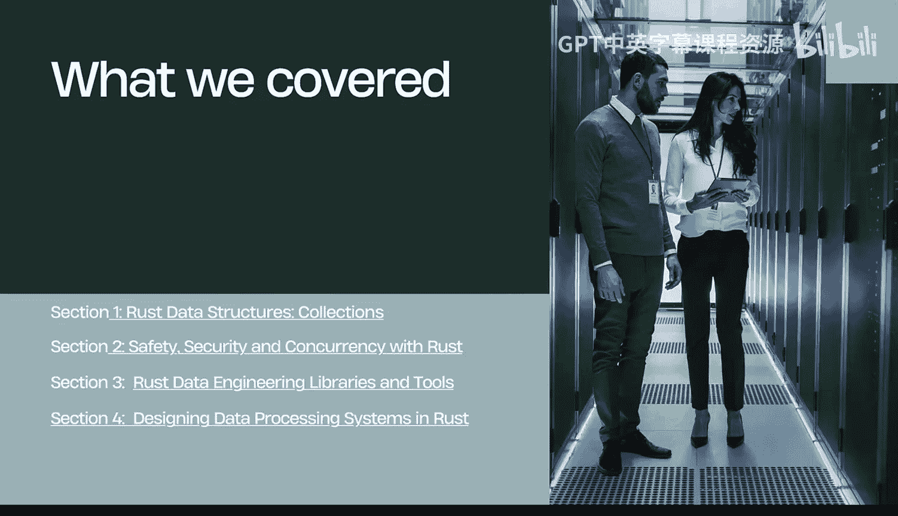
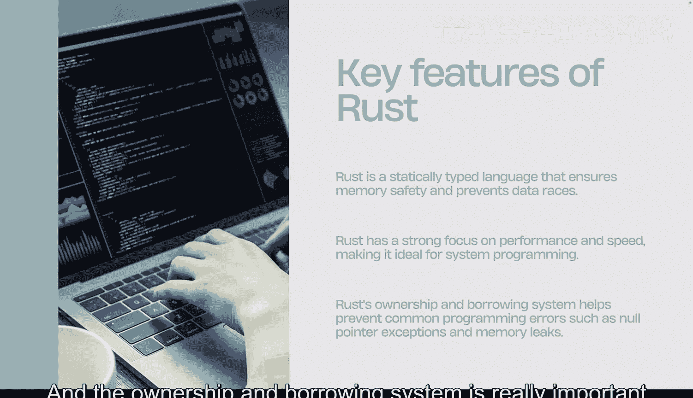
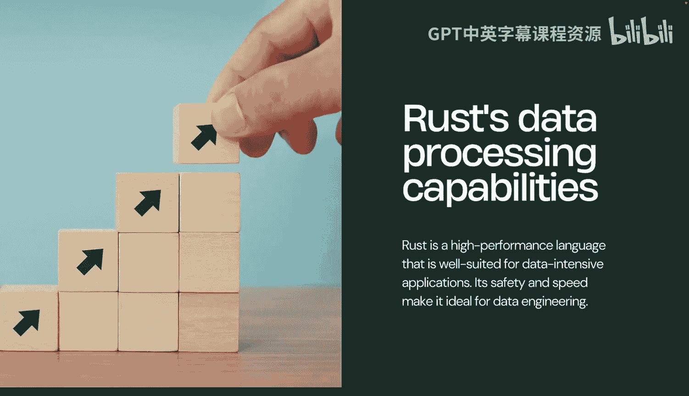
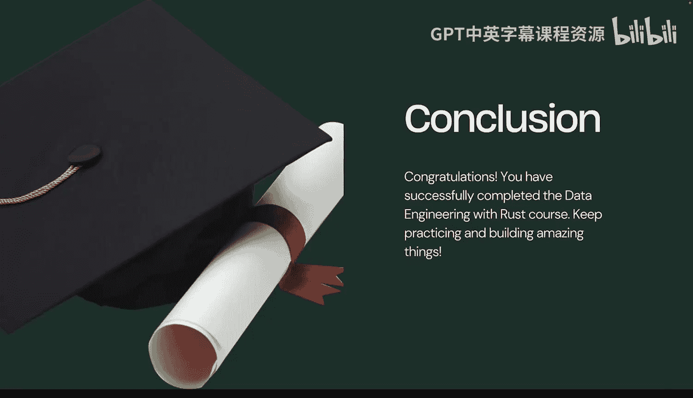

# 杜克大学《Rust编程2-3（数据工程、DevOps）｜Rust programming》中英字幕 p89 89_04_13_课程总结.zh_en -BV11y411z7Dn_p89-

We've reached the conclusion of data engineering with Ru Co。

Let's talk about what we covered in Section 1， data collections。

 including things like hash maps and vectors in two safety and security。

 including concurrency libraries like Rayon， in Section 3。

 data engineering libraries and tools like Pols， and then in Section 4。

Covering data processing systems like BigQury， also step functions and also how to use SQL to build things。

Now in some of the key features to remember are that rest is a statically typed language。

 it is also focused on systems programming and the ownership and borrowing system is really important to prevent pointer exceptions and memory leaks。

We also talked about the data processing capabilities of rust。

 and it's well suited for data engineering。

In terms of the course itself， congratulations on completing it。

 you're now ready to build high performance systems， keep building and practicing。

And a final congratulations here， you've completed the data Engineer with Ru course。

 keep practicing and building amazing things。 I'll talk to you soon。

