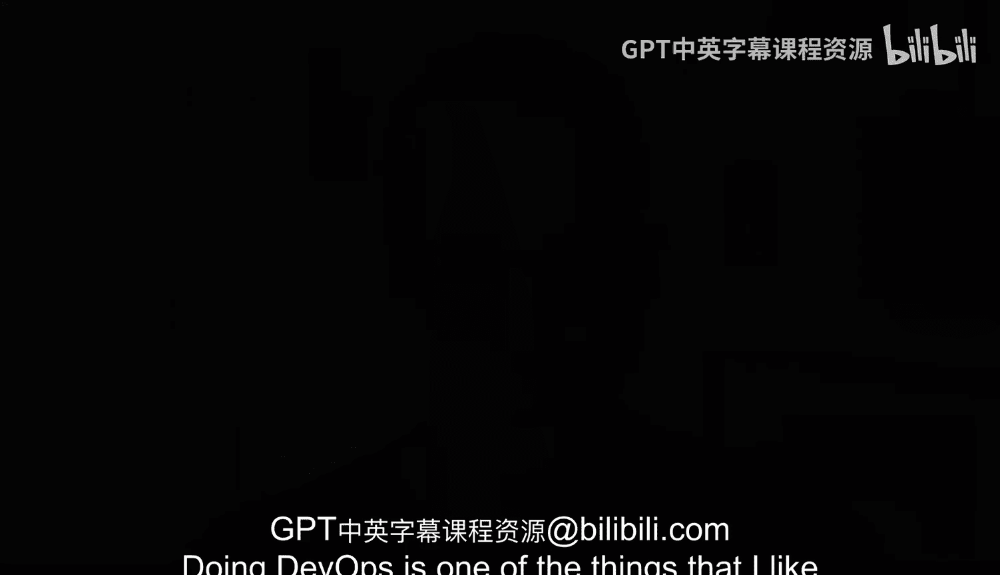

# 杜克大学《Rust编程2-3（数据工程、DevOps）｜Rust programming》中英字幕 p90 01_01_01_认识你的课程讲师阿尔弗雷多·德萨.zh_en -BV11y411z7Dn_p90-

Doing DevOs is one of the things that I liked the most from years ago when I was a assistant administrator over when I changed to do regular software engineering in my day today and then the mix of both software engineering and operational processes doing systems administration and kind of like putting those together is something that really resonated with me my name is Aresa and I have over 10 years of software engineering experience and a few four years of systems systems engineering and DevOps engineering。

 I've been a release manager， I've created a CICD systems from scratch to being a release manager for big projects that were consumed by many。

 many different people and companies and trying to support that elasticity and automate everything。

In many different places where I worked， I've worked from very small startups to large companies in large engineering teams and all throughout my goal is to put everything that I've learned you know those years in these DevOps course Now what's the added variable here Well it's rust Now you will see some examples here and there about Python。

 but mostly we're focusing on rust and why rust well， it is a very compelling choice。

 it is very fast， it can be compiled into a single binary that is very easy to distribute and share everything that it needs is right there and you know once you start deploying rust applications and dealing with rust in several scenarios you will see that the syntax is not that different if you're familiar with Python is not that different from Python especially if you're doing type hints in Python。

 you're almost already there。With a lot of how rust looks and feels。But at the end of the day。

 doing something that is very performant that is not only fast， but it also consumes less resources。

 you will see that you can apply a lot of the systems engineerings processes and things into rust and apply it into DevOs and this is why I'm excited and hopefully all of these lessons put together will give you a great overviewbe how to apply the best practices of Dev DevOs and intermingled with rust。

