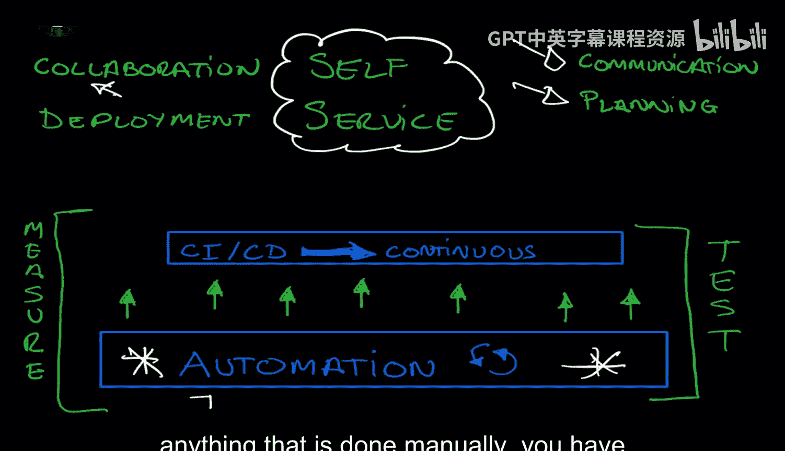
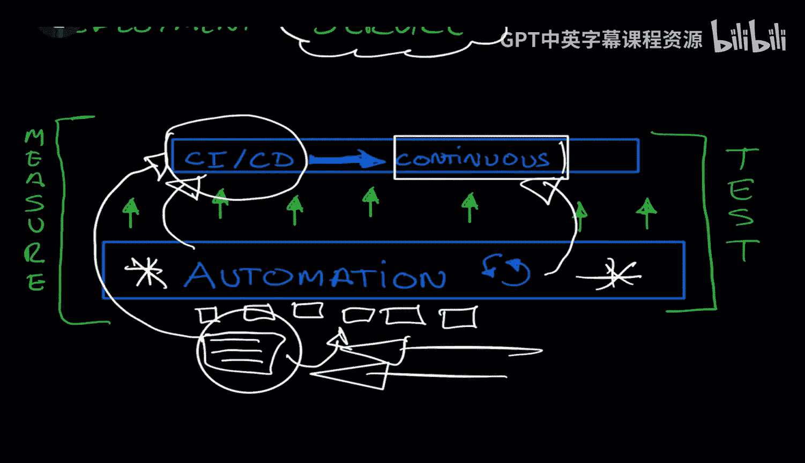
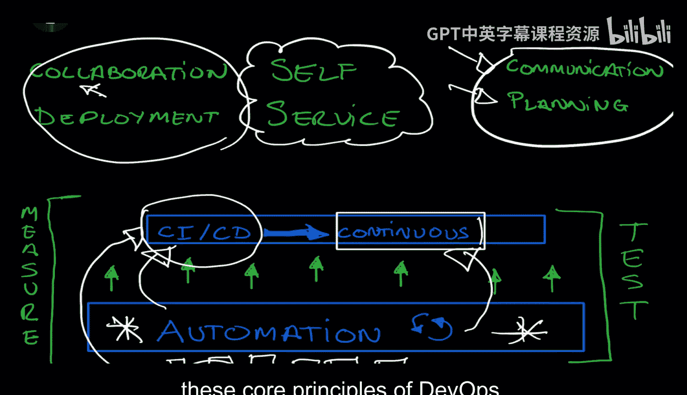
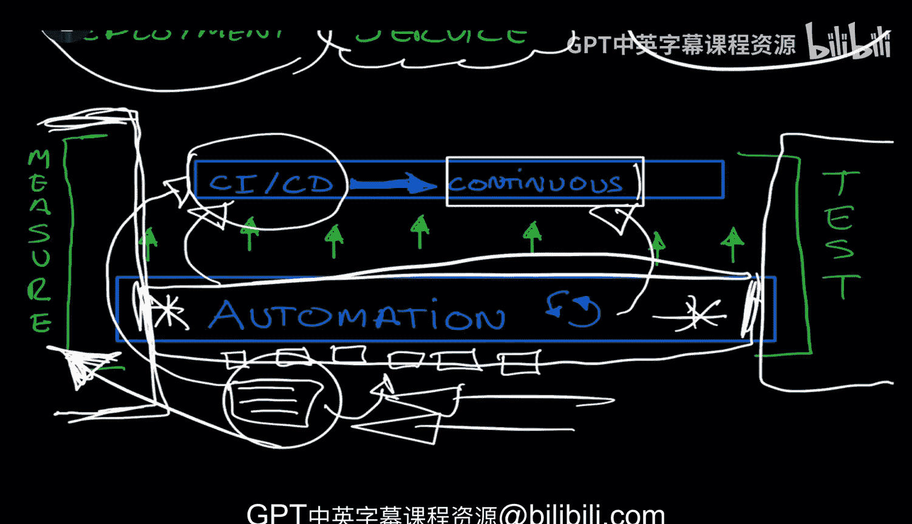

# Rust编程2-3（数据工程、DevOps）：04_01_03：核心DevOps原则 🚀


在本节课中，我们将要学习DevOps的核心原则。我们将探讨自动化、持续集成与持续交付（CI/CD）、测试以及度量等关键概念，并理解它们如何共同构成现代软件开发和运维的基础。

## 概述

DevOps包含许多重要的实践，如构建、测试、发现、持续反馈、协作与沟通。然而，所有这些实践都依赖于一个最根本的基石：**自动化**。没有自动化，其他实践将难以高效、持续地开展。

## 自动化：一切的基石 ⚙️

上一节我们介绍了DevOps的广泛原则，本节中我们来看看其最核心的基础：自动化。



自动化是指将任何手动执行的任务分解为更小的步骤，并通过脚本或代码来自动执行这些步骤的过程。例如，手动验证一段代码可以转变为编写一个自动执行该验证的脚本。

**公式/代码示例：**
```bash
# 手动验证的示例：运行测试套件
# 自动化脚本示例：
#!/bin/bash
echo "开始自动化测试..."
cargo test
if [ $? -eq 0 ]; then
    echo "所有测试通过！"
else
    echo "测试失败！"
    exit 1
fi
```

自动化本身是好的，它创建了脚本和代码来替代重复的手动工作。这为启用更高级的系统（如CI/CD）提供了可能。

## 持续集成与持续交付（CI/CD） 🔄

自动化是基础，而CI/CD系统则是建立在自动化之上的关键实践。CI代表持续集成，CD代表持续交付或持续部署。

CI/CD系统（如Jenkins、GitHub Actions）允许我们以持续、自动化的方式集成代码更改、运行测试并部署软件。你编写的自动化脚本可以成为这些平台流水线的一部分。

以下是CI/CD平台可能包含的自动化触发场景：

*   **代码推送时**：每当开发者向代码仓库推送新代码时，自动触发构建和测试流程。
*   **定时任务**：在特定时间（如每晚）自动运行完整的测试套件或生成报告。
*   **发布生产时**：在部署到生产环境前，自动执行一系列预定义的检查和部署脚本。

通过CI/CD，不仅任务本身被自动化，任务的触发时机和执行流程也被自动化管理。

## 测试与验证 ✅

然而，仅有自动化是不够的。自动化必须辅以充分的**测试**和**验证**，以确保自动化流程本身以及通过它交付的软件是正确、可靠的。

测试至关重要，因为它回答了这个问题：“我们的自动化工作正常吗？我们如何验证事情进展顺利？”我们需要建立多种类型的测试。



以下是常见的测试类型：



*   **单元测试**：验证单个函数或模块的行为。
*   **集成测试**：验证多个模块或服务协同工作的情况。
*   **端到端测试**：模拟真实用户场景，验证整个应用流程。
*   **性能测试**：验证系统在负载下的表现。
*   **监控与告警**：在生产环境中持续验证系统健康状态，这本身也是一种测试形式。

## 度量与改进 📊

测试告诉我们系统是否工作，而**度量**则告诉我们系统工作得“有多好”。度量使我们能够进行比较、建立基线并识别改进方向。

如果你不进行度量，就无法回答以下问题：我们是变快了还是变慢了？这段代码的性能是否更好？我们是否达成了最初设定的目标（如提升速度、容量或负载能力）？度量提供了数据驱动的洞察，是持续改进的基础。

## 总结

本节课中我们一起学习了DevOps的核心原则。我们了解到**自动化**是所有DevOps实践的基石。在此基础上，我们构建了**CI/CD**系统来实现流程的持续化。为了确保质量，我们必须引入全面的**测试**。最后，通过**度量**，我们获得反馈并驱动持续改进。



核心思想是：在DevOps中，任何可以自动化的事情都应该被自动化。对于手动操作，我们应该停下来思考，并尽可能为其构建自动化解决方案。这为你理解后续我们将详细探讨的具体DevOps实践打下了良好的基础。