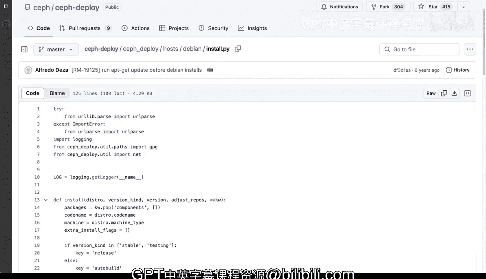

# Rust编程2-3（数据工程、DevOps）：05_01_04：什么是自动化 🤖

在本节课中，我们将要学习**自动化**的核心概念。我们将通过两个具体的项目实例，来理解自动化如何将繁琐、易错的手动流程转变为高效、可重复的脚本或程序。我们将看到，自动化不仅能节省时间，还能提高工作的准确性和可维护性。

---

## 从手动到自动：一个简单的CLI工具示例

上一节我们介绍了自动化的基本概念，本节中我们来看看一个具体的个人项目实例。

我曾在一家公司工作，该公司要求使用基于时间或事件的动态安全令牌进行登录。每次登录都需要通过一个复杂的系统生成令牌，过程非常繁琐。我向经理抱怨后，他建议我：“你为什么不自己动手解决这个问题呢？”

于是，我构建了一个名为 `worryri` 的简单命令行界面工具。这个工具的核心功能是自动化生成一次性密码，用于OTP验证系统。

以下是该工具实现的关键点：
*   **功能**：生成用于OTP引擎的自定义令牌密钥。令牌类型可以是基于时间的TOTP或基于事件的HOTP。
*   **操作**：工具会生成一个PIN码或密钥，并自动复制到系统剪贴板。
*   **效果**：用户无需再手动操作手机或访问特定网站来获取和输入令牌，只需从终端直接粘贴即可完成登录验证。

这个工具本质上是用OpenSSL等库在后台**自动化**了一个原本痛苦、耗时且在我看来近乎荒谬的手动流程。通过将几个手动步骤抽象并自动化，我显著提升了身份验证环节的效率。

---

## 复杂系统的自动化部署

刚才我们看了一个个人效率工具的简单例子。现在，让我们来看一个更复杂、更专业的自动化案例。

这是一个名为 `Se deploy` 的部署脚本，用于在多年前部署一个庞大、开源的分布式文件系统项目——`SeF`。这个工具是我在Red Hat工作时参与开发的。

`SeF` 作为一个分布式文件系统，需要安装和配置在**许多**不同的服务器上，过程极其复杂。手动操作不仅步骤繁多，而且极易出错。

让我们通过查看其Python代码（虽然本课程是Rust，但自动化思想是相通的）来理解它做了什么。以下是脚本执行的部分关键步骤：

*   **设置变量**：判断并设置是稳定版还是测试版环境。
*   **安装依赖包**：例如 `ca-certificates` 或 `apt-transport-https`。
*   **配置源和密钥**：根据版本设置正确的软件源GPG密钥，并构建正确的下载URL。
*   **处理不同情况**：区分开发版本、特定提交版本，并从相应的仓库（如非官方的Shaman仓库）获取资源。

试想一下，如果没有自动化，手动执行这些步骤会发生什么？你可能会打错字、遗漏步骤、记错顺序或放错文件。在一个涉及多台服务器的复杂部署中，手动操作引发问题的可能性会呈指数级增长。

而这个脚本将所有这些步骤**结构化**、**顺序化**地固定下来，确保了部署过程的**可重复性**和**准确性**。

---

## 自动化的核心优势

通过以上两个从简到繁的例子，我们可以总结出自动化的核心优势：

*   **提高速度与效率**：自动化能快速执行重复性任务，远快于人工操作。
*   **提升准确性与健壮性**：通过脚本固化流程，消除了人为失误（如拼写错误、步骤遗漏或顺序错误）。
*   **确保可重复性**：相同的脚本可以在不同时间、不同环境下产生一致的结果。
*   **增强可维护性**：当流程需要修改时，你只需更新脚本中的逻辑（例如修改一个 `if` 条件分支），而无需重新记忆和传授整套复杂的手动步骤。代码本身成为了流程的文档。

在编程中，无论是Python还是Rust，这种通过 `if`、`else if`、`else` 等语句来处理不同条件分支的逻辑，正是构建自动化流程的基础。自动化让你能管理这些分支，并确保所有条件都能被正确、高效地处理。

---

本节课中我们一起学习了自动化的本质：**通过构建程序或脚本来替代手动、重复、易错的操作流程**。我们看到了两个实例，从解决个人登录痛点的CLI工具，到管理复杂分布式系统部署的脚本，它们都体现了自动化在提升效率、准确性和可维护性方面的巨大价值。掌握自动化思维，是成为一名高效开发者和DevOps工程师的关键一步。