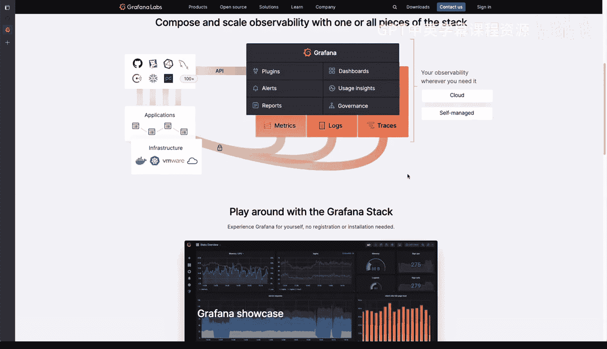

# 杜克大学《Rust编程2-3（数据工程、DevOps）｜Rust programming》中英字幕 p95 06_01_05_日志记录与监控的基础.zh_en -BV11y411z7Dn_p95-

Loin and monitoring is crucial it's important to have in most applications here we have several example applications that I'm going to show you in this advanced RaLI repository that I have that I also cover with several examples and let's take a look at the final login example。

And logging a mind train is not particular to rust， it's not particular to any programming language。

 but in general we can see how these things interact， so we have a file here。

And let's take a look at the structure and we have。Where it seems a level。

 So there's usually several different levels in logging you have debug info air warning and all of these have like different these levels are have different weight of importance and the reason why is because you may want to have info。

InIn messages like in this case， this is info message logging is enabled。

 but you don't necessarily want to have debug， so it goes it goes in in a verbosity in a verposity scale where debug is the most verbose that's where things start debug starts here and as you progress more verbosity。

 well you will going to get into less verposity writer debug starts with more verbosity and as you move forward less verossities enabled。

 So if you enable a level of login to only have error or error messages。

 then those are kind of like the most critical ones。

 those are going to be sparingly used throughout the code base usually and you will see less of those So what are the other components here in that you might see and all of this is configurable and and all applications do them differently。

 but this is kind of like foundational。 So you'll have like something like a timestamp。Again。

 not all of them have timestamps and why would that be crucial well。

 because in this case you can tell like if this one is trying to enable the login and then it takes three seconds。

 then you could see that because of the timestamp now the timestamp allows you to see where things start and end。

 but also when they happen in this case it happened at that time， like if this was a web server。

 for example， you would see something similar。Alright。

 so if we go back to the application and start spellunking over here。

 you will see that let's take a look at LibRS in this LibdaRS file。

 we see that there's a function here that is running a command and again this is not particular to rust it could be applied to any other programming language as well。

 but here we see that this is trying to run a command。

 is splitting the the string in with whitespace and then running and executing that and then。

If it fails， you will say command failed or in what the actual error is。

It is using print print line and this will go to the terminal Now。

 why why is logging relevant here or how could it be relevant？ Well， first off。

 you could say logging that error or error level logging enable that and instead of printing the output to the terminal。

 you could start fine tuning exactly where you want this information to go and at what level。

That means that if for example， we want to know what the actual command is。

 you could enable a debug message right here right after parsing so that you could say you could see every single every single command that is being parsed。

 Why is that important Well， if you're debug in the application。

 well the debug message by coming in handy， but you might not come in handy if every single command if you're executing hundreds of commands。

 every minute， you might not want to see that level of verbosity。

 but if you want to debug or you want to find understand bit better what's going on when this line happens。

 even if it's highly robustvost， then you can tweak and change that level What are some of the other things that you can do well。

 you can start defining what a destination for those logging messages are So in this case you can see that this is the command that is being run。

 that's pretty useful and you will get。You'll is doing something with a device now file logging will log to a file and we can go back to source and I believe this is in main main thatRS it'll set something for doing file logging。

Now you can have a destination like a file， usually in systems youll be writing into a file。

 but if it's a command line tool application， you might be wanting to also put login output to the terminal Now what we see here is that the configuration is going to a block arrest log that is perfectly fine But there are other several different types of file login or destinations for login that you might want to consider So for example。

 and also the location and it starts getting more complicated as well because you might be shipping those logs over the network to some other remote destinations there are systems that capture logs that over the network and why would you want to have a strategy instead of just right into a log file like in this case Well what if this becomes super highly reverse and it fills your your server So this has happened to me before when。

Highly performing database was under a lot of stress and they couldn't enable login because it could fill up the disks for the server in no time with when they started to enable the login on debug So all of these things are pretty useful these are kind of like high level easy way to understand login。

 but I haven't touch yet on monitoring。 So I want to show you right now is Graffaa and this is definitely open source something that you can actually try。

 but the reason I want to show you these is because what you get this kind of like a dashboard like these。

 why is this important you can see here， they have several different types of metrics and you can actually demonstrate kind of like performance over time。

 Now this is important because if you can measure then you can compare So if there's a comparison like say for example。

 this portion with that over there。You can see well。

 are we doing better or are we doing worse and that is critical because without being able to measure。

 you cannot have an improvement， you cannot say， well are we doing better or are we doing worse？

And Grrafaa is a dashboard allows is part of the elk tag that we'll see later， which is。

Logtash Kivaana and elasticasticsearch， which are all components of software pieces of software working together。

 and the thing that you can do here is well， you can set all kinds of different action So for example。

 you can have an alert or you can have a trigger to do a specific action that you want to cause for example。

 if the disks are get full， well， you might want to have like a certain threshold there to send alerts。

 maybe maybe text messages or call if someone is on rotation。

 and as you can see here you can you can talk to several different services like GiHub as we see there and you can talk to the infrastructure as well。

 So that is why this is important these are the kind of things that you should be looking at for both logging and monitoring。

