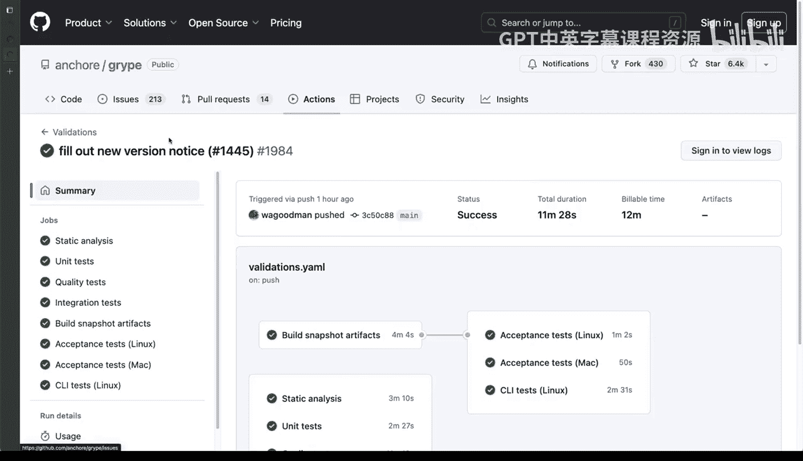
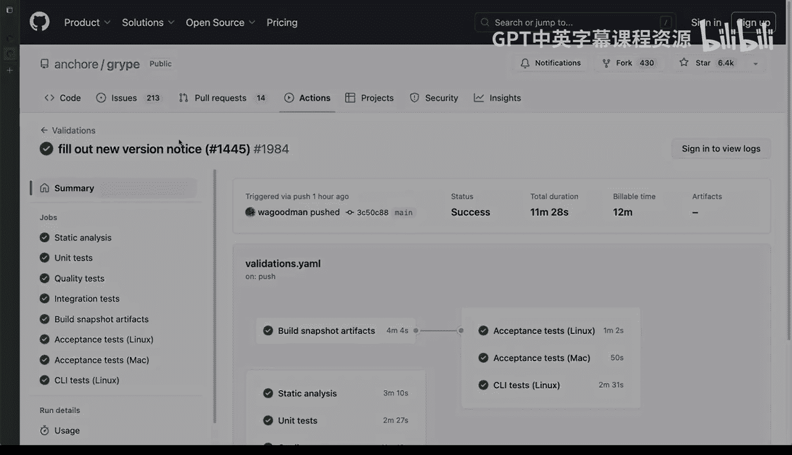

# Rust编程2-3（数据工程、DevOps）：07_01_06：可见性与可追溯性 👁️‍🗨️

在本节课中，我们将要学习DevOps中一个至关重要的组成部分：可见性与可追溯性。我们将通过一个具体的项目实例，来理解这些概念如何在实践中体现，以及它们为何对团队协作和系统可靠性如此重要。

## 概述

可见性与可追溯性并非DevOps的显性基础支柱，而是在你开始实施DevOps功能、系统和流程后产生的积极副作用之一。它们旨在帮助团队更高效地运作。我们将通过分析一个真实的Pull Request流程，来展示这些概念的实际应用。

## 可见性与可追溯性的实践

上一节我们提到了这些概念的重要性，本节中我们来看看它们在一个具体项目中的体现。这里以Anchor的Grip项目为例进行说明。虽然Go并非一个Rust项目，但我想解释的核心概念是相通的。

你可以看到，我打开了一个Pull Request，并发现了关于某个组件的两个Bug。我在此引用了一个相关的问题。

同时，我告知所有人，这个改动还需要合并其他一些内容。这就是大致的思路：我正在尝试合并某些更改。

那么，我们在这里能看到哪些关于透明度和可见性的内容呢？

以下是几个关键点：

*   **高质量的代码审查**：我收到了一位非常优秀的软件开发者Alex的审查。他提供了非常有价值的反馈，并开始进行高质量的Pull Request审查。
*   **追踪意见与问题**：你可能会问，这种颗粒度的反馈和提问是否必要。答案是肯定的。因为这不仅关乎代码变更，更关乎一个能够追踪意见、澄清未来可能遇到的问题的系统。这一点至关重要，因为有人可以进来讨论某个决定是否合理。

让我们继续深入，因为这个例子非常丰富。尽管它来自2020年，但至今仍然非常准确。

其中一个最后的评论指出，当前XmL Li没有使用漏洞扩展，并提供了更多细节。我感到非常惊讶，回复说“发现得很好，我原以为……让我来修复它。”

这不仅是在生成代码和验证需要更改的内容，更是在我最初理解的基础上进行改进。我继续进行了一些更改。

虽然这里没有完全展示这个项目的所有动态，但在我进行更改的整个过程中，很多事情开始自动执行。我将通过Actions向你展示，Grip项目是体现DevOps中可追溯性与可见性的绝佳范例。

## 自动化流程与可追溯性

让我们看看这些Actions。我们有一个“发布新版本通知”，看起来他们正准备执行某些操作。

那么，为什么这很有用？又为什么与可追溯性相关呢？

因为事情正在发生，而透明度和可见性就在这里。你可以看到Linux在运行，Mac在运行，其他CI测试也在运行。这一切都可以精确地追溯到某个特定的提交。

如果我们点击其中一个，它将带我查看实际的更改。

为什么这很有用，尤其是在DevOps的背景下？因为如果你在构建流程中，正在进行更改并推送到生产环境，你实施了所有这些步骤，你会希望确切地知道这里发生了什么。你可以看到这里有一些更改和新增内容，变量类型正在发生变化。

如果出现问题，这一点至关重要。如果某些东西运行不正常，你可以回溯到这个特定的Pull Request、提交或变更集，并精确调查当时发生了什么。

总而言之，这不仅是一个关于如何处理问题的范例，也是一个关于如何回溯到针对提议变更的对话和讨论的范例。

## 总结

本节课中，我们一起学习了DevOps中的可见性与可追溯性。我们通过分析一个包含代码审查、自动化测试和CI/CD流程的完整Pull Request实例，理解了如何通过工具和流程记录每一次变更、每一次讨论和每一次自动化执行的结果。这种透明性确保了当需要调查问题或理解决策原因时，团队拥有完整的上下文和历史记录，这是构建可靠、可协作的现代软件工程实践的核心。