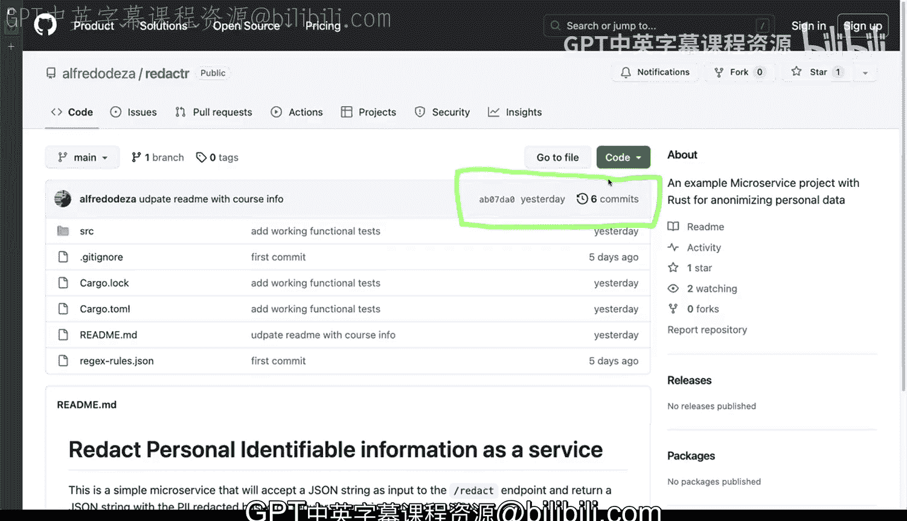

# Rust编程：2-3：版本控制与源代码管理 🗂️


在本节课中，我们将学习版本控制与源代码管理的基本概念及其重要性。我们将通过一个具体的Rust项目示例，了解如何追踪代码变更、定位问题以及协作开发。

## 概述

版本控制与源代码管理不仅是应用程序开发的核心，也是构建自动化流程和部署流水线的关键。它帮助我们精确记录变更发生的时间、内容和责任人，并在必要时回滚到历史状态。

## 追踪变更与定位问题

上一节我们概述了版本控制的重要性，本节中我们来看看如何利用它来追踪具体的代码变更。

通过查看项目的提交历史，我们可以按时间分组查看所有变更。例如，假设在某个日期之后，应用程序开始出现异常行为。通过浏览该日期前后的提交记录，我们可以定位到可能引入问题的具体变更。

以下是一个提交记录的示例视图：
```
August 18
    - Working functional test (Commit Hash: a1b2c3d)
August 19
    - Update dependencies (Commit Hash: e4f5g6h)
    - Reorganize imports (Commit Hash: i7j8k9l)
```

点击某个提交（如“Working functional test”），我们可以查看该次提交引入的详细更改。代码差异通常以颜色标识：
*   **红色**：表示被删除的行。
*   **绿色**：表示被添加的行。

例如，在Rust Web框架Actix中，路由通常通过 `#[get("/path")]` 这样的属性来暴露。在一次提交的差异中，我们可能看到类似以下的更改被移除：
```rust
// 红色部分（被移除）
#[get("/health")]
async fn health() -> impl Responder {
    HttpResponse::Ok().body("OK")
}
```
同时，看到添加了新的配置方式：
```rust
// 绿色部分（被添加）
App::new()
    .service(web::resource("/health").to(health))
```
这种变更虽然是为了引入功能测试，但也改变了路由的声明方式。清晰的提交信息对于理解变更意图至关重要。

## 版本控制的核心优势

在查看了具体的变更示例后，我们来总结一下版本控制系统提供的核心能力。

以下是版本控制提供的主要功能：
1.  **标识变更**：精确记录代码中发生了什么变化。
2.  **记录元数据**：准确记录变更发生的时间以及责任人。
3.  **回滚能力**：当发现问题时，可以轻松地将代码库回退到之前任何一个正常工作的状态。
4.  **历史调查**：可以随时查看历史上任意时间点的代码实现，便于理解演进过程或进行审计。

在没有版本控制的情况下，如果只是简单地复制和共享文件，上述所有功能都无法实现。特别是在团队协作中，当多人（甚至是两人）共同修改同一项目时，将无法准确追溯“谁在什么时候修改了什么”。

## 在DevOps与基础设施中的应用

版本控制的理念不仅适用于应用程序代码，也完全适用于DevOps领域和基础设施配置。

在管理大规模基础设施变更时，同样可以使用Git等工具来管理配置脚本、编排文件（如Dockerfile、Kubernetes YAML）和服务器配置。将基础设施即代码（IaC）纳入版本控制，可以确保所有环境变更都被准确记录和跟踪，从而建立起可审计、可回滚的变更流程，为决策提供依据和灵活性。

## 总结



本节课中我们一起学习了版本控制与源代码管理。我们了解到它是软件开发乃至DevOps实践的基石，能够帮助我们追踪变更、定位问题、支持团队协作并管理基础设施配置。掌握版本控制工具是每一位开发者和工程师的必备技能。