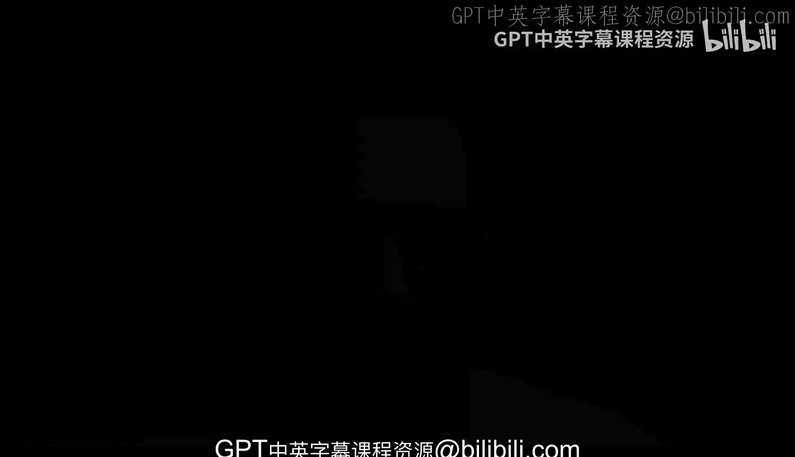

# 杜克大学《Rust编程4-5（Linux命令行工具、LLMOps）｜Rust programming》中英字幕 p01 01_01_01_认识讲师-Alfredo Deza.zh_en -BV1Hy411q7Zm_p1-

Hi， my name is Alfredodesa and I am very excited to bring you this rust and Python course where we're going to be combining these two programming languages to bring you everything you need to be successful whether you need one or the other or whether you're proficient on one or the other as well I've had several years of software engineering experience working on small startups to larger engineering groups and all throughout adding a little bit of automation。

 enhancing the projects in the teams that I've worked with。

And I think it's crucial and you will see throughout these scores all of these experience show up and in various different places like say。

 for example， the automation， I think that it is very empowering to not only know or understand a single programming language but also expand your horizons on some of the other more powerful newer programming languages like rust we'll see some of the positive aspects and some of the differences why and when you might want to choose one or the other we'll take some of the basics of CLs and then we'll take it a step further again very excited to bring you these course and hopefully you find it super useful at the end。

