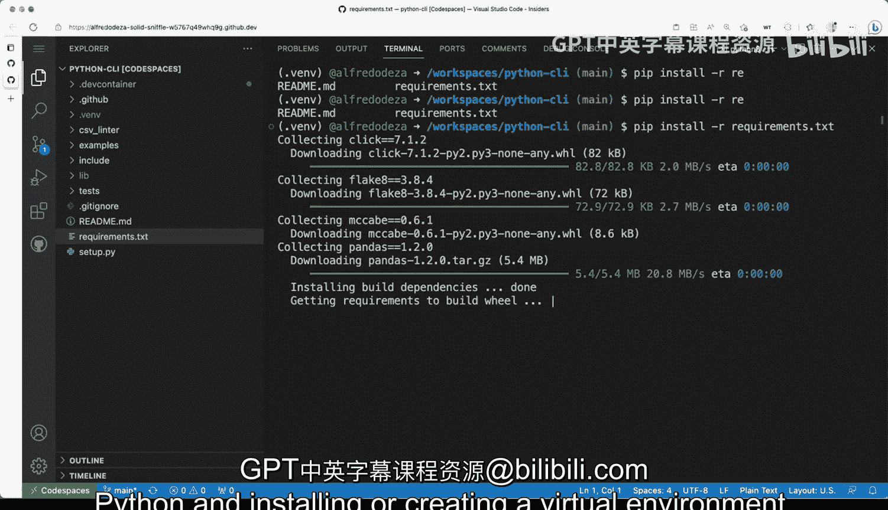

# 杜克大学《Rust编程4-5（Linux命令行工具、LLMOps）｜Rust programming》中英字幕 p05 05_01_02_搭建命令行工具开发环境.zh_en -BV1Hy411q7Zm_p5-

We have here a Python project， a Python CI project that we will be working with now we haven't gone through all of the directories and files that's fine because we will cover those later。

 but there's definitely something to be said about setting up your environment for working with working with Python creating some tools with Python so I have visual Studio code here and I have a system this is Linux system。

 I'm not gonna to cover in detail how to install Python there's many different ways but we'll cover once you have Python installed and available so in this case it's Python3 I can run the dash help menu in the terminal and get some output so now that I've verified that Python 3 is installed and in some systems in your system could actually be actually Python just Python plain Python in this case Python one work in this case。

It might be Python or Python3 depending on the system you are So the next step， we have， like I said。

 a project here， a Python commandline tool and you want to set up your environment。

 So I'm using ambitious studio code but for the effects of setting up your environment this is now going to matter too much except at the very end and I'll tell you why in a second the first thing we need to do is create a virtual environment Python has problems with tracking dependencies and isolating dependencies from the system So if you were to install dependencies that are actually defined in this file here and in this file right here you would get into trouble because those dependencies would be installed in the actual system since we don't want that we want to isolate that we want to develop that and if we're updating。

 removing we don't want to have any collisions we need to create a virtual environment So the way you create a virtual environment is to Python 3 M then we're going to use the VM。

Moule and then you have many different options。 I recommend you do just dot Vm for the name of the directory。

 Let's break through a breakout like this command that I'm running。

 First is Python the interpreter and again， you can have Python in your system dashm means like I'm going to run a module that comes with Python and then that module in this case is Vm that stands for a virtual environment。

 and I'm going to use dot Vm for the destination。 This is going to create a directory called Vm。

 Now I'm going to go ahead and do that。 and theres there's many different ways you can do this in Python。

 unfortunately， the many thirdpart libraries that you can interact with to create something similar。

 I highly recommend that you stick with what I'm recommending here。

 So I'm gonna to run this and I'm getting into trouble right away because the dependency for the virtual environment action module is not installed。

 So I have to now go ahead。Install these in this system。 This is a Linux system。

 I'll have to run run that command to get that installed in your system。

 It might be slightly different， So I'm going to go ahead and do that。

 So I'm going to run suit up get install Python 3。 That's the command that I need to run to in order to install these and then we'll come back when it completes。

Alright， so that completed， installed several things there， and things should be working。

 So let's try this again。 dash M VM dot VM。 And let's see if it works。

So it seems like it's doing something。 It doesn't tell me what it is。

 It appears to have been successful。 And if you take a look here at my directory and my tree directory here on the representation of Vi Studio code。

 you'll see that there's a dot VM。 So that's very good。 so far， we haven't done anything other than。

Other than looking into creating this directory， it has many， many different like over 100 files。

 easily no problem。 And there's tons of different things in there。

 The one thing that you need to make sure is that you're activating this environment。

 If I do which Python3， it points to the system Python。 That's a system Python。 I don't want that。

 I want the Python that it's in here。So youll you'll get actually。

 if we remove the Python and I just do LS， you'll see that there's all kinds of different things。

 including PP， which I'll cover in a second。All right， so let's activate and how we activate。

 how we fool Python to think that it's coming from that directory when I lose source。

And then that VM and the whole pathy to the bin directory and then to these utility activate so source that BM bin activate once I do that you can see that that VM appears on my prompt and if I do I'm going to clear this to make it easier I'm going to do which Python and now it is no longer Python 3 but is now coming from these path is's no longer the system Pythons if I do which Python3 its the same thing it's everything is alias So this is crucial because when you want to install dependencies if want to go to requirements that tag we have several different things in in the dependencies and some libraries you want to work with those are going to go into the virtual environment Why is this useful because when the virtual environment gets into trouble with some dependencies that it can't correctly untangle and you get into collision or a conflict。

tThen you can just simply remove the dot VM directory and recreate these again with the steps with the steps that we just tried it out。

 so again this is something that is core to Python development and you'll have to get used to using virtual environments and activating those。

Now， once you do that， I think that is pretty much for setting up your environment。 We have Python。

 we have the VM that might or might not be available and the same thing happens with PP。

 Now if I do which PP which in Linux will tell me that executable exists in my path you can see that it is there。

 but if I were to deactivate remove get away from that activate a virtual environment I'm going to do deactivate。

And I'm going to make this a little bit bigger。 let me try if I can I'm gonna clear the screen。

 So I'm gonna run which PP because I want to know where in the system is that。 And there's no Pip。

 there's no like if I do Pip help， there's nothing command now found。

 and so you start seeing that there are differences in the environment from the system in this case an operating system running in Linux and the virtual environment。

 So let's quickly go ahead and activate this again if I do which Pip here。

 you will see that that is installed and Y Pip is and I did the dash help there rather quickly。

 Why is this important because then I will be able to install the requirements that text in this case I want to get the development going on and the way I would do that。

 I'm going to clear here， I will do Pip Pip install。Dash R and then the requirements。

 the requirements file。 So once I do that it'll go through everything and download everything and install everything in the virtual environment。

 So this will take a second we don't need to wait until the definition。

 so that is some of the core things that you will have to half around when you are dealing with Python and installing or creating a virtual environment。

