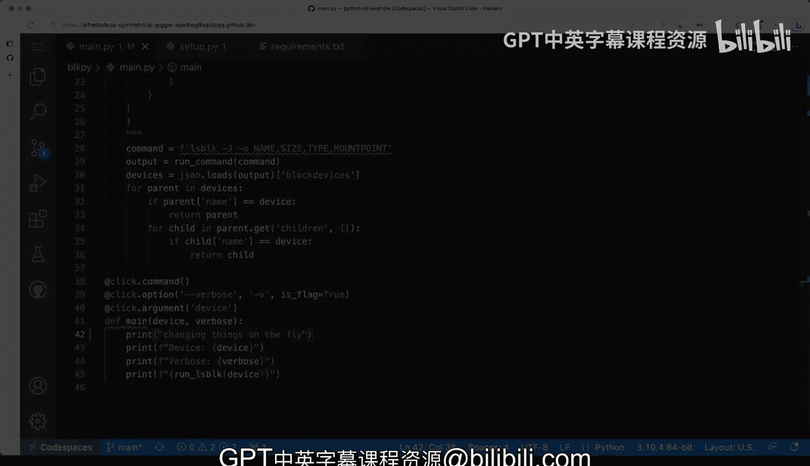

# 杜克大学《Rust编程4-5（Linux命令行工具、LLMOps）｜Rust programming》中英字幕 p07 07_01_04_处理用户输入参数与选项.zh_en -BV1Hy411q7Zm_p7-

Moving along with our simple akamelan tool that is using AliceS block。

 we're actually going to be following this Alice block project with Python throughout。

What we're gonna do is we want to move on to use packaging and why do we want to use packaging Because we are going to be using a framework why are we' going to use the framework well because a commandline tool framework will allow us to do things that are slightly more advanced。

 So I have that in this block a pi or BLk pi directory and I put everything in main that pi Now you might be thinking why are you creating a directory I putting things inside that directory。

 Well， this will allow you to modularized So if your commandline tool is going to be more complex。

 it will give you a good starting point to put more files in there So this is essentially the same code as before except that we have these click command tools or calls that are come in there so。

Kind of interesting that we're using that and it's using that a character which is is a decorator it's actually's the name in Python it's a decorator。

 if you're not familiar with decorators don't worry this is not you you don't have to really understand what exactly is going on behind the scenes。

 it is just something that will allow you to empower these function to have extra functionality and these are basically wrapping the main function right here。

Allright， so let's very quickly scroll to the top。 So this is always going to come from click and click is the library we want to install。

 So what what are what is the first step other than like this being inside of the rectory which is not super relevant for the fact that for the fact that it will help us create a more complex command line tool down the road So what is what is the thing there So we unfortunately have to get into the depths of packaging with Python now there are many different ways of packaging in Python there are all very opinion it and have their own ways we are going to try to find the most straightforward way that you can create Python commandline tools using a little bit of packaging that you can actually end up publishing on Ppi the Python package index to that we're going to go to this file right here is a set of the Now again you might have a setup that CFfg or some。

Other I think there are like five different ways you can package Python or Python tools and libraries and command line tools as well I'll show you one that is very straightforward even though it might look slightly odd and complex so let's take a look at these setup do pie the first thing you need to do is get these imported at the very top from setup tools import setup and find packages。

Next we're going to do is when to read the requirements that text file and use it to install or declare the dependencies we're not going install anything just yet。

 we're just going to assign them to this install requires so what is that requirements that text is where we can define our we can define our dependencies and in this case we want to make sure that click at the version of 7。

1。2 is the one that we want to install click is being installed from or retrieve from the Python package index and this defines the version so this is the package。

 this is the version if I wanted to have more packages I would add them in separate lines so this is a very good way of either reading the requirements that text and create a package with set the pie or you can also use it to install the dependencies with Pip which is the Python package installer。

Going back to set up a pilot just walk through some of the things when I keep doing so we cover we cover that already so let's go through the setup function so this is a very long setup function call that has certain different things the first few are pretty straightforward and so we just walk you through very quickly so we'll have a name in this case I've named these bulk block pi demo I've named it like that because when we start publishing this on the Python package index which we will go through that later I'll show you later how that works。

 that's the name that will get registered in the Python package index very short description so that users understand what this is and how when that listing comes up in the search on the Python package index you will get some information there。

The find packages is just an easy way that set of tools has to understand which ones the package and just consume that。

So it knows where my python will be。 that's my name， the author and then entry points。

 this is kind of magical， we'll have this string that comes in triple quotes and we'll have this section called console underscore scripts Now the console underscore scripts will have the name and this name here will be the name of my command9 tool and what follows is the module。

Or the directory rather and then the module in this case is mainda pi and my function What is the function that should be called in this and behind the scenes Python will create a command line tool that executes these right away Now I left these commented out the install underscore score requirements so that you can see how you would do these without reading the install requirements here from requirements that text so it's essentially the same but for convenience I just decided to make that little helper and use install requirements here so these will produce the same output as this one right here。

Lastly， the version in the URL the version is required， I don't think the URL is required。

 but there you go So those are the things that we need。

 we have to set up a pie we have the requirements that text and we have our bulk block pi directory with our mainda pi and our main function so let's put it all together I'm going to open up a terminal what I'm going to do is I'm going to create a virtual environment so'm going to go one directory there we going to on the route of my project I'm going to create a Python。

嗯。It is Python is my executable。 Let's just triple check that the version is 310。 perfect。

 I'm going to do Python dashm Vm for virtual environment dot Vm is going to be the destination directory。

 So that's going to create the virtual environment。 and then we're going to activate in a second。

 Okay， so I'm going to do source that Vm being slash being activated。And once that's activated。

 now I know that which Python will come from that virtual environment。 Allright。

 so this will come with Pip。 as you know， we've seen that before。

 that's the Python package installer。 and now I want to sorry if I wanted to install， for example。

 the requirements that text， I would do Pip install dash R requirements that text。

 Now I don't want to do that just yet I want to create this make this thing run and play with it and see what happens。

 So the trick here is that you can do。Python setup pi， if I wanted to install this， which not yet。

 I don't want to install this I'm developing my meline tool。

 What I need to do is Python set the Pi develop。 So let's see what happens when I do this。

And a lot of things happened and I'll probably get gonna get some files。

 do you see that egg dash info thats that's set the pie doing stuff behind the scene， So why。

 why is this important and why I'm using developing instead of installing this package well。

 because by developing is not installing anything is creating assemblings that allow me to modify the source on the fly and executed Now。

 remember， remember that let me see set the pie， remember this。

This right here that's the name of my term， my command line tool。

 So if I do B O K pi and I do or actually which。Block pie and you'll see that this has been installed in the Python virtual environment。

 Let me close this one out。 So that's pretty useful。

 Now let's see what happens block pi dash dash help and I get help by by default for free So that's pretty excellent。

 So if I go back to mainda pi。 you see I'm not I didn't define any help， right， I get that for free。

 just by using a framework and that's one of the main useful things that we get by using a framework we start getting these flags and all of these documentation for free。

 So we have a couple of things。 that sounds very interesting， you can see device named here。

 So lets let's take a quick look at the things that are happening here。

 we are adding an argument called device and that's a positional argument and you can see that's defined right there in。

On the help output so this becomes that piece and then the vervose or the verbosity I'm saying this is a flag。

 this is an option is not longer our argument， this means that there's an El so you can use dash fee or dash dash pervose so essentially those come to be this ones right here so verbose in this case come would be the value of these and the device would be the value of that so let's run block pi and say ST。

So there you go。 We're getting。 I'm printing out the device and the verbosity。

 So you can see here what are those。 And you can see now that these will also make it a boolean。

 So by being a flag， that means there's there's there's a true or a false。 So if I don't pass。

If I don' if I don't pass vervo， it's false if I。Passing pervo like that。

 I'll probably get it to true。 So you can see that changes。 So that is pretty powerful。

 And now we can say， we can say different things。 For example。

 we can change things on the on the fly， changing things on the fly and we can say that we can clear these。

And then do this and then we're going to get our changing things in the fly。

 This is why Python set of the pi developed is so powerful because I can do this。

 if I had use Python set of the pi install which will allow me to install that as unexecutable in my system then it wouldn't matter changing things here because those wouldn't be reflected when I'm running without reinstalling again。

 So that is a foundational knowledge to try to get some of these things running and develop and continue to develop these Python commandline tools that will be pretty useful So there you go。

 things are still working things are actually we can try1 that also still works output。

 This is still quite rough and there's still no guarding against errors in parsing and more flags。

 we'll see those later， but this should be good enough to get a good understanding。

On using something like click， which is a very popular command line tool framework that is available in Python。

