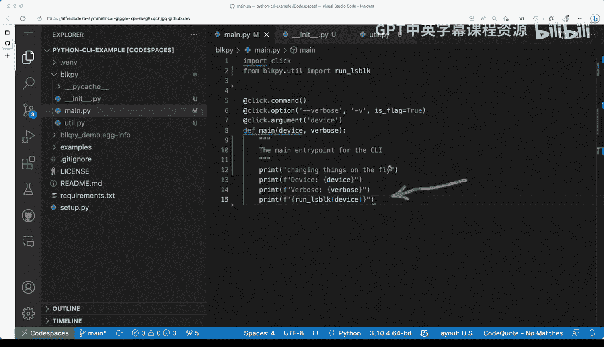

# 杜克大学《Rust编程4-5（Linux命令行工具、LLMOps）｜Rust programming》中英字幕 p08 08_01_05_通过模块和库扩展工具功能.zh_en -BV1Hy411q7Zm_p8-

So far we've covered a couple of the things that you will need to in order to create a mailline tool and before we looked at using click Now some of the things that we can do now from here is to start expanding with modules this is why it is useful to have something like like a directory with your modules inside that directory So what we're going to do right now is we have a mainpi file that is full of some other code that could be put somewhere else Now one thing that I mentioned before was that we can use LinkIn and some more extensions and we installed the Python extension and if I hover on some of these curly curly underlines you'll see that we have some suggestions in this case this is coming from Python say missing functions or method string so it would be good to have。

Something something therefore the wrong command if I do here for imports a process it tells me that I'm missing a module dostream so these are things that you can actually add and or ignore if you feel fairly confident that it it is not actually needed al right so what are we going to do here is I'm going to make this main D file this main D this main module we're going to make it smaller and we're going to take some of these stuff out so what we're going to do is going to go to。

The package， the director， I'm gonna to say， I'm going to add a new file and when I call these well you can if you have several different types of utilities and different types of things that you want to add。

 you can definitely put them in somewhere else。 but we're going to put them here。

 I'm going to say you till that pie， it is empty。 So when I'm going do we're going to do some surgery here with this file and see how we can make it make it really。

 really small， so I'm going to select all of that。All of these things and we're going to take them away and you'll see that the Li will start getting into trouble there。

 but no worries， we'm going to copy paste this here。

 we're getting problems here because Jason is not imported， that's fine。

 I just going to verify that that's there。 I'm going get rid of that。And all right。

 so we have we have the code copy paste but we need to move the modules， so you can see Jason。

 Schx and the process are no longer used， I'm going to remove those。Save that。 Go back to Uillepi。

 Go all the way to the top。And paste the imports。 when I save that。

And you can see that the red curly underlines went away。 Great。 So what we have here。

 it feels pretty good。 And now this one module， this utility tillda pi module is good to go。

 Now there's a couple of things more than we need if we go back back to main that pi。

 you'll see that run underscore Ls block is with a red underline and it says that well it's not defined we are going to need to add these special file on the director is going to open here。

 the file Exper and under block pi or BLk pi， we need to add a new file and these new file is going to be under underscore or double underscore in it。

That will underscore the pi and what this does is allows us to work with a proper regular Python package。

 We don't need to put anything in there and this will allow us to do regular imports and iss something that I highly recommend you do there is a possibility to not necessarily add one of these if you're creating a different type of package called a namespace package。

 but for effects of command line tools and working regularly with Python。

 We're going to concentrate in this use case， So we're going to leave that there and the next step is we're going to go back to main D pi and now we're going to say we're going to say from。

From。Block pi， we're going to from block Pi that you till。 You can see I'm getting auto completion。

 They're working。 I'm going to import。Import run underscore LS block。

 so that auto completion is possible because behind the scenes Viscode understands that it is in fact a regular Python module and you can work with an inputs and modules and functions so that now works and it's looking okay。

 we can see here that we're getting a missing function or method string that's not really important for what we're trying to do we can satisfy the link if we add if we add like a little doc string here and we say the main entry point for the Ci we save that and then that's fine and then we are we I think we're good to go and we now now that we have this modular right。

 let's take a look at utla pi。We have our two functions and this looks pretty good。

 Now we need to get to try it out。 So I'm going to go open up a terminal toggle terminal。

 and then we're going to see if we still have our our tool。 so block pi， it is not there。

 So this is because we don't have our。Virtual environment activated。

 So this is one of the things that you might want to do and be consistent about。

 You always want to check if the things that you're expecting are there or not。

 you can see that block Pi is actually now showing up when I say which great So I'm going clear these and I'm going to say block pie help that looks correct。

 Now lets let's see if we have the ability to run block pie S and if we're getting problems。

 we're not getting any problems。 we still have our previous changes that are sticky and we can see that this is actually working pretty pretty well。

 So if I say SD1 SD1 also works。 So things are now working。

 So when I close these So this is really good now things are more modularized。

 we have a utda Pi we can keep even extracting more so far。For example。

 all of these parent in devices and child and parent devices。

 we create a separate function and keep like keep adding more helpers that can help us get the readability and the testability of some of these functions well be more more friendly to testing we haven't covered testing yet we'll do that later but this is a very good solid starting point。

 so a couple of things that we added， we added the in it double underscorepi we create a utilitypi module and we made changes to main Dpi now look at main Dpi it looks very good just 15 lines long and that's very good just for what we're seeing here we're concentrating only on certain things and this looks already very very very good so that is a very good stepping point for you to screen more modules。

And do even more with your command line tool and the good thing is that we all were able to start because we have these blockpi or BLK Pi directory that allows us to put many。

 many files in there and work work with that now this structure will also help when testing comes into play when we start adding tests and we want to do more things with testing because we're going to be able to isolate things better。

 imagine if everything was inside of main the main function then testing would be very difficult if you want to test just like a couple of things like well the run underscore L block for example。

