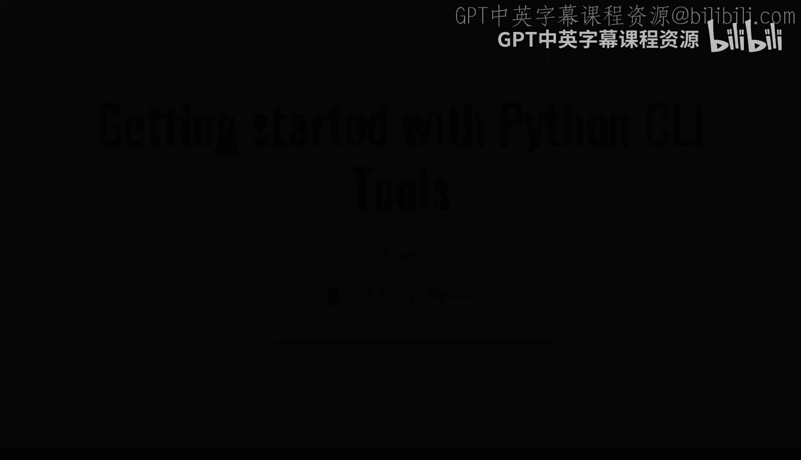
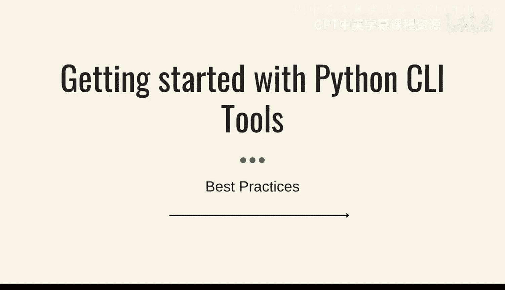
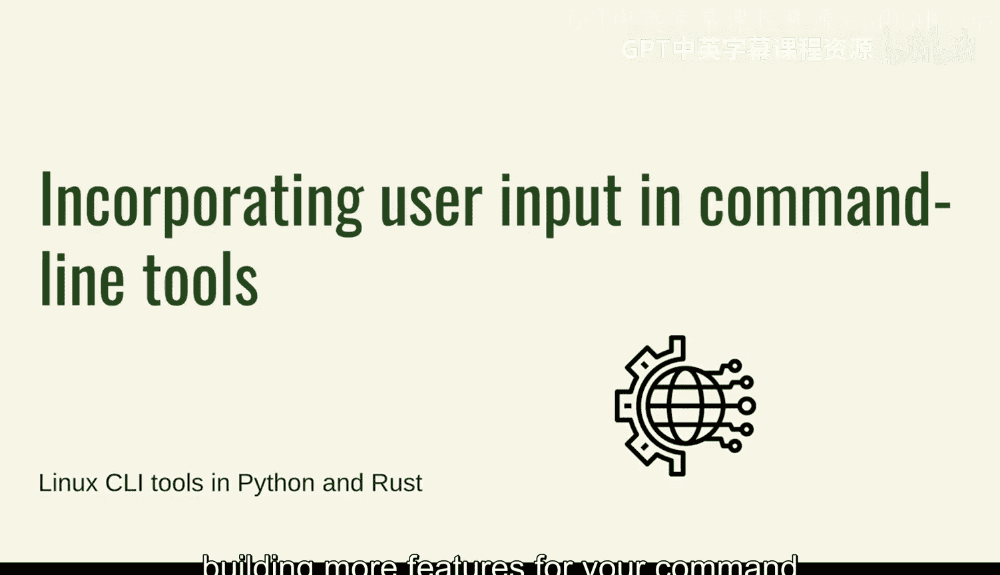
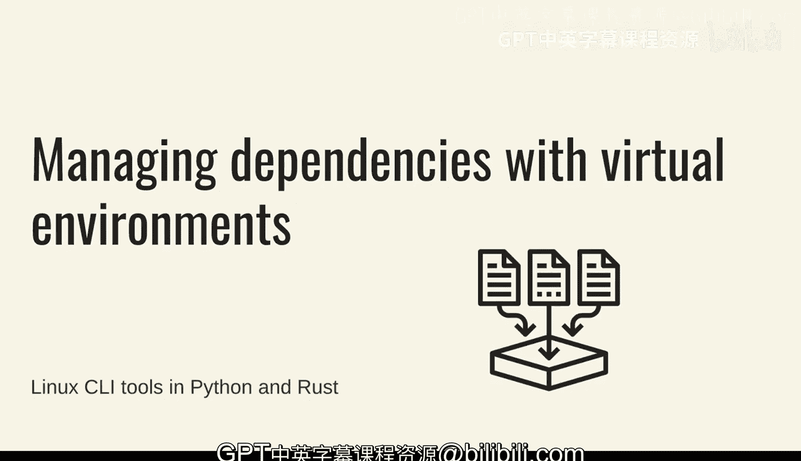

# 杜克大学《Rust编程4-5（Linux命令行工具、LLMOps）｜Rust programming》中英字幕 p10 10_01_07_优化命令行工具性能与最佳实践.zh_en -BV1Hy411q7Zm_p10-

Let's do an overview for getting started with Python commandline tools and some of the best practices。

 a few of these things we've already seen， but some of the things that we'm going to cover in this presentation are not we not part of some of the lessons so in these introduction to building command tools we went through several different aspects of putting together from the simplest possible version that you can do without dependencies and without using any frameworks to using things slightly more complex。

So first off you need to make sure that you're choosing the right library for command line tools depending on what is it that you want to end up doing you might want to use a framework which in that case might require you to use a packaging and all of the packaging tooling behind Python you might remember that we went through several different steps to try to install some packages we didn't go into death into those Python packaging is quite complex in the case that you end up using some of the frameworks there is opt par from the standard library or art par as well those are fairly complex and we didn't go into those and I my recommendation is to use the click framework Now the caveat is that for the click framework you would need to install it because that doesn't come from the standard library so there is some pro。

and cons there， I believe that the click framework in Python is amazing and you should definitely try it out and the techniques that we show you about packaging and installing libraries is definitely worth going through。

Now， if you， if you need to work with sub commands， I mean， we didn't touch subcoms just yet。

 but the click framework is where it definitely shines。

 So we saw only the basic some of the arguments and some of the options that you can use with the click framework。

But as soon as you start dealing with more complex areas， which we'll see later like subcommands。

 then the click framework allows you to go into that way。

 way more easily another aspect of this is that you are definitely simplifying the creation of your tool we saw a little bit of the help menu and the selfdocumentation of the flags and the options and the values that you're going to take in a little bit of the error handling。

 I mean some of the more advanced features which will get into later allows you to basically do all of that error checking automatically so if you want to for example。

 change from strings to integers as you saw with some of the basic argument parsing everything ends up being a string but behind the scenes something like a click framework can coerce those values into。

Integers or some other types of values Now all of these features and all of these things with click will allow you to create more more powerful command line tools with with the facility of implementing some of the framework bits and pieces of click into your tool now to the melodies command line tools in Python it is essential to set up like a good thorough development environment you can end up using whatever you prefer really like if you have a different text data than the one that I showed that's perfectly fine I prefer ambitious studio code because I think it's very feature it's free it has tons of features and some of the things that I suggested kind of like installing the extensions for Python doing a little bit of LiedIn you saw that at some。

I was getting into trouble those are worth installing so if you're not using Vi Studio code definitely go through some of the features that your textator might help you to try to get that same type of helpfulness when you're trying to develop Now the other thing that we saw is doing dealing a little bit with user input in command line in the command line tool now that's very useful but you need to think about what are some of the options that you want to expose and to customize the behavior of the tool in this case we set up like a boolean flag to increase the verposity and see the output that is definitely something useful and something that as you progress in building more features for your command line tool you will get into more。

Now when you want to start expanding the functionality of your tool。

 youll start getting into modules probably you do not want to have a single file with absolutely every single helper function or other extra code that you want to reuse in a single file I've definitely had horror stories of dealing with single Python files that were over 1 thousand lines long which was horrible horrible to work with and you could see that whenever we started separating the logic out into other modules we were able to make the main pi module more readable and that's definitely something that one of the benefits of having modules but the other one is that when you want to expand that functionality you will be able to do that with with ease and like it's very simple and very straightforward and it's very it's very。

Very easyasy to understand where certain files and certain code might go， for example。

 if you want to create exceptions， you have an exceptions module。

 then it makes sense where those will be and that's just exceptions and we can definitely keep adding more things like logging and other configuration capabilities as well。

Now when you want to move even further because we're in the case of click。

 you're already installing dependencies and you're already creating your package。

 your tool for distribution， you can keep adding more libraries for even more complex tool features so say for example if you want to do network requests one of the popular libraries for doing HTTP requests for example。

 is the requests library in Python so if you wanted to make it easier for your tool to do HTTP requests and deal with those requests when they're being sent then definitely you can you can do that Now the other thing is that with talk to a little bit about managing dependencies with virtual environments。

 definitely for setting up your environment and dealing with these dependencies and weve saw a little bit about the Python set up PyDevelop which allows。

You do have these executable that you can try it out as you're making changes to the tool while developing。

 which is a pretty， pretty powerful way of developing， always， always use a virtual environment。

 check that you are within a virtual environment and that you're not installing libraries in different locations。

That's definitely crucial。 And that is something that you have to do in through the whole process of creating。

 developing。 and even when you're trying to release your command line tool when you're trying to develop all of these of these steps and later on。

 when we step onto continuous integration and continuous delivery。

 and we're trying to automate the release of these of these tools。

 this is something that youll have to keep in mind as well。 So that's it。

 those are some of the highlights of building the introduction of building command line tools with Python。

