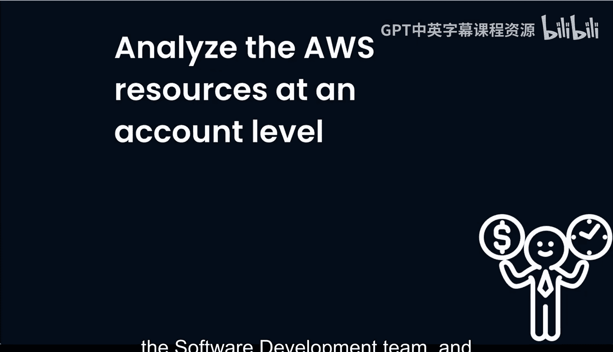
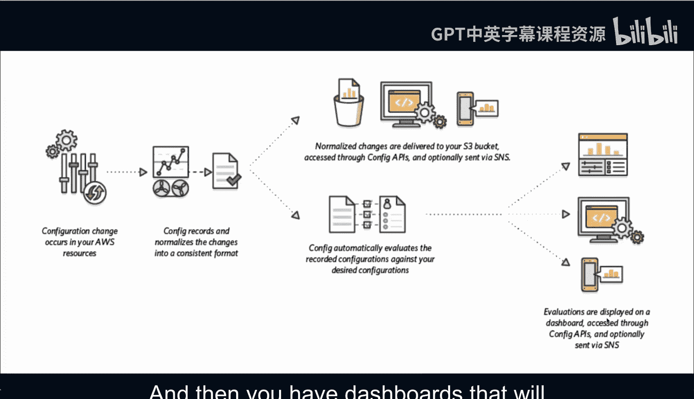
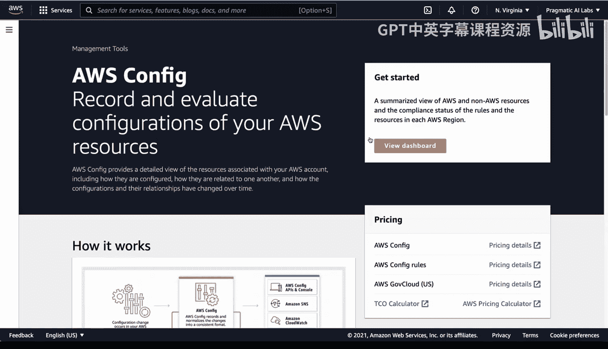
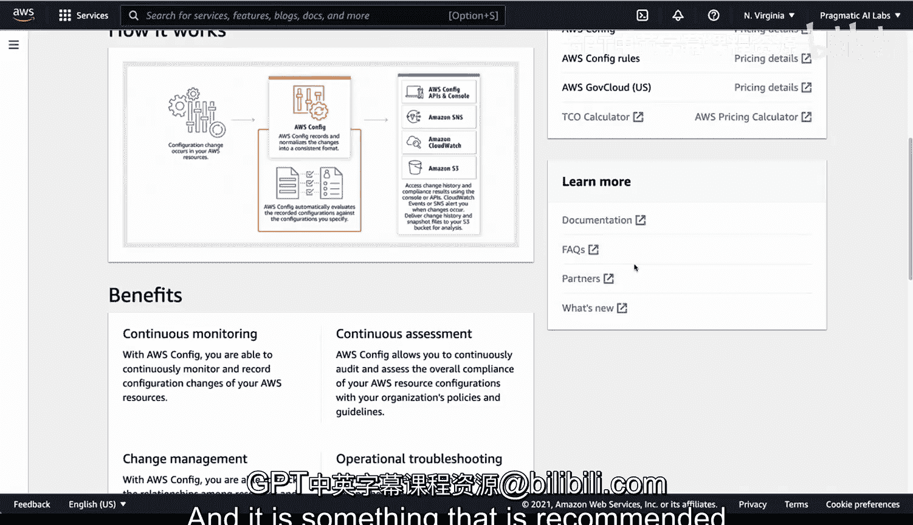

# 杜克大学《Rust编程4-5（Linux命令行工具、LLMOps）｜Rust programming》中英字幕 p102 14_01_06_使用AWS Config实现安全.zh_en -BV1Hy411q7Zm_p102-

Let's take a look at how to analyze the AWS resources at an account level。

 so if you wanted to audit multiple OUs， let's say the data science team。

 the software development team， and figure out a best practice around that。

I would start with AWS config and you can see here that AWS config will monitor changes that occur in the AWS resources and in particular。

 the config records records and normalizes the changes in a consistent format so you have an auditing system that can keep track of what's happening and it'll evaluate。

The changes against a configuration you specify Now if we take a look at how these configuration changes occur once they are inside of the AWS configurationfig system the ability to normalize the changes occurs in a consistent format and those changes are delivered to a bucket and then you can talk to that API so you could ask for resources that aren't compliant with let's say backup best practices and then this evaluation is constantly being recorded against the desired configuration and then you have dashboards that will show you everything that's happening so probably the next thing to do here would be to go to a demo and take a look at this。

 so to start off with I'll first mention that you can access this via the shell and so I'm a huge fan of the AWS Cloud shell environment and I think from a super user standpoint it's good to know how this works So in this example I have AWS configurationfig。

If you type in help， you can see that you can go through here and use lots of different options here to describe everything in your organization。

 and this might be one of the best ways to initially use the AWS Config system once you've got a setup is to run CLI queries against it。

The other way you can do things is using the console。

 the management console from AWS has a very good interface。

 let's go ahead and take a look at this dashboard。

And you can see here that I have some rules set up here and in particular there's lots of things that I could take a look at。

 so security groups， buckets， EC2 instances， right now how does all this work？Well。

 in particular you could do a conformance pack here and a conformance pack is a collection of rules and in this case I have some noncompliant rules here。

 let's go ahead and deploy a new one So if I go through and I say let's go ahead and use a sample template what's really nice about this is it has things like operational best practices for API gateway。

 operational best practices for AWS backup， operational best practices for S3。

 whatever it is I want to do， let's go ahead and do this one。

 operational best practices for S3 and if I go through and I say next。

 I just call this and we'll just call this S3。Best practices。

There we go and then I'll go ahead and say next and then if I go here and I deploy it now I'll have some rules where I can audit against the best practices that AWS recommended so this will apply to not only one account but any account that's associated with this root user and let's take a look at some of these links here once you've got this setup in this case we see this is a backup conformance pack and we can see that for example it doesn't like something I'm doing with EFS and it says this rule was created by the configforms Amazon AWS。

com and this checks if the EFS system is protected by a backup plan and in this particular example says。

That there are some problems with this， these resources are not protected by a backup plan and so what's really nice about this is that instead of asking someone's advice or you know asking for like you know maybe their opinion about something there's a set of rules in addition you don't have to actually go through and ask someone whether they did a backup or not we can go through and we apply these rules so in a nutshell the AWS config environment is a very powerful tool to audit large organizations。

 especially Fortune 500 companies and it is something that is recommended for all organizations using AWS。

