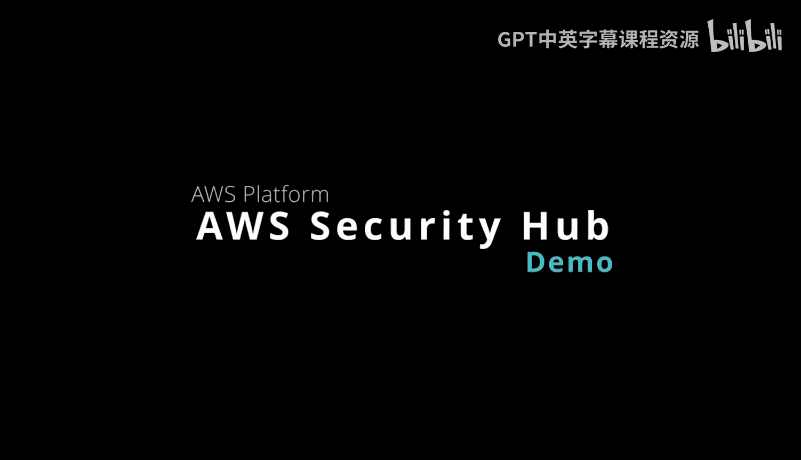
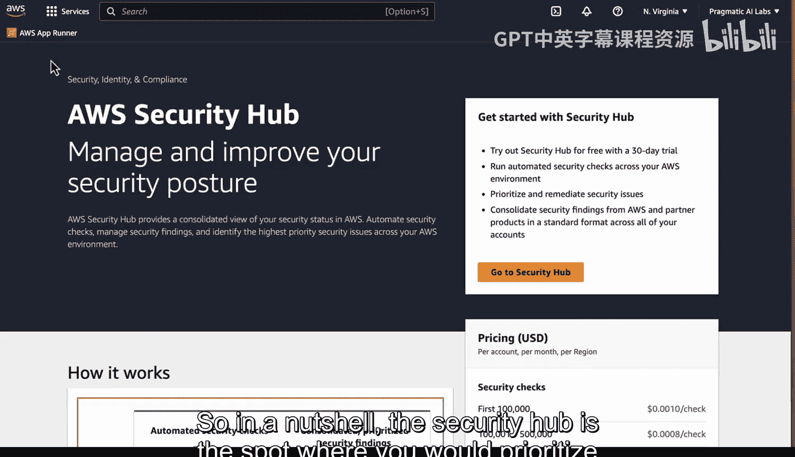

# 杜克大学《Rust编程4-5（Linux命令行工具、LLMOps）｜Rust programming》中英字幕 p103 15_01_07_AWS Security Hub演示.zh_en -BV1Hy411q7Zm_p103-

AWS security hub helps you manage and improve your security posture on the cloud。

 And this is one of the great features of this platform is that it helps you consolidate everything into one view。

 So we take a look here at the overview page， what does it do， Well。

 this security hub will automate security checks。 and these security checks will run across not only the region you're in。

 but any region or future region that is generated， and that's a big help in terms of compliance。

 Some of the things that it does include the ability to use Amazon Guarddu， Also Amazon inspector。

 Also Amazon Macy， And then once you've got those alerts。

 you can take action on them so you could build some kind of ticketing or chat or email and those can allow you to have automated remediation for those particular action。

 So let's go ahead and take。To look at how this works。 if you go to the security hub here。

At the very beginning here， one of the things that we'll see is that you'll have a summary and these security standards will show。

 according to the standards that you've set， how many of them have you actually passed and then over here we have resources with the most failed security checks and you can see these different resources here。

Also， if we go to the foundational security best practices here。

 this is one of the security standards。 We also have Cs AWs Foundation。

 Cs AWs foundation benchmark 1。4 and you can even enable other standards。

 what's nice about this is depending on what it is that you're trying to do if you're doing credit card transactions or you're doing something with healthcare you can enable these different options right here if we go into the controls here。

 you also can see the different controls， we go to security standards again。

 you can actually dig into more details about what's in this particular security standard and this is a very helpful way to apply the standard across every different region in your account if we go to insights here as well。

This is a nice feature is that you can actually dig into and look at in detail some of the things that are automatically discovered。

 so resources with the most findings or buckets that have public read write permissions or EC2 instances you know that have some issues here。

 all of these are great things to look at and then if we look at findings here as well we can actually dive into some of these findings and you'll see by the account ID exactly what's happening Finally。

 in terms of integrations， you could also again integrate this into different things like a chatbod or audit manager or config or detective to get further integration with your system finally under automations you can also go through here and create a rule for example。

 elevate the severity of the findings that relate to an important resource So in a nutshell。

 the security hub is the spot where you would prioritize。

Really the first check of what it is you're doing， you can add automation。

 and that's something that every organization that is applying security should use because of how uniform this resource is。

