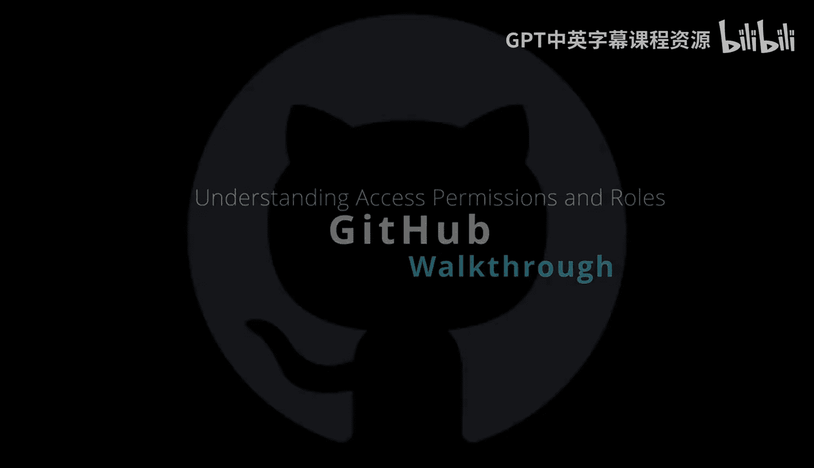

# 杜克大学《Rust编程4-5（Linux命令行工具、LLMOps）｜Rust programming》中英字幕 p105 17_01_02_理解访问权限.zh_en -BV1Hy411q7Zm_p105-

Here we have access permissions and roles for Gitthub。

There are several different ways to consider access permissions and rules。 First is a user type。

 So in terms of a user type here， this could be repository owners， organization owners， team members。

 external collaborators， we also have a repository access level。 So， for example。

 can you read to an access or could you write to access a particular repo and we also have organizational level。

 So we can think of things including organization owners billing， and in the case of enterprise。

 we have these enterprise accounts here。 So to first up look at the personal accounts here。

 I think this is a good place to start if we look at some of the things that can happen is by default。

 the personal account， the owner has access to every action that you can do in Gitthub。

 which makes sense， you could create a new repo you could you pull a repository write to a repository。

 etc。But often you'll want to collaborate with people。

 but you don't want to give them any level of permission that would be administrative。

 So typically what you would do is you would add a collaborator level access。

 This means that a collaborator could either read or write or both to your repository the next level up here would be an organization account。

 So you'll see this with， let's say a company may have several different repositories。

 and on an organizational level， the roles would be an owner， a billing manager and then a member。

 So if you're a member of an organization you wouldn't have access to the billing system or be able to destroy you repositories or even the entire organization if you weren't the owner levell access。

 So what can we do here， in terms of permissions， we have people teams read write admin。

 these are some of the things to consider。 So in terms of a person。Again。

 this would just be a typical operation that you you would have as a role and this person would be able to work with projects in terms of a team。

 this is where you would break things up so that you could organize potentially on the level of access that someone has。

 So maybe there are a certain repositories that are private maybe this is top secret code。

 a certain team could access it， but another team could not。

 that would be one way to divide up amongst teams。 Finally， in terms of the readr admin as well。

 this would be when you would control at the organizational level for example。

 who could create new repositories or who could make a repository public or private those are some of the things to think about in terms of enterprise。

 This is also a pretty interesting aspect of the whole Gitthub ecosystem and that you can also organize organize with a more enterprise level flavor So what this means is that you could collaborate within your entire organization。

The administrators could have visibility and management What this means is that an enterprise owner could invite existing organizations to join the account or transfer organizations。

 you can also enforce policies at the enterprise level。

 so it gives you the level of control that's necessary for a large organization you can also have billing and usage user licenses。

 for example， to get access to things like generative AI coding assistance or Github actions for building services。

 the compute hours or GitthHub code spaces， so it's important to think about the different levels of access。

What are the permissions that are associated with it and then what are the rules that make sense。

 given a particular type of account， again， personal， organizational or enterprise？

