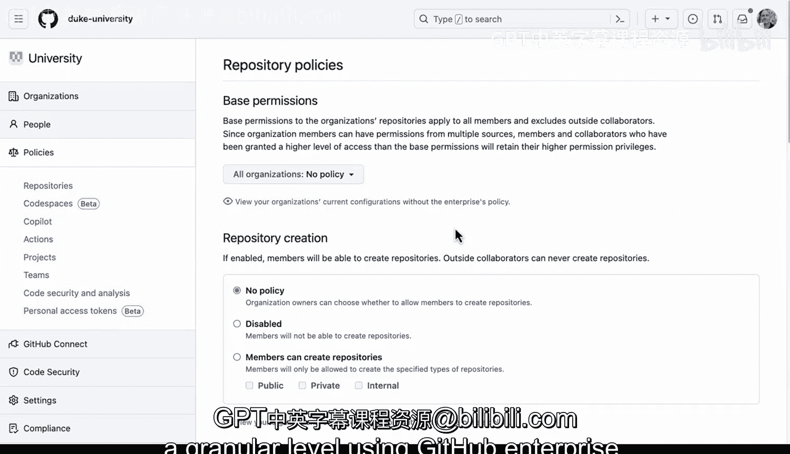

# 杜克大学《Rust编程4-5（Linux命令行工具、LLMOps）｜Rust programming》中英字幕 p106 18_01_03_仓库权限级别详解.zh_en -BV1Hy411q7Zm_p106-

GitHub repository permission levels can be divided into three main ways of thinking about the levels。

 First， we have no access。 The idea here is that a user or collaborator can't view or interact with the repository。

The implication is that this is essential for security because it ensures that unauthorized users can't even see the repository existing。

 A use case would be for a past collaborator who no longer needs access or for people that should never have access like an external vendor in terms of immutable access。

 The immutable access allows a user to read the code but not make any changes。

This idea would be similar to a read levelve permission in Github。

 The implications would be this is great for auditing or automatic deployment or even for nontechnical stakeholder but not for somebody that needs to make changes。

 so that would be mutable access and with this means you have right or even admin permissions to modify things like the administration of the repository itself。

 So this would be core developers， project managers or even Devops people。

 So this corresponds now to the policies we see here below repository creation repository forking。

 the administration or repository or even repository outside contributors。

Okay here we have the repository policies inside of GitHub enterpriseterse。

 and you can see how these translate very cleanly to the diagram before repository creation。

 there's either no policy disabled or you can explicitly say that members can create public。

 private or internal。Similarly with repository forking。

 you can set up policy whether it's either enabled or disabled， right。

 this would be mutating or immutable repository outside as well。

 Can you actually have repository administration allowed。

And then in terms of the administration of the repository itself。

 can people make changes to the repository， can you delete or transfer and if there is a issue with deletion。

 what are the different aspects of this that we care about。

 so these are all things that you are able to control at a granular level using GiHub enterpriseter。

