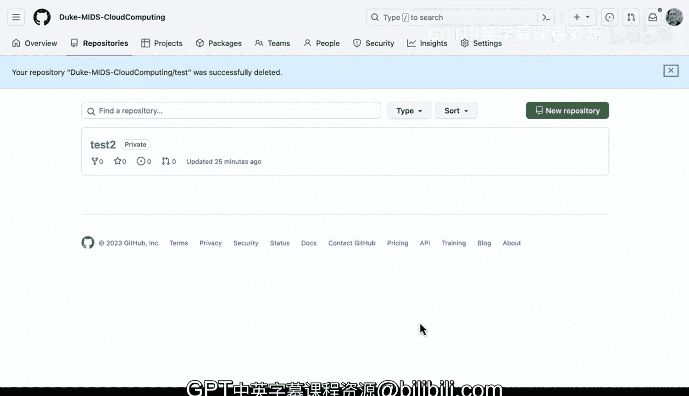

# 杜克大学《Rust编程4-5（Linux命令行工具、LLMOps）｜Rust programming》中英字幕 p107 19_01_04_仓库隐私设置与选项.zh_en -BV1Hy411q7Zm_p107-

Let's take a look at from an enterprise level all the way down to a repository level privacy settings for a repository。

 First up， if we go over to policies here， here is where we could go into setting the enterprise level repository visibility policies。

 So if we go through here first we could disable even the ability to create repositories or we could limit。

 we could say members can only create， for example， internal or private repositories likewise。

 we could set it so there's no policy as well， we can also say repository outside collaborators right so we could restrict the ability of the repository to be shown to outside collaborators。

 So there are many different visibility changes at the enterprise level that are very important to be aware of in terms of making sure that the visibility is even possible to doing granular controls。

 Now let's go ahead and move over。Back into the organization itself。

 So if we go back to an organization， we can see here's one。 and if I select this organization。

 we can actually go through here and select repository。

And actually go in and control it at the repository level as well。

 So let's go ahead and look at these settings here。 If we say settings。

 one of the things to be aware of is that the very bottom， there's something called the danger zone。

 So the danger zone has the granular control at the repository level， And again。

 it's controlled at the enterprise level， whether you have these features or not。 But in this case。

 since they're not enabled， I could change the visibility and I could change to public or I could change the private。

 if I change the public， that means the outside world can get access to it。

 or if I change the private， it means nobody in my enterprise has access to it anymore。

 only I have access to it。 We also could do several other visibility operation。

 So one is I could transfer the ownership to another person。 So， for example。

 I could transfer to an individual or some other organization。

 Likewise we could also archive this repository。 So if you archive it made it read only。

 that means it's visible， but it's immutable， we also could。Delete this repository。

 If you delete the repository。 In fact， let's go ahead and do this。

 what'll happen is it's gone forever。 So let's go ahead and type this in here and delete this repository Duke and this goes through and it deletes this repository。

 So you can see there are many different controls both at the enterprise level and at the repository granular level that you control to make sure that the visibility is up to the requirements of your organization。

