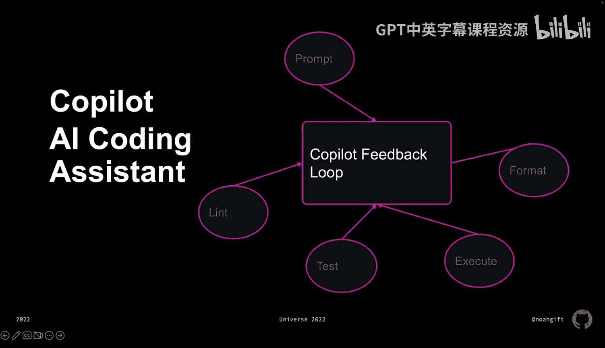
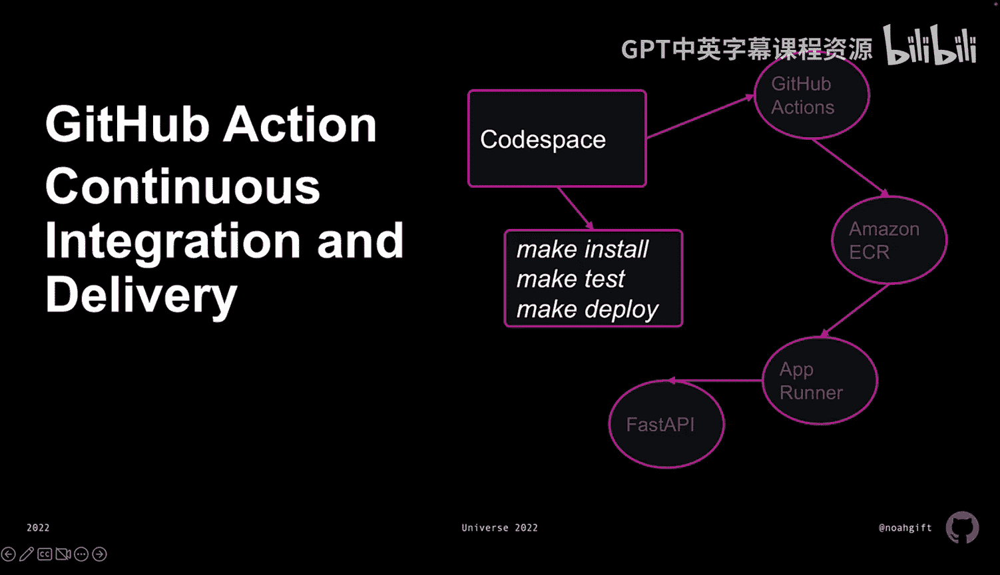

# 杜克大学《Rust编程4-5（Linux命令行工具、LLMOps）｜Rust programming》中英字幕 p108 20_01_05_揭示GitHub生态核心概念.zh_en -BV1Hy411q7Zm_p108-

Let's dive into building with the GiHub ecosystem。 Hi， my name is Noah Gi。

 and I am an executive in residence at Duke， and I teach machine learning operations。

Let's talk a little bit about GitHub for teaching MLLs。

 and this applies to professionals as well as students First we have reproducibility。

 The Codespaces environment allows you to get this incredible amount of reproducibility so that other people in your team or other students in the classroom have access to the same environment that you do。

Next， when you dive into a GPU， this allows you to use the GPU to do things like use pretrained models or to fine tune a model or to use modern AI tools like Open AIs Whiser。

The AI coding assistant Copit is inviable because it allows you to prompt and ask questions back and forth with the coppit system and actually get suggestions about how to write your code。

 how to build your code， how to build kulline tools。

 and potentially even build the boilerplate code for you。

With continuous integration and deployment via GitHub actions。

 it's an amazing way to deploy your application in the same location that you built it in。

Now， reproducibility with code spaces is all about three things。

 It's a cloud based development environment and a workspace that has a container image built in。

 This could be a boontu image or a Microsoft created image。

 It could be any image that works with Docker， and then you could customize it to meet your own needs through your own configurations with dot dev container。

Also， with computing storage， you can actually customize code spaces to use GPUs or to use multi corere machines or to use high memory machines。

 and this is inviable because you can test and build in a similar environment as production。

Access to the GPU allows you to do things like dive into hugging F。

 one of the leading vendors of pretrain models， you can take that pre trained model down。

 fine tune it and actually do it right on your device without having to pay for a $5，000 GPU。

Hugging F works very frequently with Pytorch。 you have access to Pytorch。

 You also can get into Tensorflow， build your own deep models from scratch。

 or even go at a lower level， D to the NviDdia Kuta。

 SDK and build functions that get applied directly to the GPU。

The Copiot AI coding assistant is a way of getting suggestions。

 adding details directly into your project， and with the coppiloot feeding everything inside of your project。

 you can then ask forlyting from Pylint or testing from Pt or execution with i Python and get this virtuous cycle of continuously improvement。

 and this really can be a three or four times X improvement and speed。

Now finally， with Gitthub actions， continuous integration and continuous delivery。

 it allows you to use this code space， do a make installt step， do a make test step。

 do a make deploy step inside of your make file， then push that into your continuous integration steps with Gitthub actions and then that can trigger the push of an image to Amazon's container registry that would then in turn go and trigger the platform as a service offering app runner which would in turn deploy your application。

 so you have all the tools necessary to develop an the exact same environment that you're going to eventually push deployment to and it makes for a smooth transition for continuous integration and continuous delivery best practices。

