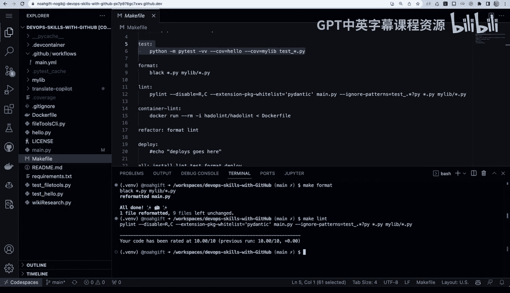

# 杜克大学《Rust编程4-5（Linux命令行工具、LLMOps）｜Rust programming》中英字幕 p109 21_01_06_演示：实施GitHub Actions.zh_en -BV1Hy411q7Zm_p109-

Let's take a look at a project that has GitHub actions enabled。

Any project that has actions will have one or more YaAML files inside of a dot GitHub workflows directory。

Inside， you can see that I have a job that runs on a bountu latest。

 It could run on any container that I choose that's supported by Github actions or my own custom container or even my own custom dev code space。

 And inside here I put each of the names of the steps。 So I say dash name。

And this would do make install dash Lint。 This would do make Lint dash test。 This would do dash test。

OrMake test and this would do a format and this would do the make format step。

 And now let's go ahead and look inside of that make file that's corresponding to it。

And you can see here there are each steps in my build process。

 What's great about this approach of having a make file that's directly linked into your Github actions file is that you don't have to think about what command to run。

 you just do the same command locally。 So if I want to go through here and I want to say make format。

 for example， it would go through here and format all of my code in my project or if I wanted to do a make L。

 it would lens all of the code in my project and the same thing would happen when it goes and gets run inside of the Gitthub actions environment。

 So the idea here。 So if we go to Github is that。😊。

If I wanted to create a new workflow by clicking actions， it could give me several different options。

 One is I could just set one up myself and would give me a template if and this is actually not a bad way to get started as you could go through here and put in whatever commands you want or even run this particular build script。

 I think it's a lot better to actually use a make file so that you can have a correspondence to what you're doing locally in your Github codespace。

But this is actually one approach that is a good start。

 Another thing to be aware of is that there's many suggested examples here that you can take a look look at like publishing Python packages。

 for example， if you wanted to take a look at this how it would actually work。

 it gives you a lot of really good guidelines for how to actually do a best practice。

 So it's a great service to use for many different things that you would do including deployment。

 and this is why it's so powerful for DevOps。 So let's go ahead and see it in action and watch it work。

 So if I go through here and I want to test out things that are happening in my project。

 I could say get stash here。😊。

Put， put my changes away。And then if I wanted to do some kind of a change somewhere。

 what I could do is I could。Go through here and and make a small modification to to a script like。

 you know change here。 And then I could do gi status and check this in。

 So if I go ahead and I add these changes。Right here， and I say。Kicking off build。

Then what it will do itll actually immediately trigger a new Gitthub actions build。 And there we go。

 kicking off build。 And this is what's so nice about Github actions is that I can then go through and step by step Watch each of the steps that I defined in my my Yaml file。

 So it's dependent on each user what it is you want to test。

 but I would recommend for a deployment process you would do make install， make Li。

 make test and then do a make deploy and it could push it into a production environment。

 and really Gitthub actions is the center of a very professional Devops workflow。😊。

