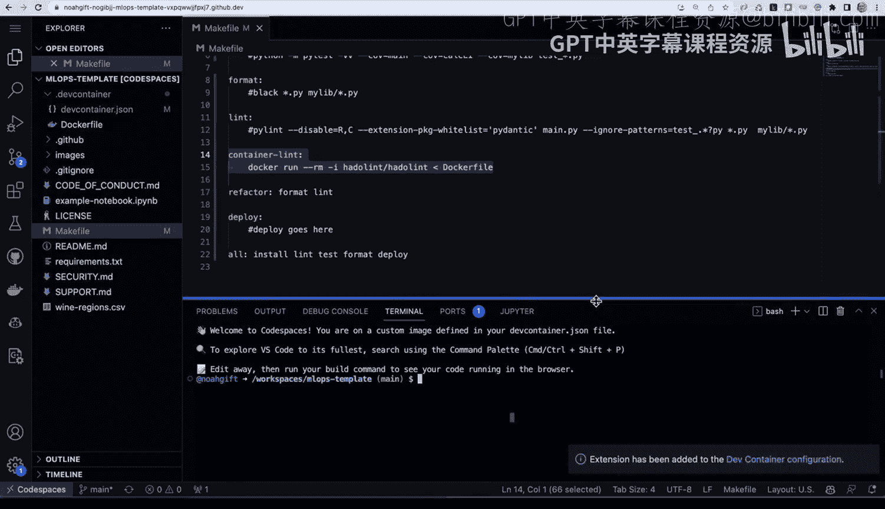
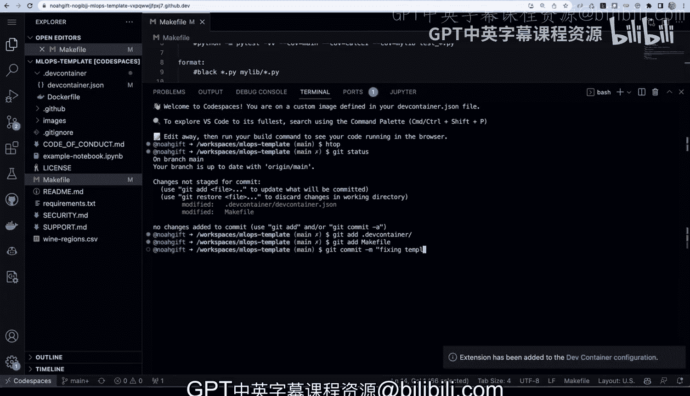

# 杜克大学《Rust编程4-5（Linux命令行工具、LLMOps）｜Rust programming》中英字幕 p110 22_01_07_演示：GitHub Codespaces.zh_en -BV1Hy411q7Zm_p110-

Here I have a repository that is a public template。

 and it has some things inside of here like dev container config files。

 which are things that configure code spaces and also some github actions flows。

 But what I like to do is tweak this a little bit for my own needs and modify this template。

 So other people can get even more things for me。 So one of the ways I can do this is by using code spaces。

 if we go to codespaces， look at this。 We' going to cloud editing by default， if I select this。

 I can get the default configuration， or in the case of this configuration menu。

 I can actually select from a wide variety of machines。 So depending on what I'm doing。

 if I'm teaching， for example， something that requires multico concepts。

 I would pick this 16 core machine， if I was going to be doing something with GPU， for example。

 finetning a hugging face model this would be the1 I would select。

 So let's go ahead and select this GPU here。 I'm going select great code space。

So this will take just a second here， but one of the things we can do as well is speed it up by doing prebuil containers。

 which is a pretty neat little feature， in fact。Once this thing launches。

 I can show you how we can go back to this。 and if we go to the settings here。

 one of the options I can select under code spaces is to use pre built configuration。

 and I'm going to go ahead and set this up。 and what this will do is it allow us to have this environment automatically built for us。

And we can say I want to select the main branch and every time I make it push。

 go ahead and rebuild this code space， and so let's go ahead and create that option。

 and so this should dramatically speed things up in the future。

So once this thing is spinning up here， we can see all the different things that it's doing。

 It's configuring some different options for the development environment。

And once this development environment is set up， I should be able to start customizing the template。

 and this should take just a second here。And a couple things to keep in mind about this particular environment is that I can also modify it myself by going into the codespaces dev container environment and tweaking it。

 which is actually exactly what I'm going to be doing and you can do that by using the dev container JSN file right and so we can see here the container started。

And it's now connecting to it， and we should be good to go in just a second。There we go。

 So the first thing I like to do to configure a code space is go to this setting right here。

 and I like to go to the color theme。And I like to change it to the。

Theme where we have color blind beta， which is a very good contrast and is also accessible。

 And let's go ahead and do that。 make this a little bit bigger。

Perfect， and a couple things that I'll do initially here would be notice that I've got this dev container that someone has already built from me。

 which is， which is pretty nice。 And we've got bullseye。

 We have some different things installed right， But I'd like to actually put more things inside of here and kind of customize things a little bit。

 And in fact， one of the things I'll do is I'll add some extensions。

 So I'm going go over to this environment here and go to extensions。

 And I'm going to install Coil it。😊，So I think that's one of the things that I like to do。

 I'll do the nightly build here as well so I can get the latest and greatest。

 let's go ahead and select that。 I also like the Github Copiloots lab。

 which allows me to do translations perfect and what we can do is I can right click and I can say add to dev container。

And I can also go here， right click， add to dev container。And。

What what's nice about this is that later when I want to give this to somebody else。

 they'll be able to get access to these， these features。 Now。

 the other thing that I like to do as well if I go back to this environment。

Is I like to go into this make file and put some different configurations inside as well as install an extension for make file。

 so let's go ahead and do that。And we'll right click on this and say add dev container。

And so now that we've got all this setup here， the last thing that I'll like to do is go back to my file。

 go to the make file， and just paste some data inside of here。And let's go ahead and do that。

And we can paste this in and I can put this little template together。

 maybe we can just say like deploy goes here。And we could potentially as well put a comment for someone。

And so I I could basically give them some suggestions about how to actually install the software。

 how to test their software， how to format their software， how to linknt their project。

 And it's all in a template environment。 and additionally， if we do H top here， you can see that。

 in fact， this environment has this high memoryory ecosystem available。 And if we type in as well。

 the NviDdia query， we could also see if the GPU is running。 So really。

 that's all we need to do the last thing I'll do is also'll say get status。

Here。And we'll say git add dot dev container， git add。Make file。

And now other people can use this template， fixing template。

