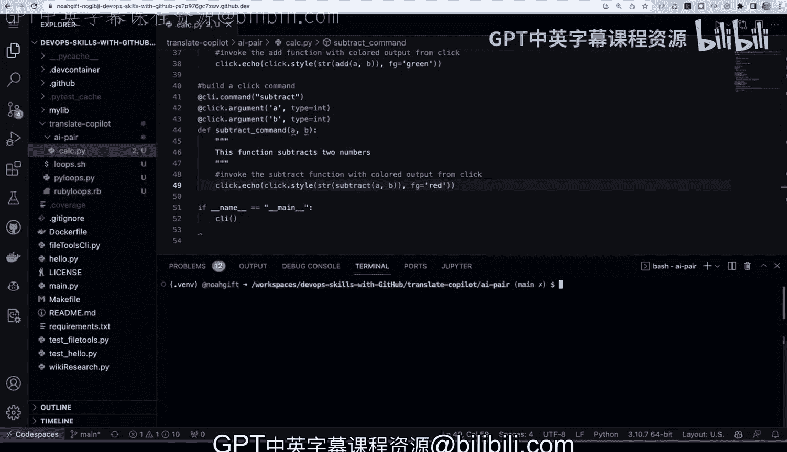

# 杜克大学《Rust编程4-5（Linux命令行工具、LLMOps）｜Rust programming》中英字幕 p111 23_01_09_演示：GitHub Copilot.zh_en -BV1Hy411q7Zm_p111-

All right， I'm in a repository here that has been enabled for Copit。

 let's go ahead and see how that works we go over to this section extension instead of codespaces we have GitHub Copilot labs。

 and this enables us to have experimental features including the ability to translate code。

And we also have enabled Github Coilt。 There is two versions， Coilt and Coilot nightly。

 I have the latest version。 We're going to try both of these extensions。

 So in order to get started here， let's go ahead and take a look at this Github Copit labs。

 What this does is allows us to translate code。 So if I click on this。

 we can see that if I toggle this， it'll translate it。 So in order to get started with it。😊。

What I can do is I can actually copy some code from an existing repo。

 So I'm going to call this loops。Like this。And then I'm going to go over to another repo here and just grab a little bit of bash code。

And I'm going to put this into this file。 So I'm going to go over here， go to loops， paste it in。

 Now that I've got a little bit of bash。 In fact， we can even run this。

 I can just type in bash loops。I love eating healthy snacks like this apple right we've got this thing ready to go。

 And now if I want to translate this， and I want to understand what it would be like to do this in Python。

 I can go over to Coilt here。 And if I go to language translation， look it's pulled this up。

 So it's able to highlight the text here。Now， Python would be a good one to play around with。

 So this is always a good idea to make it into a translate directory。

 So we can say maketer translate。Copit。And then we can move in。These loops into translate a coilt。

 that way， everythings in the same directory。 And then I can go into this translate copilt directory。

And from here， if I ask copil it for a suggestion， it gives me a good example right。

 and so I can now make a Python loops， and we can call this P loops。Dot P。Do the same thing。

 We go over here。And we can find our translate coppit， our pi loops。And let's just try it out。

 but I go ahead and I say Python Py loops， we get the same thing。

 So really is a pretty awesome way to learn a new language。

 especially if you have competency with one， and it really gets you the ability to move very。

 very quickly。 In fact， we can go beyond just Python and bash。

 We can really quickly go back to Coilt here and we can grab this code and we can say， look。

 now I'd like to translate it into Ruby。😊，Let's go ahead and do that。

 So we'll go to Ruby here and look， we also can do a very easy Ruby script as well。

 So we'll go ahead and and do。Ruby loops。Right dot dot RB right so so pretty straightforward process here to translate between different languages and it really is a great experience。

 Now， the next thing that I'll take a look at is how would we actually build out a more sophisticated workflow by having co pair programming with with Copit。

 And that's really the idea here is it's like another developer。

 So we're going to call this AI AI pair。And I'm also going to well let's make this directory called AI pair。

 And I'm also going to seed into that directory。 Now， what I'll do inside of this。

 this AI pair directory is I'm going to create a file called Calc。

And this will be a file that we can actually ask Copit to help us out with。

 And so what I can do is even help the prompt here get a little bit better。

 And so we can say from here at the very top of the file what it is we want it to do with say add this module。

Is。Used。To， to create。Calculation。Calculations。Functions。

Such as addition subtraction right and the prompt will kind of get better and better as I as I tune it。

 and we can also go through here， and we can do this。 We can add the sang line。

 which will tell it that we're also going to eventually turn it into a script。

And then we can actually go through here， really quick。And make it executable。 So now we。

 we should be able to just run it like this。 And so to get started。Look， it's it's pretty smart。

 It already knows what it is I want to do。 And this would be similar。

 right if I was saying this to it to another human。 and once we've got that one done。

The subtract function comes in and so on and so on。

 Since we already have a couple that's good enough。

 What I want to do now is start to tune the the direction this code is going and also tell it I wanted to build a Cammeian tool say this module will also。

Be invoked。As a command script， using click。And so now we're again， kind of seeding things here。

 And we'll just say import click。And now to use this， all I would need to do。

Is is tell it that I want to make a group。 So I would say build a click group。

And it would go through here and build out all the boilerplate code for me。

 So I don't have to write all this boilerplate code。 And it'll even help me write the suggestions。

 And we can， and we can go through here and we can say， this is a calculator。Calculator。App。

 there we go。And now that I've got that built。What what I can also do is now build out the commands and it's smart enough to know where I'm going and I just need to be able to be flexible and fill in the parts that it doesn't know how to fill out perfectly and then the next thing I'll do is I'll build the second command。

 which in this case it's smart enough to know the direction I'm headed。

And we can actually go and build out the rest。 There we go。 Subtract command is going to use this。

And now all I need to do to， to build this out is， is invoke it from the command line。 Now。

 let's go ahead and try this out real quick。 We can do help。We have the add function。

And we can do two and2。There we go。 and we can say two and 6。

 right And we can also do the subtract function。Now， if we want to make it a little bit fancier。

One of the things that we could do that would be pretty easy is we could also make it printed out as color。

 so what I could do is I could just tell that to our coilt。

 which has a lot of borderplate code memorize and say invoke the add function with colored output。

From click。There we go。 And now it just tweaked it a little bit。Perfect。

 and then this one probably is going to be smart enough to know that I want to invoke it with colored output。

 exactly。And now， if I go back， we've got colored output。Right for each of these tools。 so very。

 very straightforward way to use Copit is to gently prompt it and have it build things for you。

 and this calculation till you can see how quickly it can help you build out boilerplate code。

