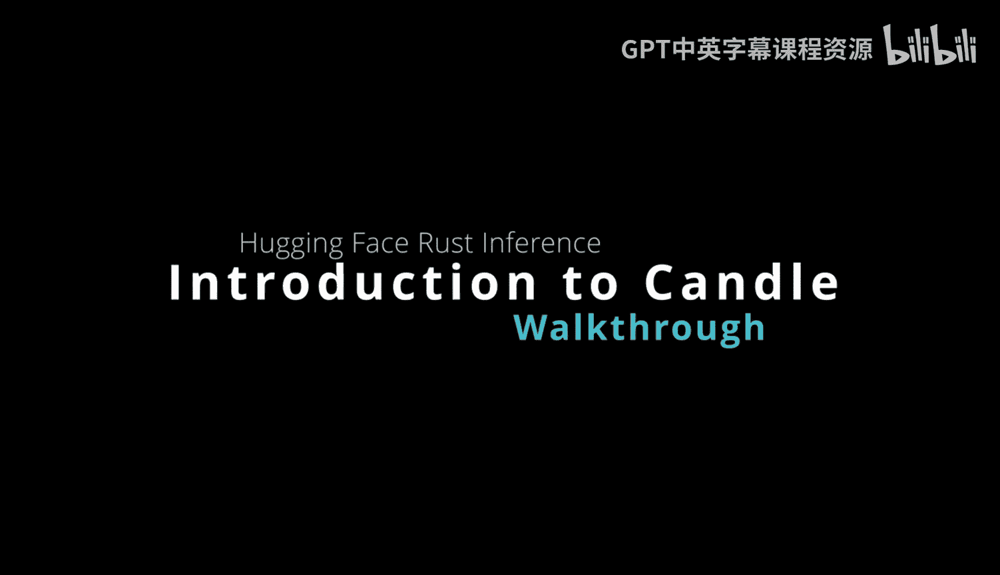
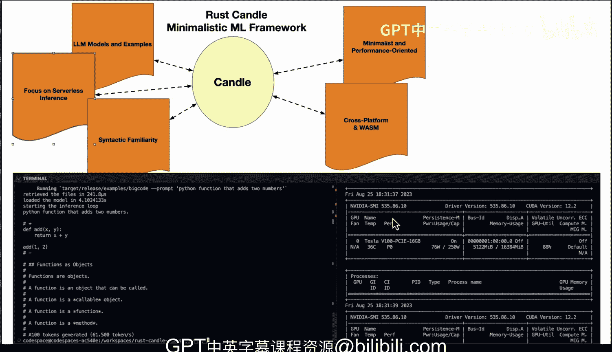

# 杜克大学《Rust编程4-5（Linux命令行工具、LLMOps）｜Rust programming》中英字幕 p112 24_02_01_Candle：Rust极简机器学习框架.zh_en -BV1Hy411q7Zm_p112-

Okay。Here we have Huging face candle， which is a very powerful but minimalistic framework for rust and it's focused on using GPU support and also doing very easy demos。

 for example， there's online demos of using whisper， for example， to transcode audio that are great。

 or you could even go back and do one liners for most large language models。

 So this is really the power of rust all put into a framework that is sponsored by hugging face。

 So if we go into an overview of what we see here you can see that this is a view of the release here with a Python function that adds two numbers and I'm actually able to get results from their big code model here。

 which is a homegrown large language model for coding from Huging face。

 you can also see that saturating the GPU using the Github codespaces ecosystem So let's talk a little bit about rust。

Candle here and some of the things it does so first the minimalistic and performance oriented on the right here。

 if we talk about what it does， it is a machine learning framework designed for rust。

 so the minimal design allows us to do GPU and high performance and ease of use。

 but you also can do other machine learning task like matrix multiplication。

We also have an extensive library of models and examples。 So there's tons of examples here again。

 Most of the common large language models are able to be invoked here and you can do text to image models like stable diffusion。

 and then in terms of cross platform support and browser compatibility here。

 you can see here that it also has that ability。 So what this means is that you can use web assemblymbly to put webbased versions of things。

 you can use CPU， you can use Cuda。 So really it's got a lot of options here for deploying your model。

 So you build one deploy mini and then if we look at the focus on the serverless inference。

 So what's really nice about removing some of the heavyweight things like Piytorrch is that you're going get a smaller binary and you're going to potentially be able to deploy this onto platforms that do serverless options like for example。

 AWs Lambda could be a target for some of the large language models。 and then finally in terms of。

it's similar to Pytors， so it should be easy for people to you know who have a familiarity with PyTs to go right into this framework。

 So really an exciting framework with lots of potential here and you can see that it's trivial to execute large language models if you have GPUs enabled but also supports CPU execution as well。

