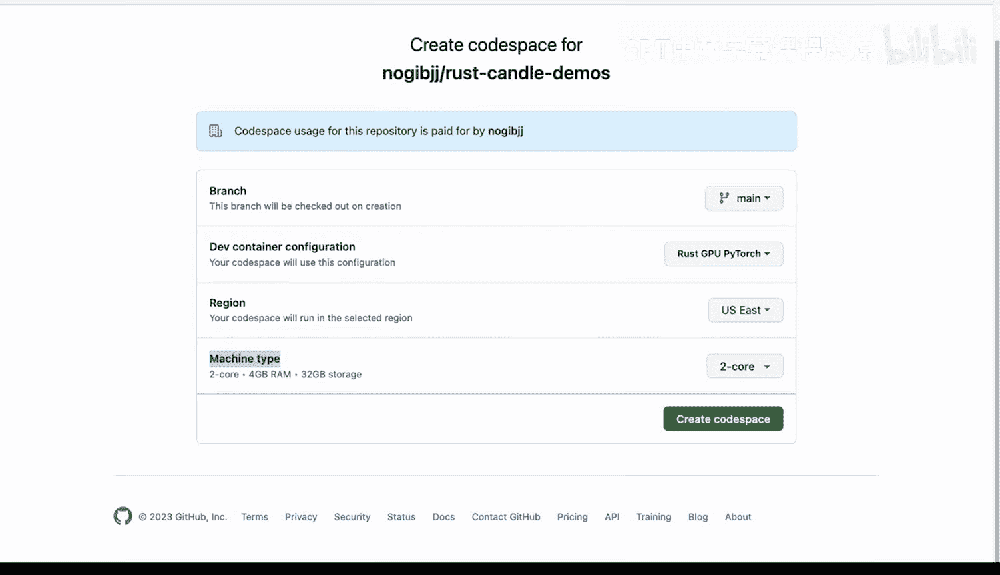
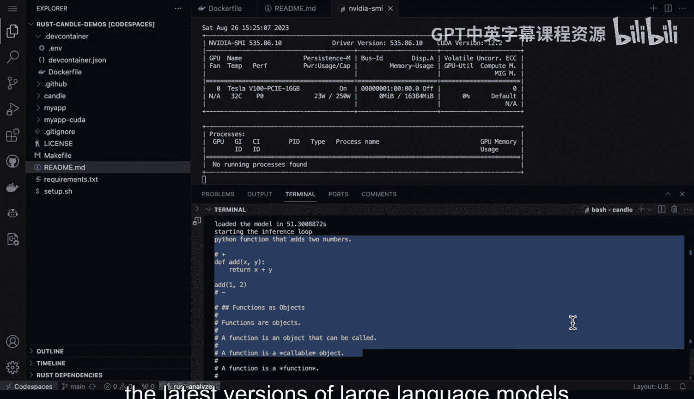

# 杜克大学《Rust编程4-5（Linux命令行工具、LLMOps）｜Rust programming》中英字幕 p113 25_02_02_使用GitHub Codespaces进行Rust Candle GPU推理.zh_en -BV1Hy411q7Zm_p113-

Here we have the examples from the rest candle framework here that allows you to do a really simple inference by just passing in Cargo run D example and the large language model like。

 for example， Falcon or Bt， etc。 Now one of the things that's cool is that you can pass in the dash features Kuda to make it use the GPU。

 which obviously is going to give you much better performance for inference。

Here's the problem though。 Where would you get that GPU。 Fortunatelyly， with Gitthub code spaces。

 you can actually get access to a GPU。 Let's go ahead and take a look at how this is accomplished。

 So first step here， I have a repo and inside I have a dev container。

 This dev container contains three files。 First step， we have an E and V。 So this could be。

 for example， my passwords， etc ceter for a local environment。 and then I also have a docker file。

 This docker file does all of the heavy lifting for this code space and let's go ahead and walk through some of the things it does。

 So first up， we have the rust dev container here， which is nice because I don't have to worry about rust anymore。

 Then we go through here and we install some packages。Including things like clang LLD， etc ce。

 Now there's some other things that are also pretty important that you may want to install depending on your project。

 So I have FFm pigg for doing things with audio for example。

 if I'm transcoding I have a GCC and then here's another big one is the Kuda tools as well。

 So the Kuda toolkit and then Kuda and VCC once I've got all these in here then I can actually also do other things。

 for example， maybe automatically create a virtual environment for Python and get rid of that problem。

 So the other configuration component here is something called devcontain Jason and this section here。

 this is really critical to get the Kuda environment working here is that I actually am able to say install Kuda true And so this can use both Kuda and also the Kudin in and if we look down here as well。

 I can also。Customize my environment with， let's say。

 post setup operations as well as extensions like copit or Vs code， make file tools， etc cetera。 Now。

 if we look at this post createre command， this means that after the codespaces is set。

 it'll run these commands。 So what do I have in there， let's go and look at what I do。 okay。

What I do is actually set the path to Kuda just to make sure it's all good there。

 And then I finally write that out to the bash RRC。

 So this is nice because that means that in theory， if someone forks my environment。

 let's say somebody else that wants to run codespaces。

 it should just work and they can actually get things cooking。 So how it actually start a codespace。

 well， if you go here， what you do is you go to code。😊，Go over to codespaces。

 And if we go to this section， we say new with options。 Check this out， you go to machine type。

 And here's where you would pick the GPU。 So in this case， we can say six core1 GPU。

 and this gives us a machine that is actually perfect for doing deep learning work。

 and especially with a language like rust， which is very performant for inference。

 we get 112 GB of Ram and also 128 GB of storage and a GPU。 And then if I go over to this framework。

 Here we go， we got everything cooking here。 So let's go ahead and kick the tires here a little bit。

 First， let's double check that we've got rust working。 So you do rust C dash version。

And this shows us， yep， we have rust working here。The other thing to pay attention to would be to double check that the NviD environment is working。

 So what I typically do what would be， I would say， type in NviDdia。SMI。And this shows us， oh okay。

 great。 We actually have the coa driver and it'll tell us what version of the couda driver And if you do the dash L1。

 this will loop。 And so if I was doing inference， for example。

 I could watch it almost like top for your GPU and it'll show you how much GPU is being utilized So this is important because if you're not sure if the code you're working on is invoking the GPU。

 this is a great way to double check and make sure that it's actually happening。

 drag that terminal up here and then type in the NviDdia Smi L1 and there it's gonna sit there and wait for inference and we'll see that it's going to hit this shortly。

There we go。 We were able to see that it was able to hit 8%。 Now。

 another fun one to play around with if we go to the readme file would be to do something with the star coder。

 which allows us to build a code example。 So let's do the same thing。

 Let's go ahead and do a little bit of more heavyweight thing here and run this。😊，Command。

 which allows us to do a Python function that adds two numbers， let's run it。

And then also open this in the other tab so we can see how much GPU it's using。All right， here we go。

 we see that it was able to peak out at actually 80 something percent。

 so it was heavily utilizing the GPU for that inference and that's why it was so fast。

 so this is a great way to get started with really kind of going to the next level with large language models is to run them yourself use a tool like the rust candle framework to actually invoke the latest versions of large language models and also check the GPU workload。

