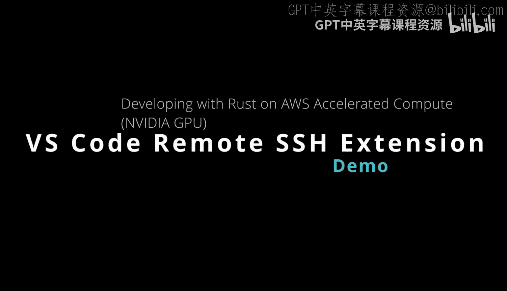
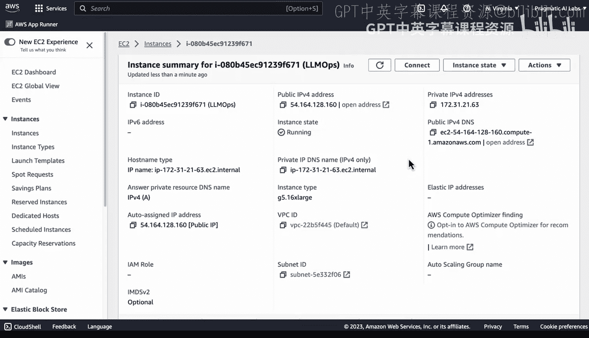
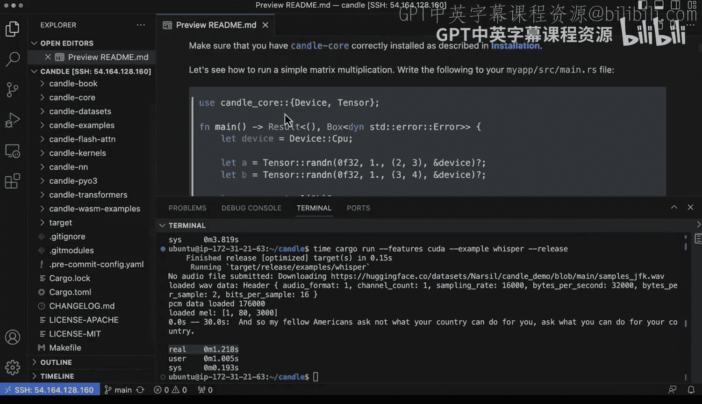

# 杜克大学《Rust编程4-5（Linux命令行工具、LLMOps）｜Rust programming》中英字幕 p114 26_02_03_VSCode远程SSH开发与AWS加速计算.zh_en -BV1Hy411q7Zm_p114-

Yeah。Rust is a great place to start for doing high performanceformance modern LLm ops because rust is one of the fastest languages in the world。

 It doesn't have legacy issues with a scripting language and it can do inference with just one command using cargo。

 One problem though is where do you run this。 If you need to have a very powerful GPU this can be an issue because not everybody has a powerful GPU。

 Well， one of the ways you can do this is via remote development and using Vs code。

 So what you would do in this scenario here is first go to AWS set up an E C2 instance。

 you'd have to pick the right one。 then go ahead and install Vs code and the remote SSH extension And next up SSH into EC2 then install rust via the rust up command just a one liner then do a Git clone for the candle repo and you're ready to run inference really it's that easy and you can do all of this actually via VS code locally。

Let's go ahead and do a demo。 So one of the things that's a little bit tricky is to figure out what is the exact version of an accelerator compute to use there's a lot of different options here and in this particular scenario here we can see that a G5 is a pretty reasonable machine because it uses AMD which are cheaper processors and you can see here one of the things I like is that I don't have to necessarily pay for 8 GPUs when I just want to do some testing on a modern GPU so I'm going go ahead and grab a big one like this which seems like a reasonable machine to use here which is a G516L large So if I go back to this page here you can see some more information about it now if we go to the EC2 dashboard here。

 you can see here that if I select this instance， one of the things I could do as I could control it here or I could even go to instant state and actually change for example。

 the kind of machine etc these are all things that I can do。While I'm running it， but in this case。

 all I need to do is do an SSH to this okay， let's go ahead and take a look at visual Studio code now and I can actually connect to that machine if I want to。

 so again， the IP address is that。 So it's gonna be 54164128160 So in order to connect to that box what do I need to do first this extension right here needs to be installed。

 So we need to install remote SS I've already got that setup great Now the other thing I'll need to do is go through and do my command prompt and and actually go for SSH here and say add new SS host so let's go ahead and add that host and what we can do is actually put in command that gets us exactly what we need。

 So what I typically do is just go to my shell and find a existing command that I use and just paste it in there so we can do that we can just go ahead and paste this in and you can see here that's that IP address but I'm giving it。

The Pm， which allows me to connect。Once you've done that。

 we can go ahead and select the host and then go ahead and connect。Now。

 the great thing here about this is it'll open up a new environment for me。

 and it allows me to really do whatever I need to on that remote machine。

 So the first thing I would probably do is open up a new terminal。 And this will open up right here。

 and we can double check that we're on the right machine。 So in this case， I can say you name。😊。

Dash a perfect。 And this is a big monster machine and we can even see， for example。

 the NviDdia stuff going on SMI， we can see here that in fact it is an NviDdia machine here that's running the latest versions of Kuta great。

 and we can see the NviDdia information here as well， including the model。

We've got all that going really at this point we're ready to start developing so what we can do is say first of all。

 C into the checkout， which I have the inference code and I also could remotely connect to a folder so we can just go ahead and say candle。

Okay， and what's great about this is that allows me to really act like I'm working locally on the machine。

 look at different code examples， build things out， etc ceter。

 which is really cool and I can act like this is really my machine， which which in this case。

 it really is a seamless experience。 Now again， if I go back to the terminal here。

 what I really want to do is actually dive into running one of the commands that will do some kind of inference for me。

 So let's go ahead and do that。 there we go。 Now you can see here that if I run it again。😊。

The inference is very fat。 So this shows how the power of the GPU is really helping me out。

 And if I wanted to， I could run know further examples here as well and and we can see some of the other demos。

 for example， if you wanted to run birds or star coder， etc cetera。

 we can actually do all those and again， treat it just like my local development box。

