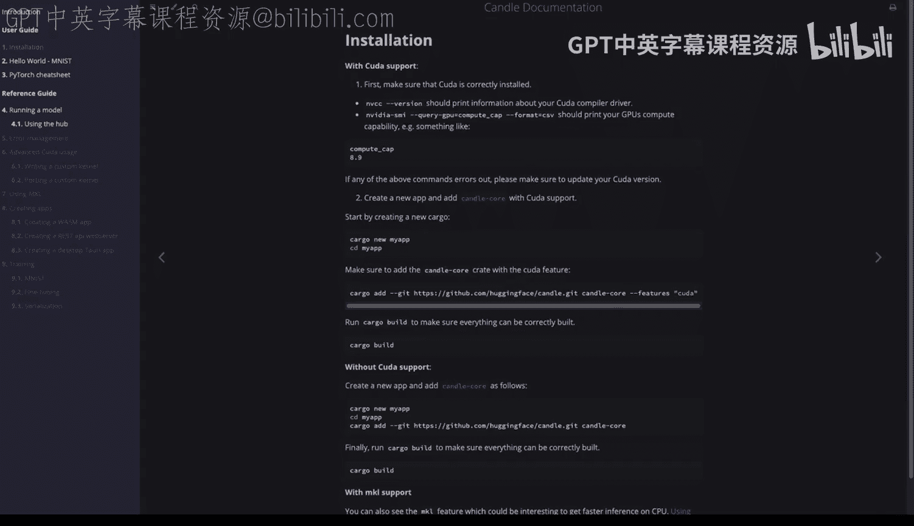

# 杜克大学《Rust编程4-5（Linux命令行工具、LLMOps）｜Rust programming》中英字幕 p115 27_02_04_构建Candle Hello World.zh_en -BV1Hy411q7Zm_p115-

Allright， here I have a Github codespace that's got everything set up to do GPUbased development and rust。

 I can type in R C digest version。 that's installed。

 I can also type in make verify and this shows me the compute cap and also shows me that the Kuda compiler driver is there。

 So next up， what I'm going to do is I'm going follow the huggingface rust candle documentation and I'm gonna to say cargo new my app。

 Okay let's go and do that cargo new my app。 right， next step we'll go ahead and CDd into my app。

 And what I like to do is just copy my own make file into a project。

 So we'll say let's look above us and put the make file down here that way I can use all of those commands and use shortcuts and then at this point we can just do cargo build and it'll be ready to go。

 So if I don't want to add the Kuda support though first， let's build it without GPU。

 let's go ahead and do cargo a command。

So this is kind of nice。 all I have to do is type in cargo add and it adds in the candle interface here for us。

 All right， and then at this point， if we look at the source code。

 you'll see there's a main file here。

It just says， hellello world， This is really just getting installations set up here。

 And then we can just type in make build because I need to put that into or make file。

 Let's go ahead and do that。 Let's just do build。And you cargo build。Make build。Perfect。

 and now that it's built， the other thing that we can do is just do a run to verify that everything is working correctly。

Perfect， so that installation worked successfully。 So let's go ahead and build one more。

 So let's type in cargo new my app。 This time we'll do it with Kuta。

 and we'll seed into that Kuda app direction， and then we'll C P again。😊。

A make file so we have a nice scaffold for whatever things we need to do in here。

 and then the only difference is we're going to have to add in the kuda feature， right。

 which is going be pretty straightforward to do。 let's just go ahead and type that in。 All right。

 now I've gone ahead and added that feature， which is ka。

 And if we go over to the source code for this。And we look at the cargo dot2 M L file。

 you'll see cargo candle core with Kuda。 That's it。Same thing here if I wanted to。

 I could just instead of adding it to the make file for speed， I'll just say cargo build。

And we can even do and cargo run。Put it all together。 And this will actually verify that couda works。

All right， we're all set。

