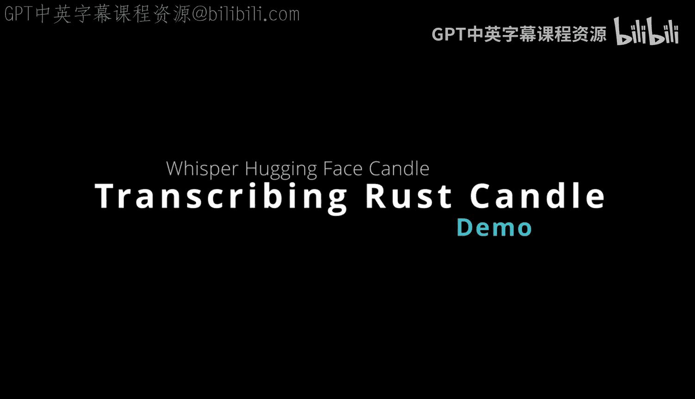
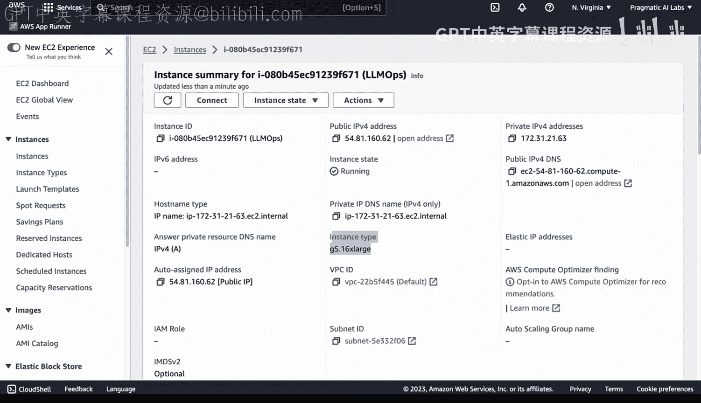
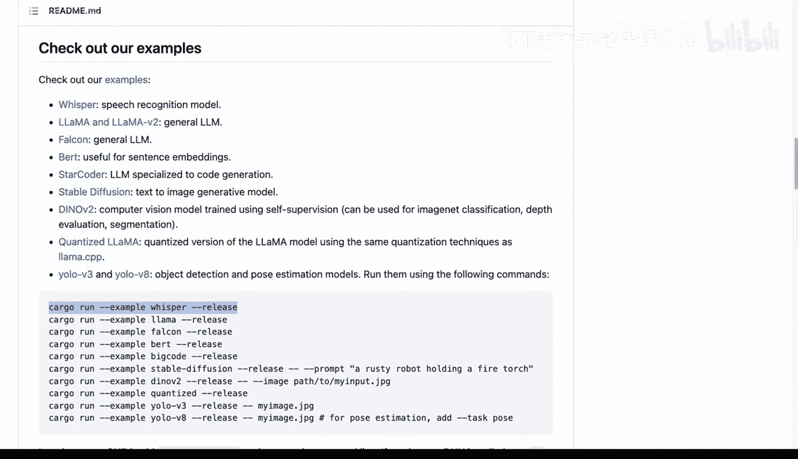

# 杜克大学《Rust编程4-5（Linux命令行工具、LLMOps）｜Rust programming》中英字幕 p117 29_02_06_使用Candle Whisper进行语音转录.zh_en -BV1Hy411q7Zm_p117-

One of the emerging new things that people are looking at is using preting models for automatic speech recognition。

 so Ws largege is a good example of something you could use without any fine tuning and you could actually go in here and look at the different kinds of parameters for example。

 maybe a medium would be 769 million parameters or a large。

 whatever it is you're trying to do now the question though when you're using tools like this is how do I run it Well。

 fortunately with huggingface candle here， you can see here that this framework is a minimalistic highper framework that includes GPU support and in fact there's examples of using whisper right here so in order to do that let's dive into the source code a little bit。

 look at a whisper， look at the main notice that it's actually using clap which is a commandland tool parser and we can look at some of the parameters that are both constants or the ones that can be passed in here。

As well so we could dive into this and kind of play around a little bit with this new emerging tool。

 So how do we do this？ Well， I would recommend getting an EC C2 instance that has a G5 instance type these are the newer Nvidia GPUs。

 This one happens to be kind of a monster here with 64 cores and a very fast GPU。

 And so I'm going to go ahead and dive into this using visual Studio code remote， How do we do that？

 Well， let's go ahead and dive into the remote here。

 and we can see in this terminal right here if I stop it。

I've actually got NviIDdia， SMI。Dash L1。 So I'm looking at the GPU and we're pretty much ready to go。

 Now， if I want to actually go through and first， I guess really kick the tires on how the candle interface works here with whisper。

 Let's go ahead and look at one of the examples here。 So we have one right here。

 which is cargo run example。 So let's go ahead and fire that one up。 So first up。

 we can do that cargo run example perfect。 Now， notice what it says here says running on CPU is still ran very fast and it downloaded a sample file here。

 So this is okay。 But why don't we try to do the features Kuta。

Okay， how would we do this just to control a， get to the beginning and then do dashs features。

And then now we can use the GPU and we should be able to see this thing when it's compiling actually target this particular。

 there we go， 48%。 So it's able to use half of the GPU here， which is great。

 Now we can do even better though because there's another feature called CdNN。

 And this is for basically couda4 neural networks。 and it's even optimized for these kinds of operations So we can go further here and run it and look it's even faster and able to utilize it and it's able to be a much more efficient way to do inference。

 Now， this is okay。 But what if we wanted to actually know dive into some different formats and styles。

 Well let's go ahead and take a big command here that I have previously and we'll kind of play around with it and see if we can get to work so。

😊，Here's， I'm going to use the hash like that so it get stored。

 And I can kind of profile some of the things here that I'm working on。

 So in the directory above here。We've got some audio files。 I've got a wave file here。

 I've got that other sample wave file， right， so we can actually play around with these a little bit and see if we can get something working with custom flags。

 So I'm going to go back into candle， go here and go to this。APrevious thing right here。

 And then look at some of those flags。 So we'll say cargo run dashsh example， whisper。

And then we can say profile released with Dbug。Perfect， and then for the input。

 this is the important part is I'm going to have to tell it where that file lives。

 So I'm going to say up a directory。 and I've got this four score wave。

 And now this one is an interesting one because it says model medium。And we'll go ahead and do that。

Medium English， and then we'll do dash task， and then we'll say transcribe。Perfect。

 now this is going to optimize this for those particular flags here。

 and we're going to compile it and run it again。All right。

 so we've been able to get this to work with CPU， but it's a little bit sluggish。

 so let's go ahead and switch on our extremely powerful machine here because if we go to H top。

 for example， you can see sure， it is using a lot of the cores here。

 but I think we can do better with the GP。So if we go up here or here。

 we can go to run and again do dashsh， and we can say。Features。But C DN N。

And we could probably get rid of debugging as well， and that might speed it up。

 let's go ahead and try that flag。And let's do it again。Well， look at that。

 We are able to get the GPU here hitting up to 70%。 So very， very fast inference。

 And if we run it again here。Let's go ahead and try it。It's going to immediately do the inference。

 hit the GPU and you can see that this is a reasonable workload for people that are going to。

 maybe spin up a machine using AWS batch and then transcribe a huge amount of data for some other data processing system they're building。

