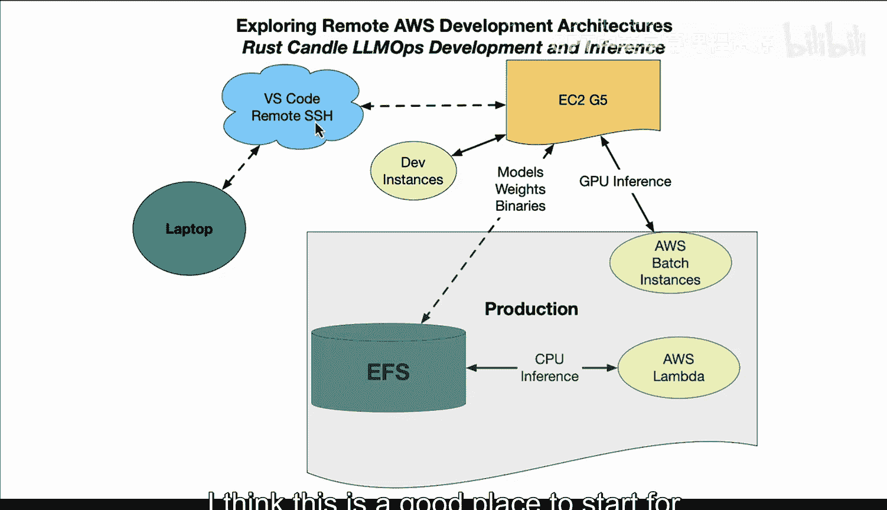

# 杜克大学《Rust编程4-5（Linux命令行工具、LLMOps）｜Rust programming》中英字幕 p118 30_02_07_探索AWS远程开发架构.zh_en -BV1Hy411q7Zm_p118-

Let's take a look at a rust and hugging face candle asynchronous development workflow。

 How would that look。 First up， you have an E2 G5 instance here。

 What's great about that is it has the power to do modern GPU inference and you can actually use spot instances as well to save money。

 But in development， what you can do is actually use an instance you stop and start。

 and you can connect to that instance via visual studio code remote， which is a great way to develop。

 really just install the plugin。 you're ready to go and your laptop can have access to that。

 So what it means is that you can start developing code into a cloudbased environment that's very powerful And you can use it and pay for what you use versus buying。

 let's say， a $40000 GPU。 Now in terms of production， here's where things get interesting。😊。

You could also be codeveloping with EFS。 so the mountpoint could sit onto your development box。

 but that same mountpoint could also be used for production。

 You could download these huge models and weights and these things can be gigabytes and gigabytes of data and you can actually use that as your location for staging this data through production。

 then when you do a deploy to Ews batch， it itself can provision E C2 G5 instances and you can actually do really modern rustbased inference using these powerful GPUus in a very efficient way and elegant way with very little costs。

 So you don't need notebooks， you don't need Python， you do this in a pure rust way。

 Now another thing to think about is if you've compiled your code in a way that target CPU as well。

Your AWs Lambda could read that binary right off of EFS and actually serve that production instance out as well。

 So there's a very really incredible I would call it emerging Ru story for LLM ops and MLlOs。

 And what it really means is that you're open to doing new things。

 new ideas looking for efficiency And with this particular architecture。

 I think this is a good place to start for many companies that want to serve out LLMs。😊。

