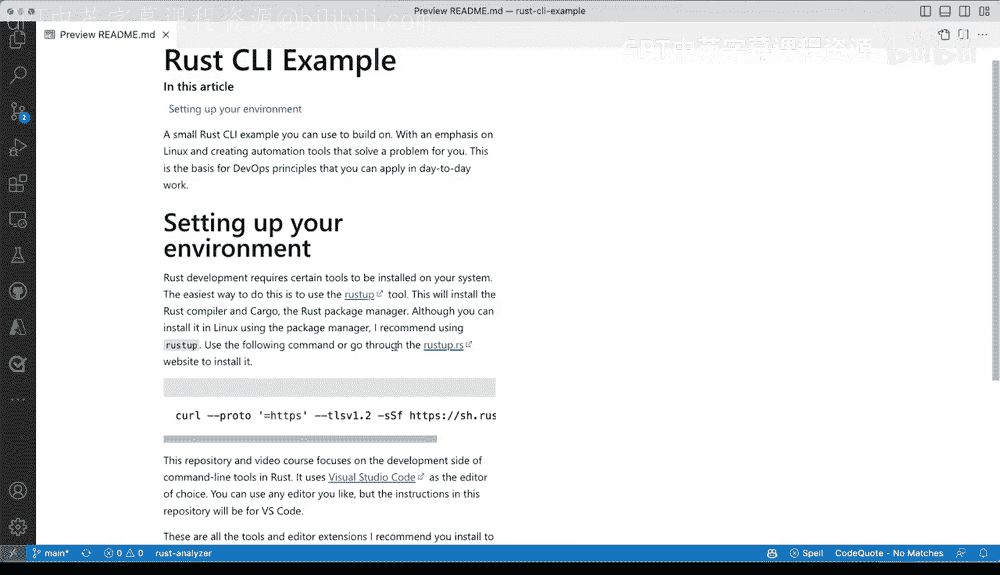

# 杜克大学《Rust编程4-5（Linux命令行工具、LLMOps）｜Rust programming》中英字幕 p12 12_01_02_搭建命令行开发环境.zh_en -BV1Hy411q7Zm_p12-

Let's take a look at what a rust development environment would look like in real life like with a real example you're building commandline tools now this is different in many in many ways from Python so unlike Python where I didn't cover specifically how to install it up will cover how to install these with rust now just a quick reminder that installing rust is only needed for development environments。

 once you build once you release a binary one stats already created then you don't need to have rust installed in your target systems now this is a perfect reason why you want to prefer something like rust when building command tools it is because you not have to use tools like curl or this call to the shell to install your rust environment。

Let let's go through how that would look like let's actually go ahead and copy this whole command here and let's say control C and thenm going I open up a terminal and I already have installed rust I'm going to paste this and you will see that it will go through certain prompts now let me scroll all the way to the top We to rust it will create a couple of directories one is the rust up cargo which will go into later details。

In details later， once we cover some of the things that happen there with cargo。

 which is one of the tools that we will use to install。

 build and create dependencies and all of that good stuff。

 And then you'll have a bin directory which will be added to your path which in fact。

 is actually covered right here where your shell environments will get updated so that you have access to those paths Now like I said。

 I already have that installed in your system， it might look slightly different if youre if you're using Linux in this case I'm using no1。

 but it doesn't matter if you're using Linux， you might be tempted to use the package manager。

 I highly suggest you don't and you use rust up like I doing right here for my system Now I already have it installed I'm not gonna go through all of the steps you can go through that I'm going say I'm going select number three and canceled installationulation and be done with that next when I want to show you is I'm going come back to。

All of these shell environments， and I'm going to close them up for now。

But wherere again in Bi Studio code， that's what I recommend the extensions for Vi Studio code are pretty important because theyll allow you to use rust and develop rust。

 So Bi Studio code has the ability to install an extension here and in this case is the rust analyzer so let's quickly search for it。

And it's this one right here， so I'm gonna to click on the rust analyzer。

 I already have it installed if you don't have it installed you'll be able to select that from here and it will give you very good feedback when you're developing beyond just code completion which you also get with the Python extension when you're writing Python and doing some auto completion that's fine。

 but you'll get also the references and some of the searches that are available for your own code as well and you'll get documentation when you're hovering over some types and even some definitions as well。

Now， beyond the rust analyzer， which you will also check for any problems you have with your code。

 I also want to make sure that you have a Githubpi installed now if you're a student you can get these for free。

 but otherwise you will have to pay for the service。 So if you have it installed。

 it's not only require you to have it installed but available for your account。

 And once you have it installed and ready to use， you'll have these little logo here at the bottom that will indicate that you're good to go allow you to write faster。

 if rust， if you're comfortable with Python and not rust and you want to try rust Well。

 a Github pilot is an excellent excellent way to try to to get to where you want to be with solid recommendations and code suggestions that might allow you to go faster。

 Now， beyond that， let's explore very quickly， I'm not going go into details as to what the code。

I actually doing。 I'm going to open up the file Exper some of the components that we're gonna be dealing with beyond the readme and the license。

 there are a couple of cargo files。 These cargo files are related to packaging I'm defining my project dependencies here。

 does happen automatically with a special cargo commanded will go into details later。

 then the cargo that log lists the dependencies I have the dependencies and freeze them to exactly what are exactly the things that are needed for my project to work。

 The gi ignore is just a regular version control system get ignored that also gets auto generated by cargo you can still you can now see that the cargo is basically everywhere right like this was automatically generated by cargo。

 we have the cargo log， the cargo Tail file Now actually I skipped over that。

 it defines my package which is block Rs similar to the Python project that we saw before。

Will use the same underlying example， the same problem that're going to solve。 Next。

 you're going to have a target directory when you're building your ra binary those will get in there。

And there's nothing to that directory other than all the files that will get produced when you're building。

 you're compiling， you're creating your binaries。Most of the components。

 most of the files that you will be working with are in SRC。 That's where your rust files will go。

 And optionally you can have a directory called examples where you can put in things that you may want to provide examples for your project。

 even your command line tool and we'll have those in this project certainly as well。

 So let's very quickly take a look at main directRS。

 I'm not going to go through the details of the project just yet。

 Gt is just an introduction to the development environment So let's see what are some of the things that we're going to be doing here。

 Now I mention three things that we're going to do with cargo。

 I didn't say exactly what are those one is format。

 the R one is Cpy and the other one is check So let's assume that without going into the details of the actual code and what is actually happening here。

 let's open up a terminal。And I'm going minimize these and if I say which cargo I can verify that cargo is indeed installed。

 So first the first thing that we're going to do is use cargo format and the name in the cargo FMT actually for short。

 and what that does， I'm going to close the file Expr here what it does is that it gives you a normalized way of formatting your code so let's assume I have that oops have that right there。

 sorry I scroll over there let let me move this out of the way so let's say like on purpose。

 this very odd very， very odd formatting formatting here。

 let' let's see what we can do so let let's assume hey I have no idea about rust and I'm making some changes here。

 if I do cargo FMT which is cargo format everything you will get normalized to a style that is common。

For rust code。 So it gives me confidence that even if I'm not doing things quite right。

 cargo format can make that happen for me。 next up is clippy。 So I'm going to say clear。

 and I'm going to say cargo。Clippy and type that and it will give me suggestions as to what are some of the things that I can try。

 So in this case， I have on line 4 something。 I mean， this is not an error， but it's telling me hey。

 you should probably want to use char here。 If you want to split the command。

 So how about we try to implement these let's go to all the way to line 4。

 which is right here and then make that change very quickly。

 I'm going save that and I'm gonna run cargo Clipy and cargo Clipy said hey。

 you know everything looks pretty good and you don't need to do anything else。

 Well that sounds great。😊，And that is how you can make sure that you're doing things right。

 especially if you're not very used to rust。 But even if you are a pro in rust。

 I highly recommend you use some of these calls to cargo that will allow you to get that done Now clippy and format and all these sort of things will get install in your system when you do the rust up command that I showed earlier。

 And the last one I want to show you is cargo check。 So cargo check will be a way of not compiling。

 but rust will try to see if there's any problems。 So say， for example。

 if I add a semi column here and try to save that and run cargo check again。

 we'll get errors with very fast errors with with cargo check Now one of the things is that the rust analyzer extension will call those out So you can see here I'm getting a red curly underline if I hover and I say what's。

See what's going on here with this underline。 you'll see that I have mismatch types。

 That is a problem with rust not that is a problem with problem with my code。

 that rust is telling me where it's coming from and that is coming from the rust analyzer。

 So the rest analyzer is giving me some examples， this is perfect and it allows me to do something there。

 So if I hover over the semicolon you can see that I'm saying， hey。

 remove these semilon to return its spell。 don don't try to do that So I'm gonna remove that save it and very quickly。

 everything goes away behind the scenes it is rust analyzer doing all that work for me and making sure that my code is well and is's doing good and it will actually compile giving me suggestions when not to do So that's very quickly an initial overview of your development environment kind of like the workflow it would have without going into detail as to what the tool is doing。

On rust specifically and taking advantage of the readme and all of the documentation that we've shared。

 So that's it， I highly suggest you use rust up。 The command is right there Otherwise you can go to the actual web website。

 which is rust up that R S。

