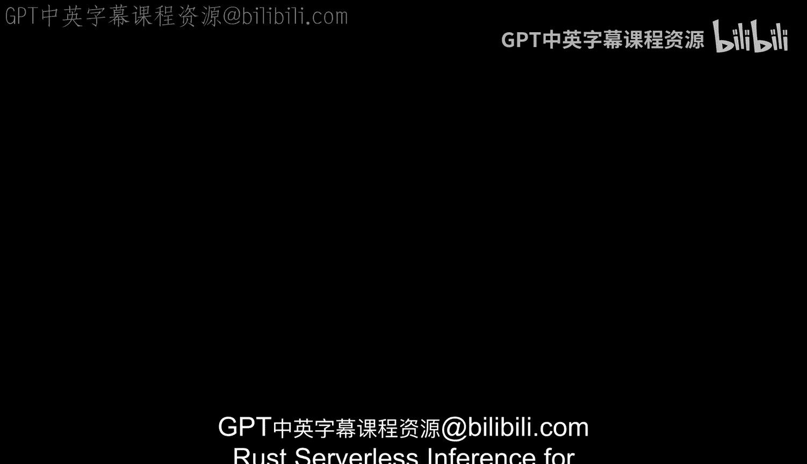

# 杜克大学《Rust编程4-5（Linux命令行工具、LLMOps）｜Rust programming》中英字幕 p120 32_02_02_无服务器推理.zh_en -BV1Hy411q7Zm_p120-

Rust serverless inference for large language models is an exciting new field。

 and it has many emerging traits that are interesting to look at。

 If we take a look at this diagram here， you see that we can deploy machine learning models for scalability。

 cost efficiency and you can use inference for a serverless architecture。

 The user input could include text images or other data and that would be passed you。

 let's say AWs Lada。 The function could contain the model and also the rust candle runtime for quantized models。

 the model itself is going to be quantized and what this means is that it's going to use reduced precision integer data types instead of 32 bit floats。

 This could make the model up to four times smaller。

 run the runtime as well in candle provides operations like， for example。

 Lama CPP that are optimized to run quantized models efficiently and the serverless functions。😊。

Autoscale to handle any number of traffic ensuring fast response times。

 The function would scale to0 as well。 So you're only going to pay for what you use and the small model size and no idle resources。

 make this very cost effective。 serververless billing is then going to be based on invocation。

 not on this really expensive GP that's always running and the quantized integer models would run faster。

 even on lower end and mobile CPUus really opening up emerging use cases。

 and there's not going to be a need for those expensive GPus for many models。

 The output is also returned very quickly back to the user and latency is minimized by the auto scaling。

 And the architecture will enable you to take an advanced M model and deploy it to production efficiently and a cost effective way and at scale。

