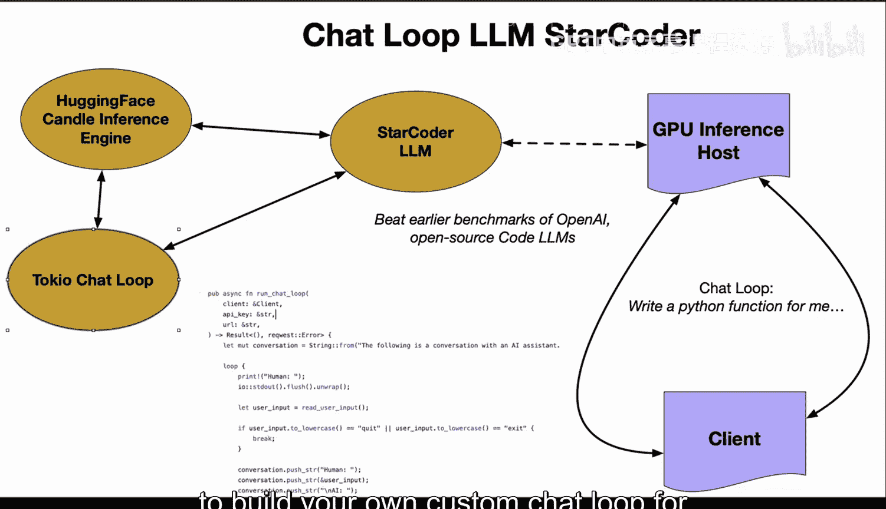

# 杜克大学《Rust编程4-5（Linux命令行工具、LLMOps）｜Rust programming》中英字幕 p124 36_02_02_StarCoder聊天循环.zh_en -BV1Hy411q7Zm_p124-

One of the more exciting things you can do with chat loops using large language models is build your own coding assistant with Huging face star coder。

 It has been able to outperform even earlier models from Open AI or competing solutions。

 and if we take a look at this particular example here here is how you could actually dive into and build your own custom conversational AI。

 So if you look at a prompt here， we would want to make some thoughtful response So you would call out to a star coder in point this could be hosted on a GPU instance。

 let's say AWSG5 and then the async request from the client would allow non-blocking asynchronous request。

 So the chatvat would be able to respond very easily Also you would be able to append each message pair to the conversation history to provide context for the AI and then the C adjacent Cate。

😊，Would allow you to do easy serialization using the J format。

 and we could leverage Rus's strong typing system and memory safety so that we could have confidence that the chatbot would be both robust and secure we also could use the hugging face candle inference engine to easily integrate that star coder large language model and we could build that custom Tokyo chat loop right so you can see here we have a pub async function that has a chat loop and we're able to actually loop through and respond back to the comments that are put inside。

 So really in a nutshell here it's very straightforward if you use these building blocks from star coder to huggingface inference to the Tokyo code to let's say open source clients as well around jascript to build your own custom chat loop for coding and you don't have to pay anybody。

