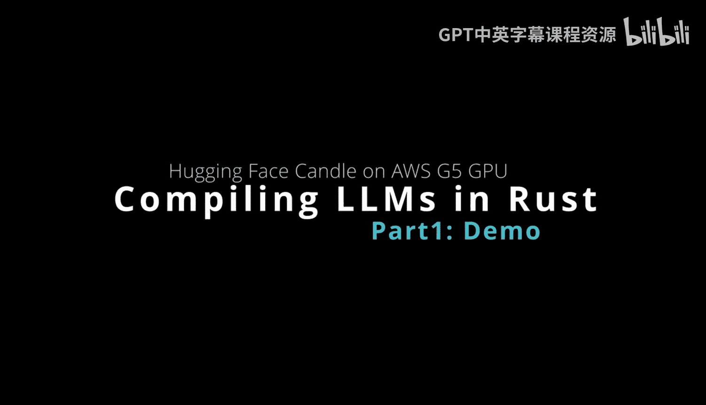
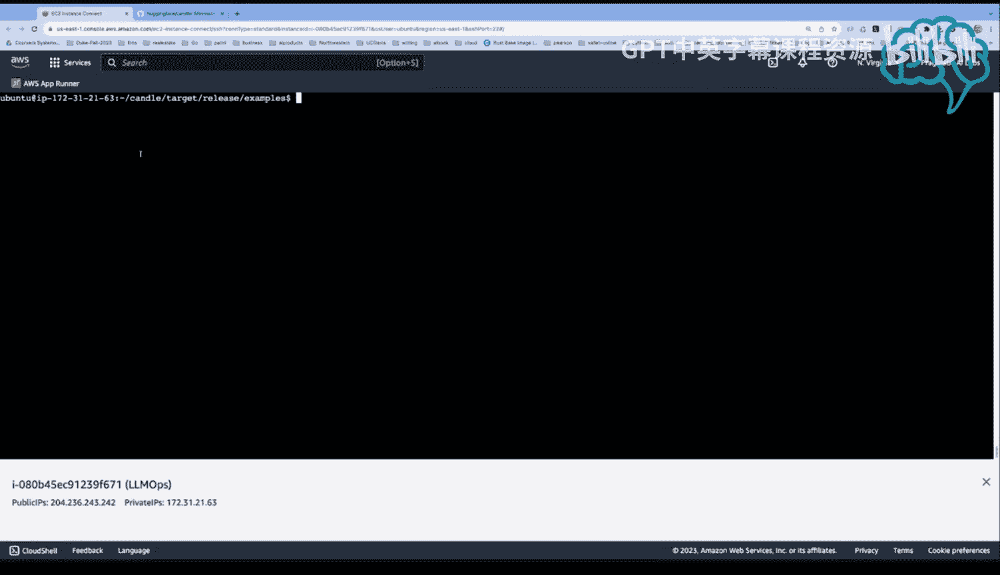
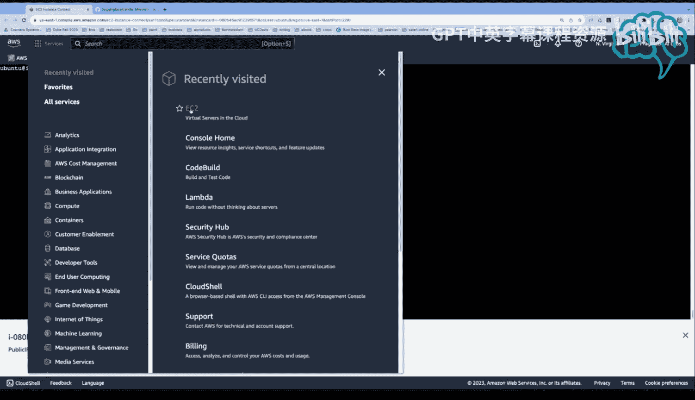
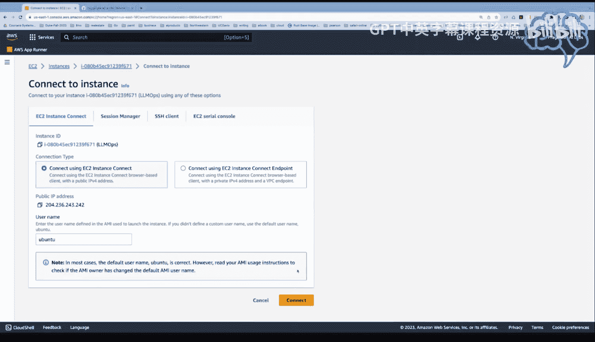

# 杜克大学《Rust编程4-5（Linux命令行工具、LLMOps）｜Rust programming》中英字幕 p125 37_02_03_在AWS G5实例调用Rust Candle（第一部分）.zh_en -BV1Hy411q7Zm_p125-

So this week， I'm going to dive into。A interesting scenario here where you can use the package management system in rust to invoke large language models。

 So I think everybody's talking about larger language models and how cool they are。

 But what's interesting is you'll see people。You know giving these really complex workflows。

 applications， all this you know complexity around running a large language model。

 but because of the beauty of rust and the cargo package management system you don't have to do anything you can just actually use the cargo system to invoke models I'm going to do this with huggingface candle and I'm going to do it on an AWS GPU that's a very powerful GPU so let's go ahead and take a look at how we would do that so first up here I've got huggingface candle let's just look at what this does So this is a minimalistic MLl framework for rust and you can see the code is really simple right but the biggest thing here and I think this is why it's so exciting and I would say probably one of the most exciting things and all of LLM ops is that you can actually run all of these large language models by just running one line so I don't know why more。

People are using this it's pretty exciting and let's go ahead and figure out though how to run it yourself so you don't have to you know pay someone to run larger language models or sign up for some API service etc。

 it's ready for you you're good to go so。How are we going to do this， So first up here。

Let's take a look at the console inside of AWS。What you would want to do in my recommendation would be you'd go to instances here and you would say launch instance。

At that point， you're going to want to pick， in my opinion， the base AMI。 So， for example。

 deep learning base AMI。Is a great place to start because it doesn't have extra software you don't need installed。

 So a lot of times people will look at it in a deep learning AI and it has a bunch of junk installed on it that you don't need like if we're using rust。

 we don't need Python packaging tools like Hoda for example all I want is I want the couda drivers and I also want coudin in。

 So CdnN to be installed， which is a optimized couda for neural network。

 So really all I need to do then is just go to the abuuntu deep learning base AM here which which is this one and then at that point once you launch it。

 the instance type then is going to be critical So what you would want to do is you would want to actually pick in this scenario you would want to pick the NviDdia based choices and if we looked at the different choices here we can actually。

Look at NviIDdia。Or we could say accelerated。Aelerated。So this would be let's just say V5。

Here go would be the family type and you can see that these actually have different choices here。

 but basically the G5s are the ones I would recommend and they have NviDdia already set So now that we've got that what I did is I went over to EC2 here and we can see that I've got a machine running and this particular machine has everything we need in it and and in fact let me just show you if I want to go back to E2 here real quick let's just see how I connect it so I go to instances I have one running here。

 which is called LLM ops and you can see it's a G516 X large and all I need to do to connect to it is just click connect and say connect using the E2 instance connect So I don't even have to set up SSH keys I don't have to set up anything I've just got access to it So once I've done that the only other thing you need to do is install rust So there's really one command you just say rust up right。

I've already got rust installed and we can do gas share version。There we go。

 the other thing to do would be to clone this hugging face repo so you'd want to go to code。

 go to local and clone a via ACDPS。

