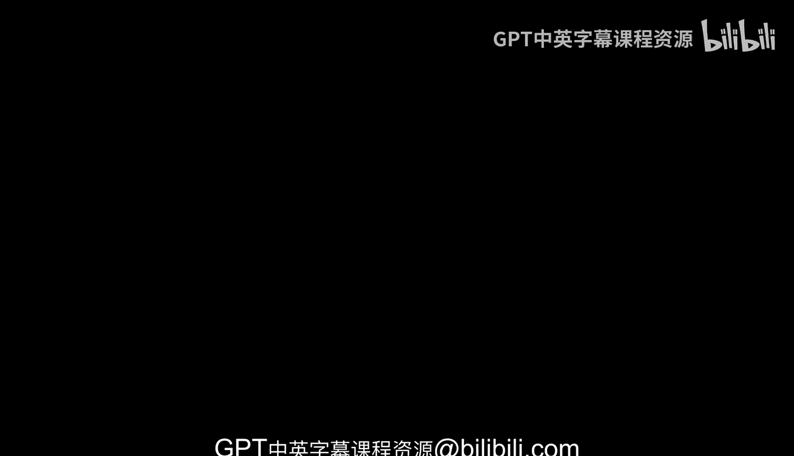

# 杜克大学《Rust编程4-5（Linux命令行工具、LLMOps）｜Rust programming》中英字幕 p127 39_03_01_Rust BERT简介.zh_en -BV1Hy411q7Zm_p127-

Rus bindings for hugging face models with Ru Bt is a great way to leverage Huging face with rust and the key idea here is that there's a repository of pretrained NlP models like Bt G2 bart and these were originally in pytorch and the rust crate would provide the bindings to hugging face models and then you can use them in your rust code So if we take a look at this really what is happening is the rust programs can now access these pretrained models on the hugging face hub and the rust native bindings as well can be loaded and executed efficiently in rust without the use of Python So Ru Bt is going to convert the original pytorch models from Huging face into a format that's usable from rust code and it also takes care of tokenization and other text preprocessing imp pure rust which makes it extremely fast。

 The rust code can then call。back into rust Bt to do inference or even fine tune the powerful NLP models and the results are converted back into native rust types。

 and this allows rust to leverage hugging faces models without avoiding the overhead of Python So the key points here are that you know really rust binding to hugging face models。

 you can load the models like Bt GBT2， etc ce。 you can avoid Python use rust native execution and you can handle the tokenization and preprocessing in rust。

 which is extremely fast is one of the fastest languages on planet Earth and you're also able to。

Easily access advanced NLP in Ru so in a nutshell， Ru Bt enables seamless usage of hugging face NLP models directly in Ru code。

