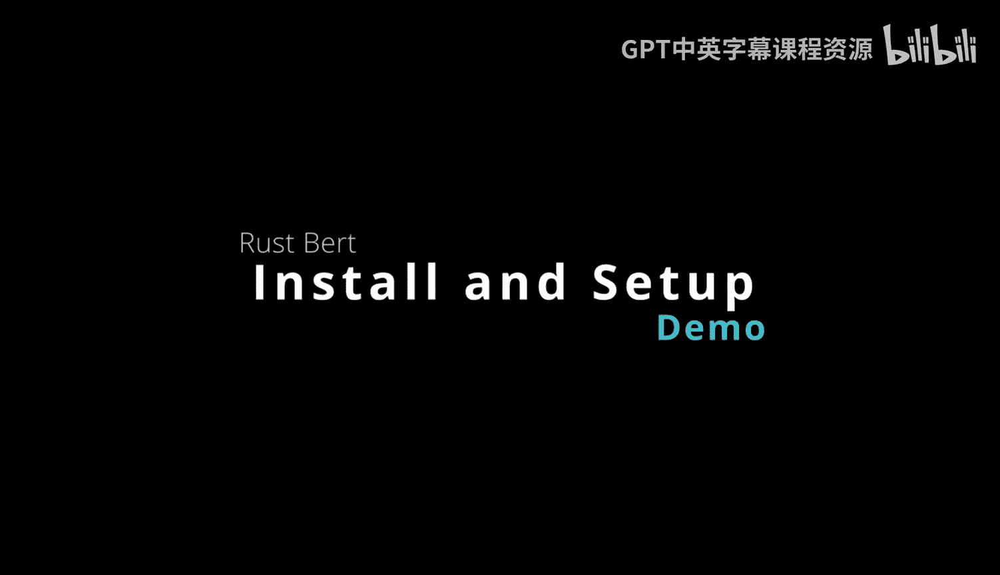
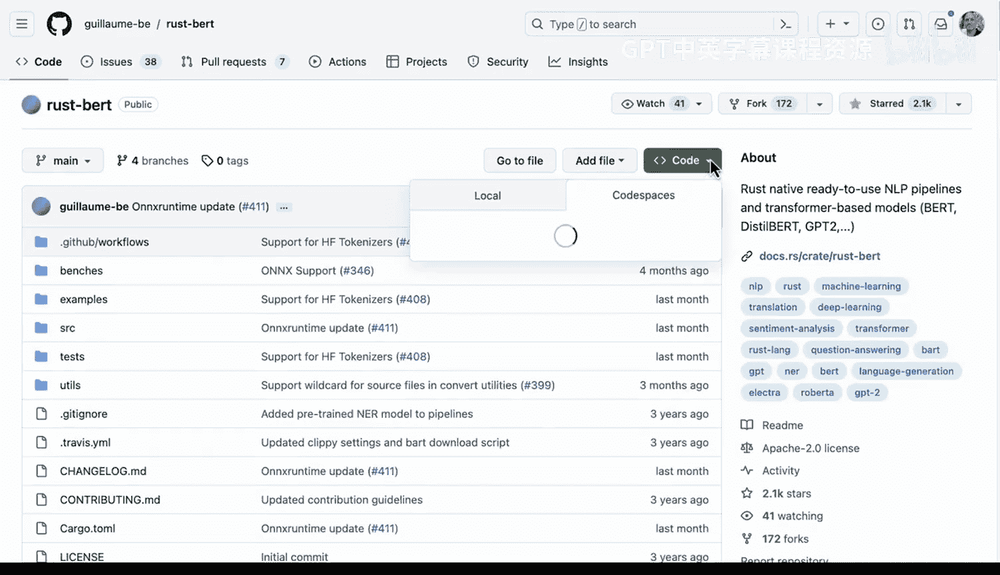

# 杜克大学《Rust编程4-5（Linux命令行工具、LLMOps）｜Rust programming》中英字幕 p128 40_03_02_安装与配置.zh_en -BV1Hy411q7Zm_p128-

Here we have Ru Bt。 you can see it's a rust native study the art natural language processing model and pipeline Cate。

 and it's a port of the huggingface transformer library using the rust pipey towards bindingines or the onx runtime bindingines and also the preprocessing rust tokenizers。

 some of the things it can do that are very powerful is multithreaded rustbased tokenization。

 so you're going to get some amazing performance and also GPU inference。

 and if you look at the way it works， it's as simple as you could possibly imagine here you would actually put a few different statements together and really be able to use any model。

 Now if we take a look at some of the things that it can do， it can do translation， summarization。

 multi turn dialogue， zeroshot classification， etca， etc。

 and you can actually look through all of these different things and see what it supports。

 So it's a very powerful way to get started with high performance。Hugging face in rust。

 And so a few other things to be aware of are some of the installation issues。

 So when you're using it， the library is going to have a cash folder for downloading pretrain model。

 So this is something to be aware of if you're on a machine that has limited space。

 This is something you have to pay attention to， maybe delete some of it。

 and some of the models can be hundreds of megabytes to even know gigabytes。

 Now you can customize this。 let's say that you were working with multiple people in your organization and you had a really high performance file server that was a network mount。

 you could actually set this environmental variable to that network mount。

 and then not every developer would be downloading the same 10 gig model you know to do the work。

 This would probably be a very good strategy for a larger company。

 Now you also can do a manual installation of Lib torch。Liiptorrch is very big。

 so it's a multiple gigabyte library here and one of the things to be aware of is that it's going to automatically put that inside of every single installation or project unless you install it and then do a symbolic link to it now this is or set an environmental variable and this is very important to be aware of now if you're just doing a standalone project。

 you can just you know not do anything but this is very important to be aware that you don't want to necessarily download this every single time you create a new rust project。

Also， you can see you can do the same variables on Windows and OS 10。As I mentioned earlier here。

 you can see that the buildcr will automatically download it for you。

 but because this is several gigabytes of coUuda enabled libraries here。

 you really don't want to be downloading this every time you say cargo new。

 So that's probably the biggest thing to be aware of in terms of the installation and you also can go through here and actually verify the installation Now we can actually go through this as well。

 I think would be a good thing to demo and also finally the last thing is that it also has support for Onyx which is amazing because this allows us to have this portable runtime and look here we can actually set these environmental variables here so we can have a very good installation story here for doing LLM ops。

 So this is a great library to be aware of and it's pretty exciting so。😊。

Let's go ahead and do our particular setup here by going into a environment I've already got set up in Gitthub called Ru Ptorrch GPU template inside of here we have a dev container you can see inside that I've actually got things all set up for couda for example and this is the running environment Now let's go ahead and go and do basically exactly what it's telling us to do in these installation instruction so let's go ahead and verify that this works So I'm going to go ahead and throw this command in here and we can actually say yes。

 we want to do a Git clone and let's go ahead and do that it says oh permission deny So all we need to do to change that is we want to do a Git clone of the HP version So let's go to code let's go to local and let's copy this。

 So we'll go back to this environment here。

And we can say。Up Brow and change this to H TDB。All right， Go that。And once we've got the clone。

 we can CDd into it。

And we can do the next command， which should be right here。

To verify the installation would be to do cargo run example sentence embeddings。 All right。

 if we go through and we run this great， the embeddings work So this is really an important aspect of the installation process is to make sure that you do a sanity check at the very end by running the cargo command for the Ruper repo that does this example so that you can verify that you've actually exported lib torch correctly。

 you have the correct version of it， it's always important to go back here and notice in this version here。

 they're saying that you should use version2 in the future， it could be version 3， etc ce。

 it's important to look at the documentation and then finally。

Go ahead and verify your installation like we just did， and we can see that in fact。

 the embeddings do work。

