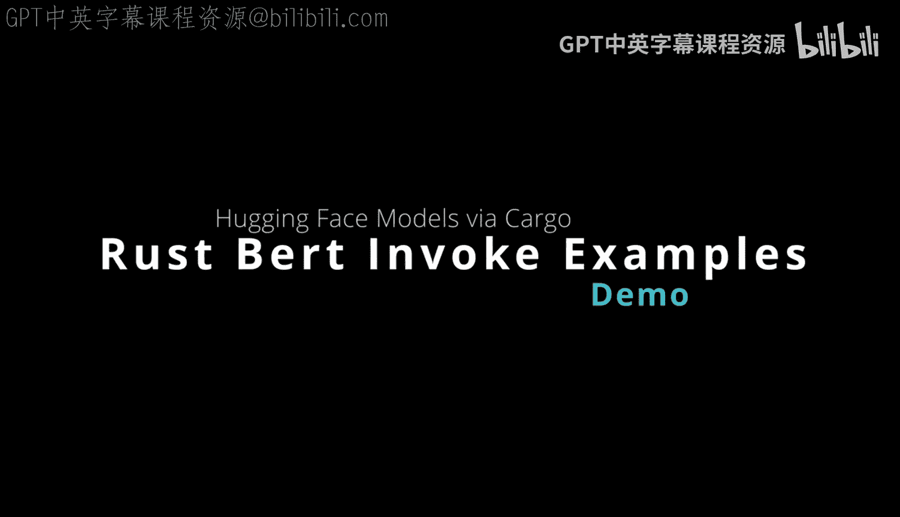
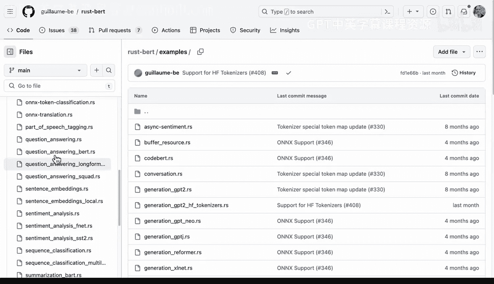

# 杜克大学《Rust编程4-5（Linux命令行工具、LLMOps）｜Rust programming》中英字幕 p129 41_03_03_基础语法与模型加载.zh_en -BV1Hy411q7Zm_p129-

Alright， so I have Ru bird here where I've already got it installed in a Github codespace environment。

 And what do I I want to do next。 Well， I want to look at the different examples that can be executed just from a Git pull。

 And this is one of the big advantages of the rust ecosystem is that once I do a gi clone as long as I have a proper installation with couta。

 and I have an environment。 let's say like Github codespaces， I can run each of these examples very。

 very easily， right， And let's go ahead and try it out。 So first up。

 if I look at this repo and I do a Git remote dash V， right。

 we can see that I've got it cloned And if I toggle this down and I go to examples， look at this。

 we have all these different really cool examples to try out and it's trivial， right。

 So all I need to do。😊。

Is run an example， for example， cargo run dash example and then put the name of the rust file。

 So if we look at sentiment analysis here， let's actually dive into the specifics of what's going on So first up there's a crate called anyhow and then there is the rustbert input here so we have these two libraries that are required and then there's a main function right so very straightforward in terms of a one line example here。

 So first up the classifier is created， so this is sentiment classifier then an input is created and this input is just a vector of strings so we have string1 string2 string3 and then you just pass that input into the model you then go ahead and say what's the sentiment So very easy to replicate these examples by diving into this particular example repo and then actually trying it out。

I would say this is a huge win over traditional Python based data science because of how straightforward it is to trialut examples。

