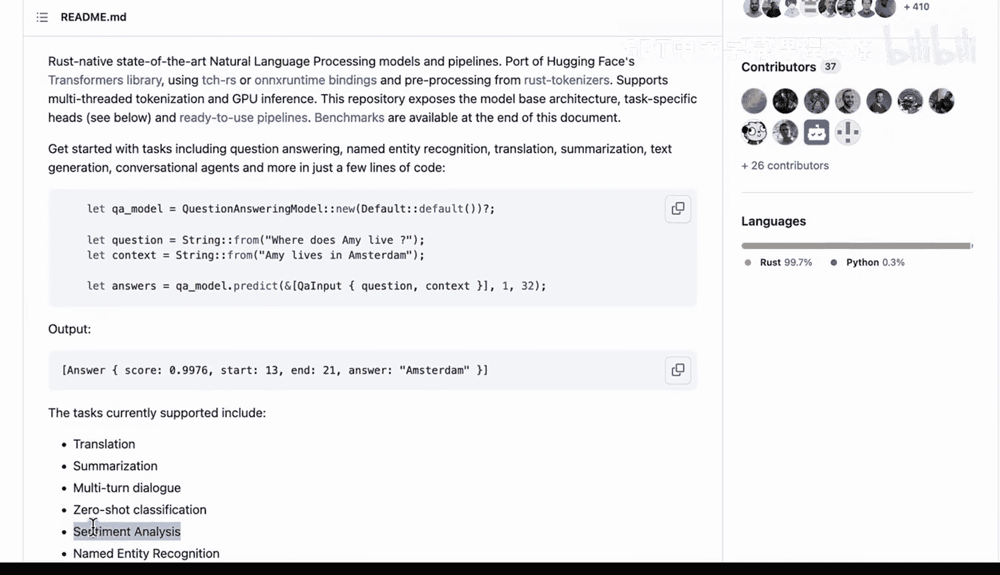
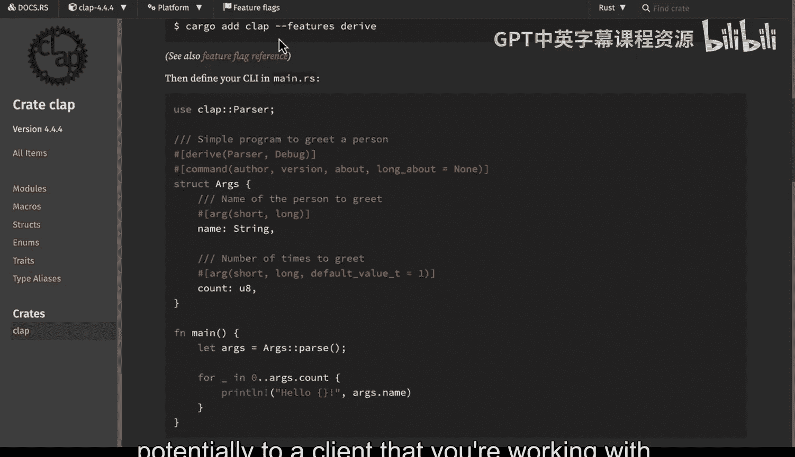
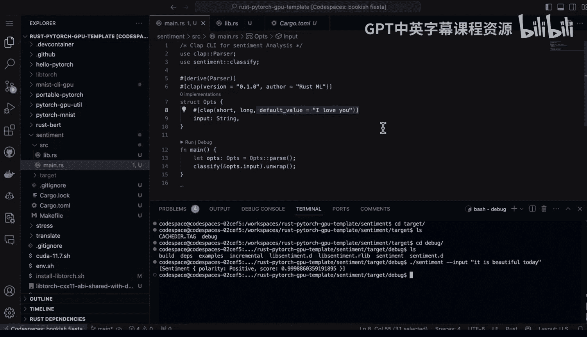

# 杜克大学《Rust编程4-5（Linux命令行工具、LLMOps）｜Rust programming》中英字幕 p130 42_03_04_构建情感分析命令行工具.zh_en -BV1Hy411q7Zm_p130-

Here we have Rubi。 It's a rust native St art NLP model and pipeline tool。 It's a port of huggingface。

 You can see that you can do sentiment analysis quite easily。

 Now if I want to do this inside of a Ci。 that's one of the best ways to take advantage of these hugging face models and I can use clap here。

 So we say use clap parser， build out some arguments and then just execute it inside of a main function。

 So really simple to build a binary that you can actually distribute to the rest of your team or potentially to a client that you're working with。

 So if we go over to this example here， what I did is I put together based on the example from the rust bird examples how to classify sentiment。

 So I tweaked a little bit and let's walk through what I tweak。

 So first up in here I say I want to pass in an input because I know later that I'm going to have clap parse this from the command line and then what I do here is I say let's say。

Actually convert that input into a vector that contains the string so that I can easily pass it back into what is expected。

 right this sentiment classifier dot predict is going to want to accept a vector。

 and so I have a vector that contains a string。Finally。

 I just go through here and I say print the output。 It's a very small function。

 Now to use it inside of the main dot Rs here。 First， we need to look at the cargo do2ml file。

 If we look at the cargo do2ml file， you can see that I have the sentiment。

 which is the name of the package that I created， and then I also have the dependencies。

 There's three dependencies。 There's Ru Bt， and's also clap here which is what's going to allow me to do the Kameion tools。

 and then there's anyhow which is actually useful for returning results。

 And if I go here and I look at the main look at what I've done。 I've said use sentiment classify。

 So I import this function right here。Then I build an input。

 This input is going to be handled from clap here。 You can see it's really straightforward。

 you put in your options right here， I put in the name of the tool that I'm building。

 and then finally at the very bottom， it's just two lines。 I just say lit ops， this pars the options。

 and then I do the classification。Fortunately， it's even just as simple to run it。

 So let's go ahead and run this thing。 So if I Cd into sentiment。

What I can do is just type in cargo run。And I can say dash， dash。 And in fact， if I just do that。

 because I've set the default value to be， I love you。

It's going to give me back a sentiment result that's going to be positive。There we go。 Now。

 if I want to run it with options， though， I can just do this。 I can say that's just help。

 and I can take a look at what's actually happening。 here we go。

 It's going to require me to do input。 So let's go ahead and do that。 We'll say input。The football。

Seaan。😔，Is terrible。There we go。And now if I go through and I pass that in。

 aha we see that there's a negative polarity， we know that that's strongly indicating that that's not what I want in terms of the sentiment。

 Now， if I go into the target directory， the last thing I'll bring up here is that I can always go into this debug and I can build an optimized binary as well and I can just run it right so I can just type in sentiment and now I can just type in input。

嗯。It is beautiful。Today。And I can also run the binary that way。

This is one of the powerful things about Ru is that you can build things that are able to be distributed quite easily to other people。

 and it's quite simple to wrap it up using thirdpart libraries because of how powerful they are。

