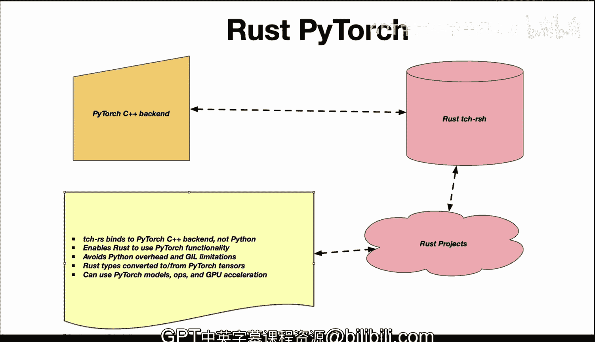

# 杜克大学《Rust编程4-5（Linux命令行工具、LLMOps）｜Rust programming》中英字幕 p131 43_03_01_Rust PyTorch简介.zh_en -BV1Hy411q7Zm_p131-

Rus Pytorch is an interesting library because it is a interface for Pytorch in rust a little bit about Pytorch is a popular deep learning framework written in Python and optimize with C++ and coUa and it provides tensor operations neural network layers model training and other capabilities but the crate with rust here provides the binding directly to the C++ backend of Pytorch and essentially it allows you to use Pytororch with native rust code so the idea here is that by using this crate in your rust program you can access the power of Pytorch for deep learning and tensor operations and by binding to Pytorch optimized C++ backend and avoiding the Python overhead you get huge efficiency gains rust itself can then call into the TC RRS crate and then it can handle converting rust。

Types2。Pyors tensors also invoking ops and the results are converted back to rust types。

 and this allows rust to leverage both the pytors models and also utilize GPU acceleration while avoiding the severe limitations of the Python gill and a few of the points here are that the bindings here are written in rust right they're not Python also rust is able to use native Pythts functionality we don't have to use the Python overhead or the gill or even the problems with the packaging system like Conda and rust types are converted to and from Pytorors tensors and then finally you can use GPU acceleration。

