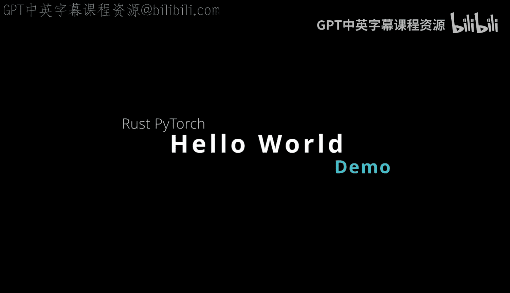
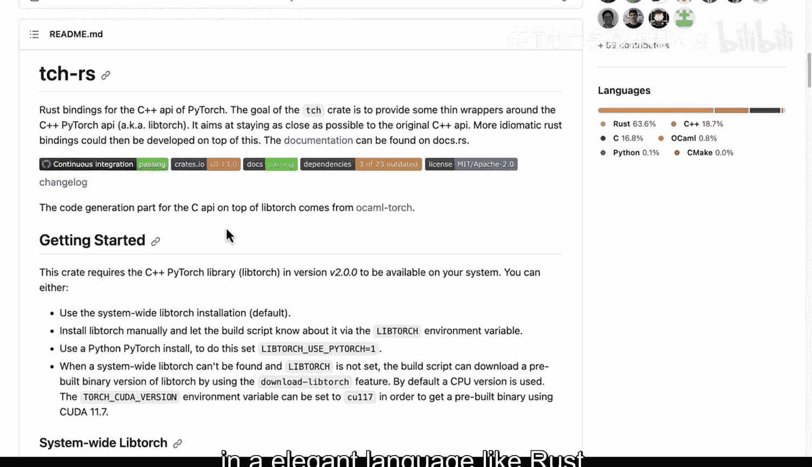
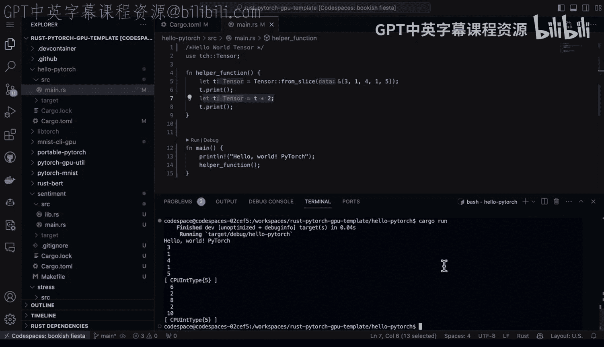

# 杜克大学《Rust编程4-5（Linux命令行工具、LLMOps）｜Rust programming》中英字幕 p132 44_03_02_运行PyTorch Hello World.zh_en -BV1Hy411q7Zm_p132-

Rus bindings for the C plus plus API of pi Tch are very exciting because it allows you to just get right into the lowlevel parts of piytorrch in a elegant language like rust so let's go ahead and take a look at what this looks like first up here's a hello worldl example here but before we run it let's dive into what's necessary So first you would need to say cargo new to create a new skeleton structure but look at this we have the dependencies here and I need to actually have what version of Py Trch is the latest one of the nice things about cargo is it's easy to check exactly what the latest versions are we can see here oh good I've got the latest one next up here if I go to the main do or rest。

 I have got hello worldl tensor and then I'm able to just go ahead and use that and then make a main function。

 So really only a couple lines of code to get started here。

Let's go ahead and walk through it so we say let T so it's going to be a type of tensor and we say let's go ahead and pull together a slice here and then let's go ahead and multiply everything inside of that slice by two and then once we get the result here let's go ahead and print that out so in order to do that all we have to do is type in cargo run。

Youll see we're able to actually get that cooking。 Now， if I wanted to you know。

 add more things to it， et cetera， a good way to play around with that would be to， you know。

 maybe build out another function。 we can say like， you know， helper。Heler function here。

 and we could actually put some of that logic， for example， inside。

 and then we could basically just call our helper function。You know， hello world。Pytorch。

And run it one more time。Cargoren。recomples it and we've got this cooking and if I wanted to go through here and modify it further right。

 I could add another you know operation， let's say multiplely by two print it again if we go through here and we run it cargo run so pretty straightforward to get started with Pytorrch using the rust bindings。

