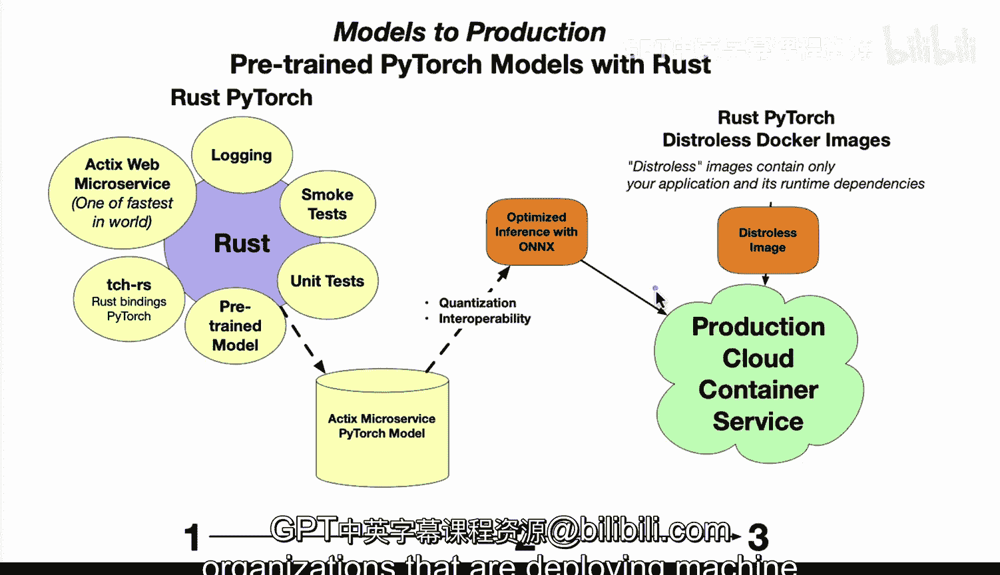

# 杜克大学《Rust编程4-5（Linux命令行工具、LLMOps）｜Rust programming》中英字幕 p133 45_03_03_PyTorch预训练模型.zh_en -BV1Hy411q7Zm_p133-

Yeah。

Here we have some new ideas around bringing models to production。

 using things like pretrain models in Pytorch with the rust language。

 Let's go ahead and walk through some of the ideas here。 So first up。

 we have rust and the idea here with rust is that it's a systems programming language focused on speed。

 memory safety and parallelism。 What this means is that there's a lot of advantages where you can reduce the common source of bugs。

 We also have acts here， right， If we look at actics what's nice about actics is that it's one of the fastest web frameworks in the world and it's suitable for building scalable and high performance web services。

We also have the p towards bindings here。For rust。 And these are ready for building， training。

 running machine learning models and rust。 And they wrap the C plus plus byytorrch ecosystem。

 We also have onyx here， which is a very interesting component because it allows you to consider things like。

Quantization and also interopability the idea here is that if you're able to quantize a model。

 you're able to get better performance with only limited reduction in accuracy Also with onx you have the ability to do interopability What this means is that you can use different know py towards or Tensorflow or you know maybe MXnet these different machine learning libraries and make them work in a similar way。

 So it's a way of making a uniformed interface。The other thing to consider as well as you're kind of going through the first step。

 which is the systems programming component to the second step， which is this onyx component。

 is in this final phase is you're ready to take the onyx model that was again developed it with rust potentially using actics to serve it out。

 and then go to a optimized image for a container。 In this case we have distres。

 and disstris is pretty interesting because it allows you to package only the application and the runtime dependencies。

 right that's the real idea here for distreis。 This makes the deployment minimal。

 secure and extremely efficient by reducing the attack surface of the container image and also making it very efficient for inference Finally。

 in this whole ecosystem here， why would we care about this versus other solutions like Python。 Well。

 part of it is that we are building。Things with rust you know which has concurrency and safety features。

 it has managed state in multithreaded context that's able to be done safely and it's really an optimal environment for doing high performance web services and then in terms of deployment and scaling because it's in a distis image here。

 you can push it out to lots of different production cloud service containers so it could be using something like GCP。

 for example， using one of their container services or AWS or using Azure or maybe your own data center。

 the idea here is that once you've got this ecosystem here of Actics， Pytorch rust。

 onyx distis it's actually a modern stack here that many organizations that are deploying machine learning models should consider。

