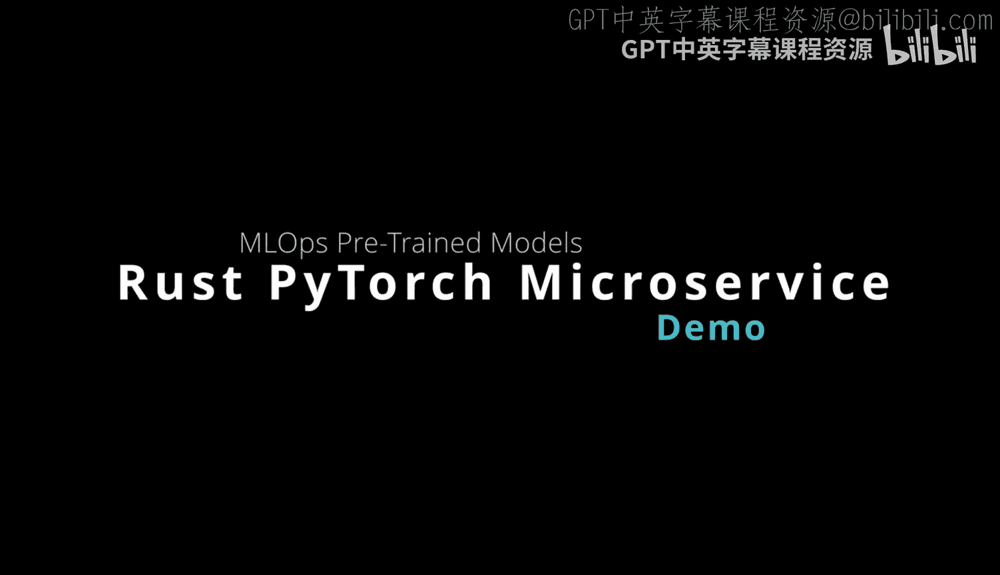
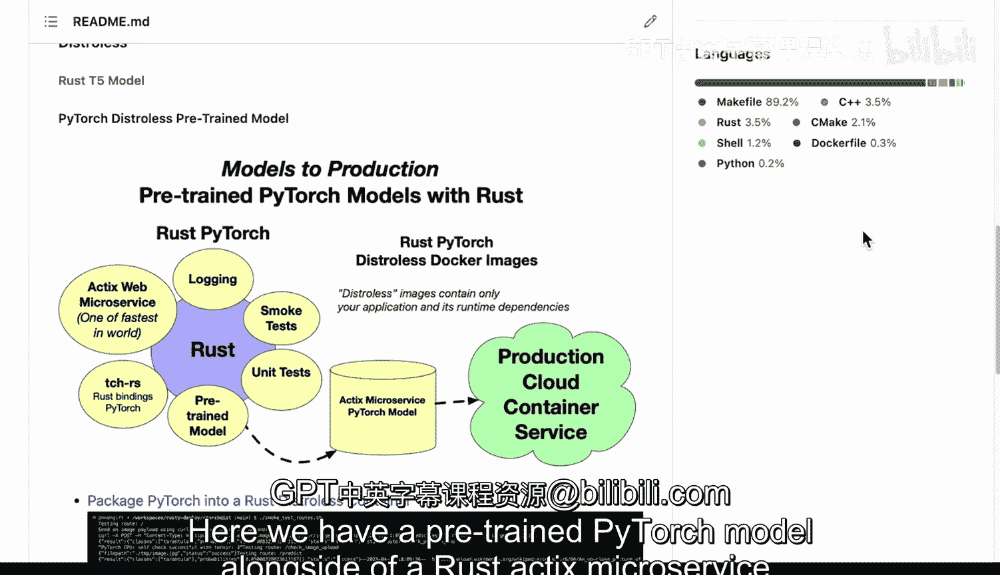

# 杜克大学《Rust编程4-5（Linux命令行工具、LLMOps）｜Rust programming》中英字幕 p134 46_03_05_运行PyTorch预训练模型.zh_en -BV1Hy411q7Zm_p134-

Here we have a pretrained ptorrch model alongside of a rusts actics microservice。

 Let's go ahead and dive into the code here。 I've got this running inside of Gitthub code spaces and I have this R torch disk directory。

 So first thing we'll do is C D into here and we'll get this cooking。 Now。

 if we look at this directory here， I like to use make files。

 And you can see here that if I did basically a make debu that would build the Docker a container。

 if I said make build， this would actually build the release here。 And in this case。

Let's go ahead and say make build。 you can see here that it shows me that I can run this particular command。

 so let's go ahead and do that。Cargo Bill dashje16 perfect。 We've already built this previously。

 And so we just checked the binary。 Now， if I want to run this， I can also just type in cargo run。

 And this is a way to actually run the project as well。 So the bill just compiles it。

 The run will run it and what's nice about this local binarybased running is that it will allow me to test out some things like for example。

 a smoke test。 And as this thing is is cooking here。

 we can take a look at what the smoke test looks like and this smoke test goes through and it lets us curl each one of the routes right here。

 there's a second route， here's a third route， here's a fourth route。

 And what's nice about this smoke test。Is it uploads images so that I can do a image prediction using the different endpoints。

 So let's go ahead and open up a new terminal right here and let's go ahead and run this go into our our torch disk and we'll run the smoke test。

There we go。 You can see here it goes through each of these endpoints and runs it。

 So that's really one of the really powerful things to do when you're building a microservice is make something that makes it easy to test the different predictions and also add some nice logging。

 Let's go in and take a look at how I set up all of that logging。

 If we go into the source code here and we go to the main here。 noticeice what I do。

Is actually I'm using this logger right here。 And this is actually going to pass this into this microservice。

 And then if we go into the actual logic here， you can see that I have all these info messages that allow me to look at different aspects of what I'm doing so that I can debug things and look at them in production。

 So it's really important when you're running through and building a microservice that you actually add logging so that you know what's actually happening。

 Another thing I'll point out here in terms of the routes that's important is that this is the only route that I would use in production。

 but I did set up different routes。 like in this case， this is checking that pytor works。

 This is checking that image uploading works and then this is checking that I can actually do a prediction of a image that's local and disk。

 So I'm breaking this particular problem here into three different sub routes so that I can verify that the microservice is actually working so this is a nice。

Health check type system so I could maybe not expose these routes or all four of these routes to people in production。

 I would only expose the bottom route， but these would all be self check type monitoring in points that would verify that each of the different components are working properly。

 the installation， the image uploading and also the image prediction itself。

 So this is a neat little strategy that you can use。 And if I wanted to go through here。

And check out how the container works as well。 Let's go ahead and try this next。

 All I would need to do is stop this。 And again， if we look at the Docker file here。

 it's pretty straightforward。 We have the Docker code， I download by torch。

 I set some in variablesables here。 And in this particular section here， this disreless。

 This is where I copy all of the artifacts， including Lib Torch the pre train model。

 And then I just run the binary itself。And in terms of the make file。

 we can see here that the Docker build process is just Docker build。 And then to run it。

 we just go ahead and run that。 So I'm going to go ahead and run that command。 I'll say make。D run。

And this will run the Docker image。 I like to use make files because this is a very unwieldy command and it'd be easy to make a typo。

 but we can see here that in fact， everything that I did before。

 it works identical right the smoke test works。 I can see that my application is easily deployed。

 Now the other thing that we can take a look at here is the size of this image。

 that's one of the huge advantages of this approach And if we take a look at Docker image Ls we can see that this is a three gig image。

 So for this particular pytorch installation。 pytorrch is in the gigabytes itself。

 So it's really the majority of the code that's in here is just pytorch and the model is pretty tiny under 100 megabytes and the rust code itself is probably。

 let's say20 megabytes。 So the majority of this is just pytorch and delivering it somewhere。

 but this is a lot smaller than a regular image that could be sick。Or 8 or 10 gigabytes。

 So this is a great way to reduce the size of the image by using this distless type package。

 The other thing that I'll point out here as well， in this structure。Is in this particular test here。

 We have model tests， and this just goes through and runs some model test here。

And then I also have some vision tests。 This goes through and runs the installation of the bindingines test。

 and I also have some web tests。 So， for example， a functional test that verifies that the index would work properly。

 So these are all the steps here that are important to be aware of。

 And if we want to also look at the model itself。 I actually have this model here。

 I have a bunch of different models that are available that I could put into this build process in this particular example I'm using a resnet model but again。

 you could use any kind of a pretrain model。 So these are the overviews of how things work。

 you saw yourself that you can use the binary to deploy。

 you can also use the Docker dis list to deploy。 And once you've got this setup。

 it's pretty easy to deploy this to any cloudbased service that can work with a container。

