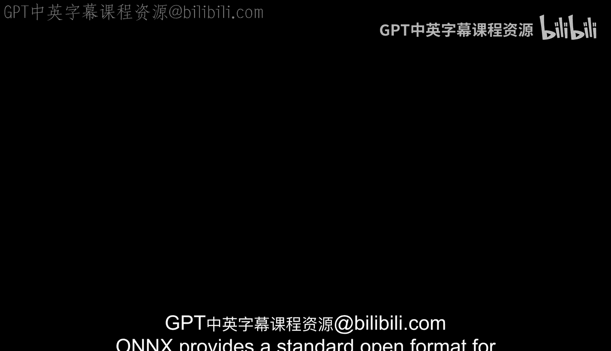
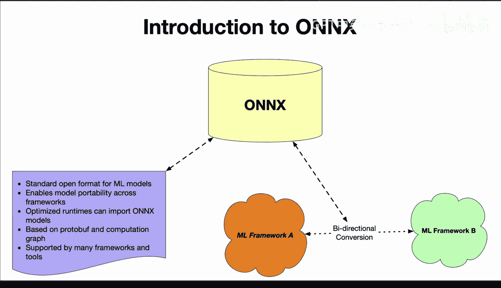

# 杜克大学《Rust编程4-5（Linux命令行工具、LLMOps）｜Rust programming》中英字幕 p135 47_03_01_ONNX简介.zh_en -BV1Hy411q7Zm_p135-

OnX provides a standard open format for representing machine learning models using Protographuff。

 serialization and graph format。Frameworks like by torch and Tensorflowlow can export their models to the Onx format。

 and this allows an interchange between frameworks， model portability and optimization。

 The Onx model can then be loaded by a runtime optimized for efficient execution。

 This runtime doesn't need support of every framework just onx and Onx can serve as an intermediary representation to enable model portability and also optimized deployment。

 This works really well with Ru because you can use Onyx as a format to really build out a deployment for MLops and multiple frameworks can export to it and multiple runtimes can import it。

 So really in a nutshell it's a standard open format for MLl models and enables model portability across frameworks It has an optimized runtime that can import onx models It's also based on protobuff and computation graphs and it support。

By many frameworks and tools So in summary， Onyx facilitates model interchange and efficient deployment by providing a common representation。

 So this fits very nicely with the rust language when you're doing LLM ops。

