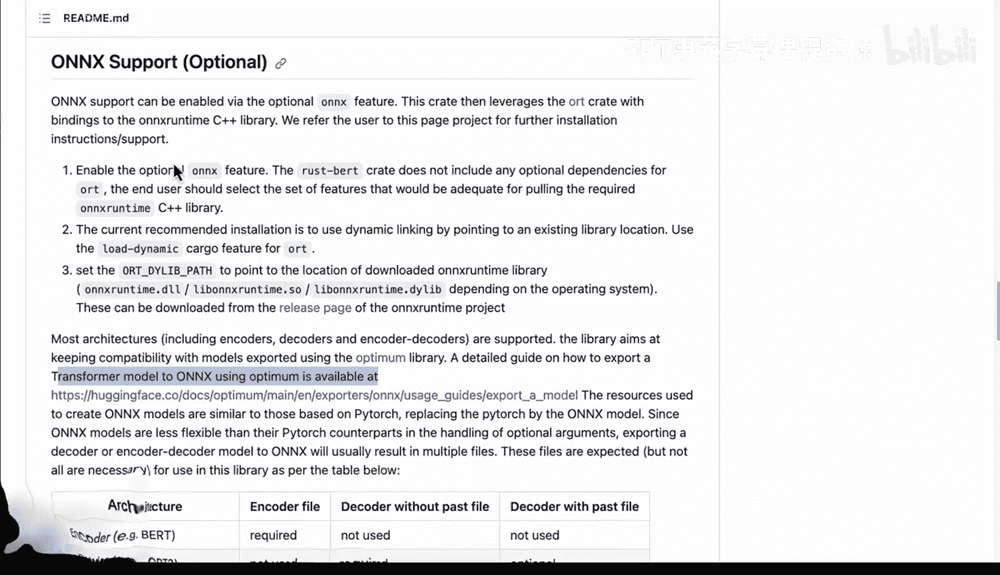

# 杜克大学《Rust编程4-5（Linux命令行工具、LLMOps）｜Rust programming》中英字幕 p136 48_03_02_ONNX格式转换.zh_en -BV1Hy411q7Zm_p136-

One of the cool things about Rubert is it has onyx support。

 Let's go ahead and take a look at what that actually means。 So with onx support。

 what you can do is you can actually use this runtime that allows you to convert from one format to another format and in addition to that you can set the ort path here so that you can use that runtime。

 let's say it's a shared object file， for example， and these can actually be downloaded as part of your build process So let's say you have a build process that compiles the binary that's necessary and also it could be pulling down this do so file so that you could really have a portable runtime for your models。

 Now notice here as well that you can use the optimum library here。

 So with transformer models you can actually convert them and we actually have some information about how to do this。

 So let's go ahead and go to this export a model to Onyx from Huging face here and we can see here。

It shows you that you can do an install that allows you to export the model and then at that point you're able to use Onyx So why would we want to use Onx Well if we look at this。

 the guide here is that it's an open standard。 So again you could have had this and towards or Tensorflowlow etc but when you convert this you're able to actually have an intermediate representation here and this makes you able to switch between frameworks So this even if you're not going to use。

 let's say the other framework in the future， your deployment process could be a lot better because you have a unified system to handle any kind of a model so that's really the idea here is that by using the Onx runtime you could have optimizations。

 you could even include， let's say a quantization step to really shrink the size of the model anything you can do to package things up。

 make it more efficient this is one of the reasons why people are using onx。

