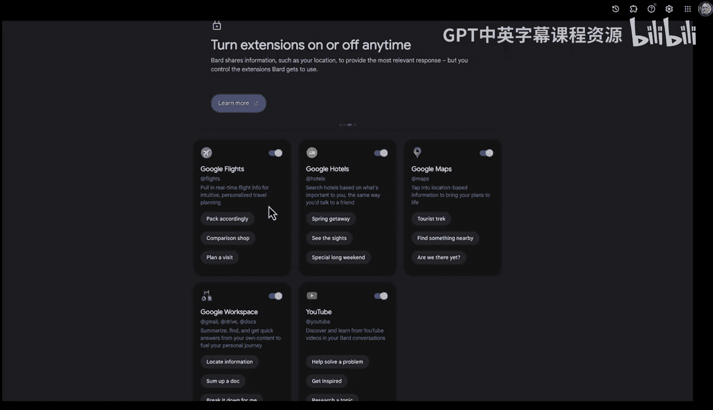

# 杜克大学《Rust编程4-5（Linux命令行工具、LLMOps）｜Rust programming》中英字幕 p137 49_04_01_扩展Google Bard.zh_en -BV1Hy411q7Zm_p137-

Yeah。Here we have Google Bard， which has some very interesting features。

 including the ability to use extensions。 One of the things that's interesting about extensions is that it allows you to have personalized context where you can ask an AI assistant for unique things like。

 for example， flights， hotels， maps， maybe your workspace documents or even YouTube。

 So one of the things I'm going to do is I'm going to have it help me out with a courseursera specialization I'm working on。

 So if we go over here， you see I've got a specialization where I'm doing large language model operations with Rus。

 we have a whole outline here。 Now， if I go and I copy this particular bit of text here。

 What I could do is I could actually ask my Google workspace bard integration extension to actually do some stuff。

 So let's go ahead and you know click on this link here and I can say， for example， give me。

An overview of the key points。Of this document。And what it's going to do iss going to go into my Google Drive。

 It's going to find my document， access the documents， look inside for key facts。

 and then it's going to give me a summary。 So it says this document shows that it's going to cover the benefits of using rust for LLM ops。

 It's also going to use rust to build large language models we're also going to use the deployment of large language models as well and we'll have case studies of real worldld projects using rust and in fact we can see here that there's actually lots of information about different things that I'm actually working on So it's pretty cool that I'm able to dive into these particular aspects of documents and see the different bits of information。

😊，And what's really fascinating about this is that I can actually even go further。

 so what I could do is I could say you know， thanks。

 can you give me a few examples of Ru code that I recorded？As dot and P4 files。

And let's see if it's how smart it actually is， so can we actually go inside， look at some MP4 files。

 extract the data out in a text format and give me some samples。

And here we go we see there's some examples here and in this case it says here here's a few examples of rust code that you recorded as MP4。

 so it's actually getting a little bit confused in that it's actually thinking that I want to do MP4 stuff。

 what I'll say instead is give me code sample in rustT that covers a topic on my course。

Here we go and we're going to see if it's able to use that context to give me some new creative ideas。

 So this is another emerging part of using generative AI is not just that it's magic but you can actually set the context and get some new ideas so we see here there's a code snippet where I do in fact cover binary search trees in this particular specialization and it's giving me some new ideas about how to actually cover that in the course。

 So I think this is a great emerging field here is not only just using blindly generative AI。

 but using generative AI in the context of particular extensions and finally using your specific context for the documents you have so that you're able to really get right to the heart of the matter in a more specialized manner and also you're not kind of just blindly you asking for gene idea。

 So I think this is a new emerging area。Of generative AI is the ability to have these kinds of conversations with your data in a context of a particular application or problem you're solving。

