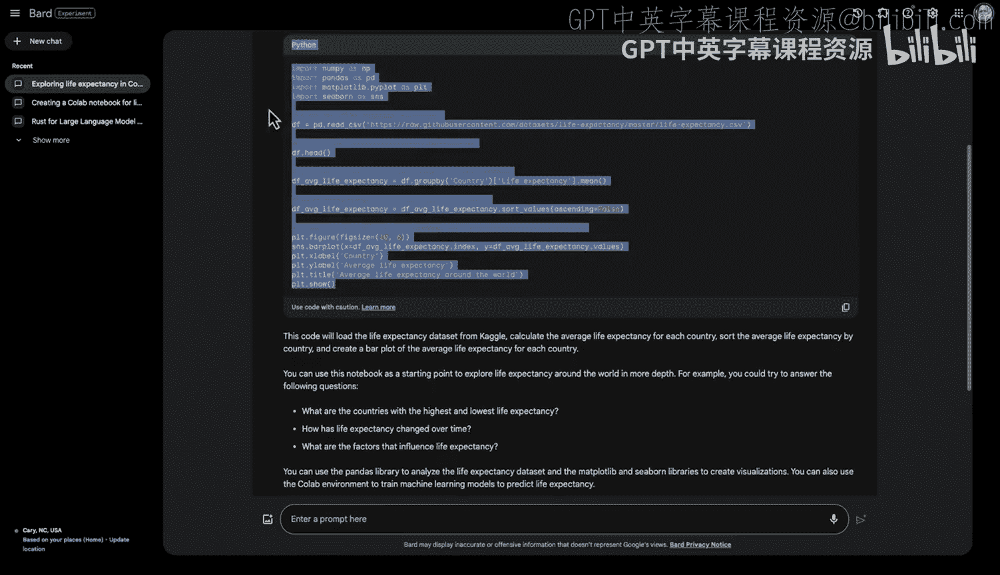
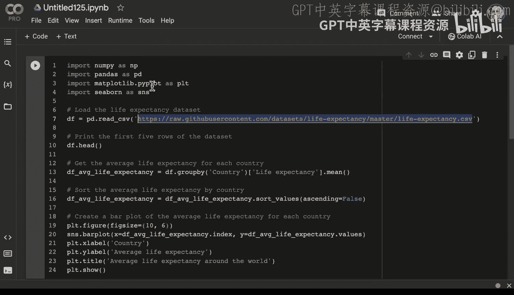
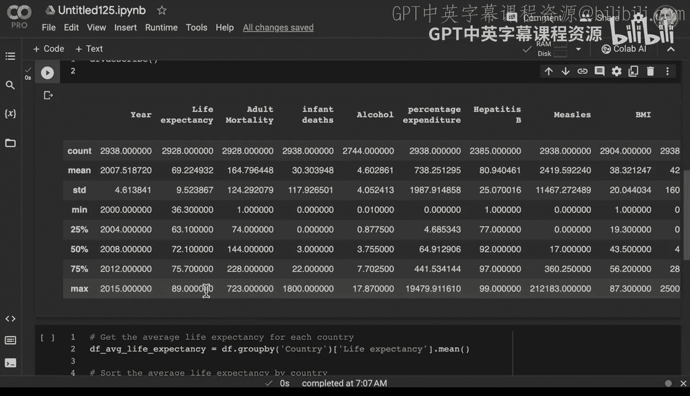
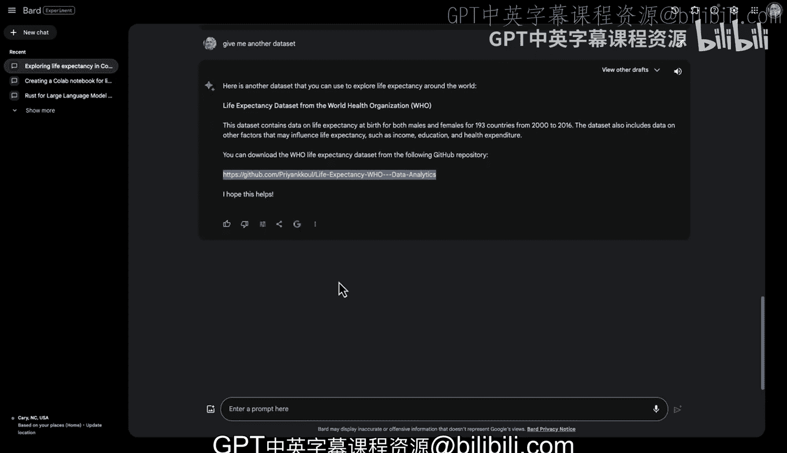

# 杜克大学《Rust编程4-5（Linux命令行工具、LLMOps）｜Rust programming》中英字幕 p138 50_04_02_通过Bard探索Google Colab.zh_en -BV1Hy411q7Zm_p138-

Yeah。One of the useful features of Google Bard is beyond just doing summarization or using traditional generative AI techniques。

 There's an integration with Google Collab。 So what we can do here is actually use it to help us start doing data science。

 So in order to do that， I'm going type in， help me create。😊，A coab notebook for exploring。

Life expectancy。Great， so what we see here now is that it's going to tell me the exact instructions。

 so go to Google Collabab， click the new notebook and enter a name for the notebook and after you've done we can actually paste this information inside so you can see here this is a example of how you would actually create this Now the question here that is interesting as does this actually exist。

 right this would be one of the things that we could actually explore here。

 So let's go ahead and try this out and put it into a notebook。😊。

All right， we'll go here， let's go to Coab， let's go file new notebook。

And I will go ahead and paste this out。So it says import life expectancy Now。

 one of the things I would probably do first is make sure that this even exists。

 And so we could actually go back here， paste this in， notice that with GiHub。

A lot of times you will need to double check whether that actually exists。 So in this case。

 it's not working so。

The logic looks right， but we don't have the right data set， we could say， hey。

 find me another data set。

That data set。Give。😔，Me， a 404。All right， so here's some other data sets and I could even go further and I could say。

Show me the exact or give me several URLs， right， So give， give me several。

GitHub URLs that contain life expectancy data。So this might be one of the ways to get around some of the hallucination problems is。

 oh， we need to actually keep going further I can go give me。Another data set。

So this one says there's a data set at this location， let's go ahead and try it out。

We do have some data here。 so he was able to index this a while back here and we can see that this particular data set looks like it's a good one so we can go ahead and go raw。

And let's go ahead and push this in here。 So if we just swap this out now。

We could start to kind of build off of what was done earlier now。

 there's no guarantee that the columns are the same or， you know， anything like that。

 but it's a good start to see if we can get things going。 So yeah， thats probably the first problem。

 So how would we get around this。 Well， we don't have to actually blindly follow generative AI。

What I can do here is just make a no a new cell and this cell we won't run and I'll rerun this cell so that I could actually bifurcate the parts that are working。

 So in this case， maybe I don't even need that other cell。

 we just want to start with this and keep developing。 So if I did another cell below this。

 for example， I could actually say Df dot describe。

And we could actually run through and describe this particular data there we go。

 So one of the things I'll recommend here is when you're dealing with generative AI solutions is don't give up。

 assume that there's going to be some problems so essentially design for failure and be able to you know essentially cut out the parts that are issues and keep working forward and if you do that approach just like the real world。

 generative AI is a useful assistant even when it does hallucinations。

