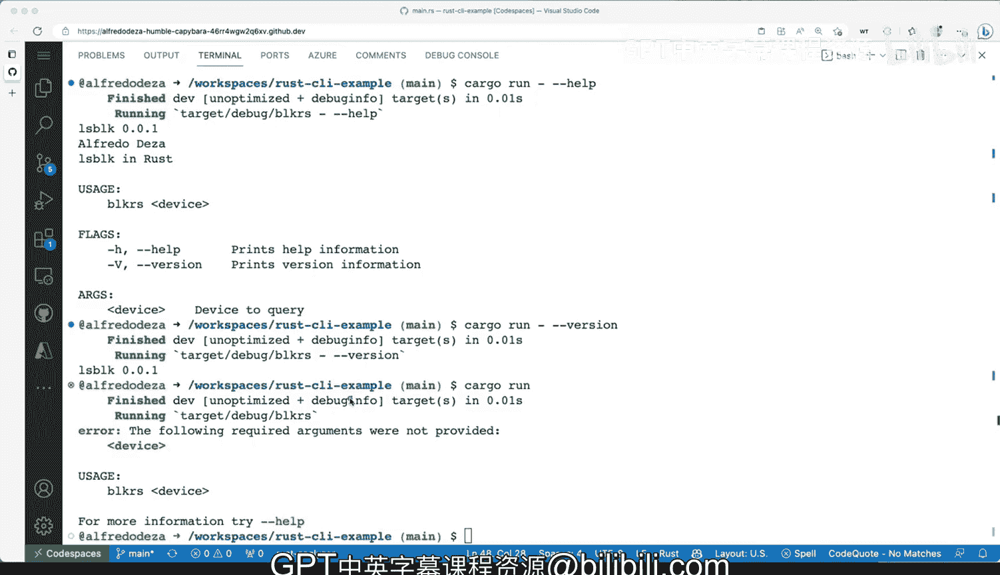

# 杜克大学《Rust编程4-5（Linux命令行工具、LLMOps）｜Rust programming》中英字幕 p14 14_01_06_处理用户输入参数与选项.zh_en -BV1Hy411q7Zm_p14-

Our simple example for grameine tool works fine， but now let's。Take it a level up。

 I step further here。 and let's make it a little bit more robust。

 Let's add some command line tool arguments， flags and help menu generation by using a command line tool framework in rust。

 One of the things that didn't show you before is how to get started。 I mean。

 everything was already there And everything kind of like word。 So what's， what's the deal。 Well。

 I wanted first show wanted to show you like things that were working。

And now we're gonna start from scratch。 if I do LS。 I removed everything from here。

 I only have the license read me in some examples directory。 the way you do this。

 and I mentioned before how cargo would automatically generate the gi ignore and several other things。

 So the way we're going do this is with cargo in it and we're going to pass our name and the name for our tool is block Rs and I'm going to say dot to signal cargo hey。

 I want to work in this directories。 So I'm going to do this。

And it says created binary application package and a couple of things showed up， source appeared。

Cargo Til， which weve seen before and Ge ignore， I think， got updated。

 So let's take a quick look at cargo Tail。Great block R。 that's fine。

 There's no dependencies installed。 So the first thing we want to do is we are going to add the frameworks when I say cl。

And the version that we want to do is 2，3，3。Pot3。 And that's， that's fine。

 And the R one that we're going to do is you remember， we are going to do third。

 which is third Jason。And this version seems fine okay。

 so these are our dependencies clap is the new thing that we're adding which will pull in the bits and pieces for our framework to actually work。

If we go back， let's go back to SRC and take a look at main。 how does main look like， well。

 main looks pretty basic， so all of this is automatically generated。

 it will give you a main function by default fault now。This looks okay。

 but it's not what we had before。 I moved everything out of the way。

 so I'm gonna do some copy paste here and get this back into working order with our main function but I wanted to show you what cargo in it this thing right here would do for you we create a directory it will create SRC and main that right。

 so I'm going to copy everything and get this in working order。 Okay so main R is good to go。

 I've pasteed everything that as we had it before let me open up the terminal again and what I want to do is I want to build and make sure that everything will get built back again now you can see Sir Jason is getting pulled in and clap is also getting pulled in and now everything is getting build which which is great this will take a second actually not bad 13 seconds perfect now all of my dependencies already and we're ready to do some development so now。

Instead of dealing with these arguments collecting just the last the last one from the terminal what I'm going to do is I'm going to use clap so the way we do this is I'm going to start butcher in this main function right away so I'm going to give me some room here and'm going to say let matches and I'm going to start clap and clap this looks almost right。

 so I'm going to keep going double colon and L block is exactly what I want and I'm going to say this is going to be version how about0 that0 that one。

And I am going to say， well， the author is going to be myself Alfrerodesa right there。

 and I'm going to give a little bit of a help。 not not help I'm going to do about what is what is this right like El blocking Ross sounds perfect。

 So compile theres helping me out a little bit。 now I'm going to create some well。

 actually what I can do is well I can start adding some arguments。

 but I want to see what what we will get we can say get matches。And let's see， save that。

 So just with that， we can try it out and we can open up the terminal and going to do cargo run。

 I'm going to say dash。And then dash dash help。 and I'm gonna get a couple of complaints there。 Yes。

m I know that I I call this a variable and I'm not going to use it。 So it's warning about that。

 And then I'm using the dash to limit the output and that's fine。 but I am getting。

I am getting a little bit of of our block R tool。 Alright， so that's fine。

 let's close these and let's start adding。 So what was the one thing that we wanted to add。

 We wanted to add an argument， So let's do let's do that arc andm to say。

We're going to do clap and we're going to say Arg。 and we're going to do how about with underscore name。

 and we're going to say device， which is exactly。Exactly what we want and let's try let's try to accept that index index 1 means that that's the first position that we want and we are going to make it required the help sounds correct and I'm going to save these。

So I'm gonna try it out again， toggle the terminal run help and it's building and now we're getting several different things。

 we get help， we get version and we get our device device and then we have LS blog version here that's01 my name what is this about So very very nice now we're getting we're getting some things now before we're getting into some tropic we didn't have any arguments now we' pass in cargo run dash now this dash allows me to separate and cargo hey this dash dash help is the thing that you need to pass in to my actual tool that you're building right there so that's very good but if we pass in anything here like say for example SDB it still works but it's not exactly what we want and the reason why get this rid of these the reason why is because we are still doing this。

Silly thing here。 So let's let's start removing that and start making sure that we can actually work with all that。

 So we still need the output。 We now have the device。And we need to get rid of these two things。

 I'm going to remove them and add these device。 So let's。Let's accept that suggestion from Copit。

 and you can see the matches is now being used。 Mat is now coming from here。

 And I'm saying get the value of the and then make it a unwrap。

 like basically get get the result from from that operation and be able to pass it right here。

 So now let's try and see if this will work。 I'm going to clear these I'm gonna run and and it all works。

 So SDB works。 Sb1 works as well So that's perfect。 And then if we say dash dash help that works。

 dash dash version works perfectly as well。 L block well， this is not LS block。 It is。Block a。

 which is I need to I need to change I need to change that。 That's not entirely correct。 So great。

 What have we done here。 Let's walk through， let's walk back some of the things that we've done so we've created we've added clap。

 which is our framework for parsing command line arguments and flags and whatnot and we've set up our version then the author a little bit about the help menu there and we've added an argument。

 a positional argument， which is called the。 we're actually telling everyone that is required if we go and say if we don't pass anything we'll probably get we'll get an error as you can see here。

 the following required arguments were not provided so perfect we have a binary we can make use of these and make it more robust we're getting the error handling by default。

😊，We can take it a step further by making it better with your handling and we'll take a look at that next。

 but now we were able to do cargo in it， start from scratch。

 get some code working and use Claap the command line tool framework for rust。

