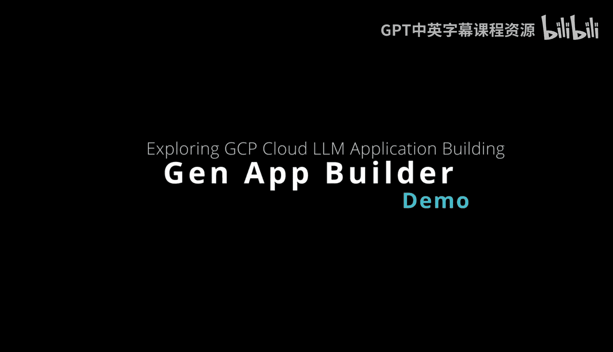

# 杜克大学《Rust编程4-5（Linux命令行工具、LLMOps）｜Rust programming》中英字幕 p140 52_04_04_探索Gen App Builder.zh_en -BV1Hy411q7Zm_p140-

。An emerging new technology inside of the generative AI space is the ability to use generative AI to build apps more quickly。

 If we take a look at Google Cloud Gen app builder。

 you can see here we have type configuration and data。

 These are the three components of building an app using generative AI。 and we have search。

 chat and recommendation。 So first up here， if we take a look at search。

 you can see that you're able to have a enterprise edition。 So you could do extractive answers。

 for example， you could also do an advanced LLM feature。 So you could have search summarization。

 search with followups。 So this is a great feature here in terms of using really off the shelf LLM technology in building your application。

 Another one we could build as well is the chat。 So let's go ahead and take a look at how that would work。

😊，So if we go through here and we go into our chat interface。

 what I'll be able to do is build out a new application。

That uses chat and we can have dialog flow API。 so in this case we'll call this chat bot。Great。

 for a company name， we'll call this pretend Co。And for datastore。

 we'll go ahead and say the source of our data so we can choose either a website URL so we can automatically crawl website content from a listed domain。

 so let's go ahead and pick a domain that I have called PL。com perfect。

 and let's go ahead and say continuein and for this we'll call this PIML。Great。Awesome。

 so at this point， what's going happen is that we're able to then select this as a data source。

 which is again a customized data source， and then there's going to be a LLM based chat application that's built really just with low code。

 no code type technology so the advantages of using these kinds of tools is that it really puts the power of advanced large language model technology in a hands of developers that maybe don't have the time to fully develop an application or in the case of someone without traditional software development skills。

 as long as they know the context that they're searching for。

 they can build out applications very quickly。

