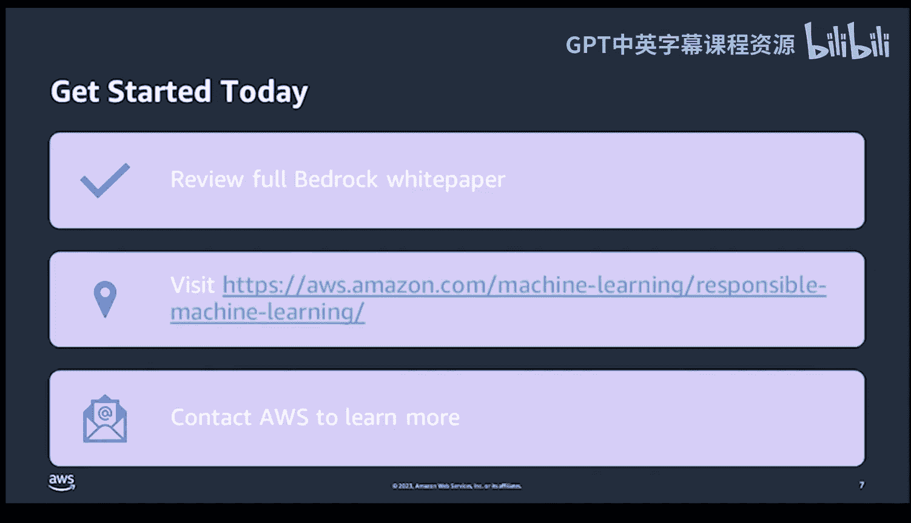

# 杜克大学《Rust编程4-5（Linux命令行工具、LLMOps）｜Rust programming》中英字幕 p141 53_04_01_基于AWS Bedrock的责任AI.zh_en -BV1Hy411q7Zm_p141-

。🎼。

Hello everyone and welcome I'm NOAA Gi today we're going to dive into a deep dive into AWS Brock。

 a foundational tool set for responsible AI from build to deploy。

So first up here when we think about what AWS bedrock is。

 you might ask you know why am I building it， what are the core problems。

 well in essence it's a system designed to help me and professionals like me create ethical and responsible AI systems on AWS so what we're talking about here is that the entire machine learning lifecycle from inception to deployment and ongoing operations。

But why is responsible AI so important today， Well。

 let's consider the ramifications of a biased AI in criminal justice or healthcare。

 or in the case of copyright laws， the stakes are incredibly high。Benrock isn't just a tool。

 It's a philosophy encapsulated in7 key pillars。 Let's go through these pillars1 by one。 First。

 we have education。 Education is one way of considering that knowledge is power。

 I'm sure to make sure to train my teams on how to avoid biases in AI。 Diverity。

 a variety of perspectives can help us see what we might miss otherwise。

Use case evaluation Every tool has a right and a wrong way to be used。The key is evaluation。

Also quality data， the garbage in versus garbage out， mindset is a critical mindset。

 high quality representative data is essential。Bias testing。

In the case of continuously testing for bias， it makes sure that we ensure fairness。Human review。

 in the case of reviewing things， there is no substitute for human judgment。

 monitoring and retraining。This is a not a set and forget operation。

 it means that regular checks are essential。Now， let's look at some incredible services to support these core pillars。

 First up， we have Amazon sagemaker clarify。 This is a way of looking at the bias and explainability and having a watch dog set in motion。

 those practices。 We also have Amazon augmented AI。

 This is a way to facilitate human in the loop review。😊，We also have Amazon SageMaker model Monit。

 which is a way of looking at quality assurance manager for models。

 we have Amazon SageMaker Data Wangler， which is a go to operation for data preparation and analysis。

 and we also have together a robust framework for ethical AI development。

But how is bedrock applied in the real world， this is a key question， Well， in financial services。

 it's behind unbiased loan and risk models in HR， it's eliminating the resume May screening bias in content moderation。

 it's ensuring that there's policy violations that are caught reliably and it's hard to overstate the importance of trust in today's AI landscape。

There are three big reasons why Amazon is my platform of choice for bedrock。

 The first one is the comprehensive ML services。 for example， Sagemakerr。

 this caters to a full life cycle of M projects。 We also have a robust tool set。

 So AWS has the most comprehensive set of responsible AI tools period。Three expertise。

AWS has a treasure trove of AIML technology， and they're willing to share these through expert consultations。

So how do you get started today Well， to start a responsible AI journey。

 the first step is to digest the comprehensive bedrock White Paper from AWS then you should visit the website to look at the responsible AI section to explore the related services further Finally。

 what I would do is I'd reach out to AWS experts who can provide a tailored guide to adopting bedrock in a project with AWS bedrock ethical AI isn't just a possibility It's a guarantee。

So thank you very much for listening to this talk， there's some other resources that you can get a hold of me on。

 including LinkedIn， YouTube， GitHub profilefile， pragmatic AI Labs。

 also Coursera and my Amazon author profile if you're at Reinvent as well。

 I look forward to seeing you。Yeah。