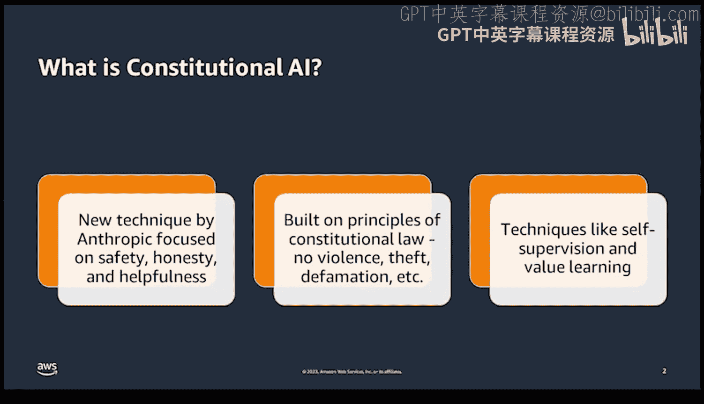
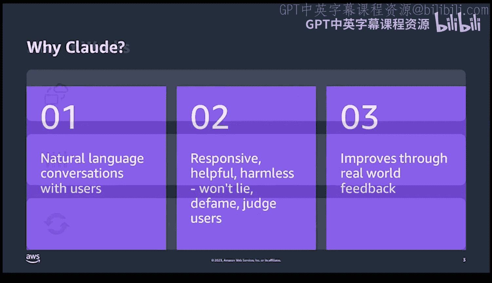
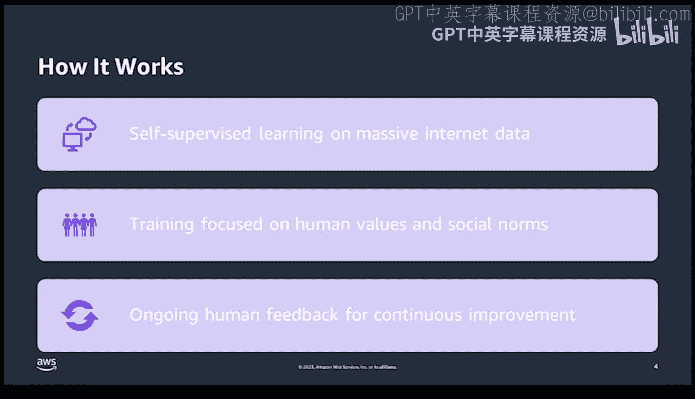

# 杜克大学《Rust编程4-5（Linux命令行工具、LLMOps）｜Rust programming》中英字幕 p142 54_04_02_AWS Bedrock与Claude模型.zh_en -BV1Hy411q7Zm_p142-

。🎼。

Hi， everybody。 and welcome。 My name is Noah Gi。 I'm the founder of pragmatic AI Labss。

 and I'm also an executive in residence at Duke。 So I'm excited to talk to you about this new subject。

 which is AWs bedrock with Claude by Anthropic。 It's a very exciting topic。 So to start with here。😊。

One of the things to consider with these new ecosystem is what is constitutional AI This is a key question First。

 what it means is that there's an innovative approach that focuses on safety。

 honesty and helpfulness This is very different in that these are the core traits。

 not just maybe model accuracy， but what am I doing to actually ensure that the safety of the system is important。

 so drawing inspiration from constitutional law， this AI is programmed to avoid violent behavior。

 avoid theft， avoid defamation etc so why is it so important well this technique includes self superupvision and also valuebased learning from the backbone of the model and incorporated into this particular technology。

So if we look at know the details of Claude here， let's first get into why was it named Claude Well Claude is designed to converse in a natural language。

 what it means is that this provides a responsive， helpful and harmless interaction。 It will not lie。

 It will not defame it will not judge the users so this is a huge step forward in AI ethics plus Claude continually improves based on real- worldld feedback。

 so imagine having an AI assistant that's not only understanding what you're trying to say。

 but it's also going to learn to assist you better over time。

So how does this system actually work？First， one of the things to think about is the secret sauce is self supervised learning on a massive data set from the internet and also curated in an ethical way。

 But here's the twist。 The training is oriented towards human values and social norms。

 and it's a cycle that never stops things to ongoing human feedback。 So in essence。

 this AI is going to evolve with the evolution of society itself。

And this is a key differentiation from other technology platforms in that is really designed to be helpful to society from the very beginning。

Let's talk about some of Claude's capabilities。 First up here。

 one of the things that Claude can do is it can summarize and do task tracking and also fact checking。

 So， for example， with Claude， you could give it， let's say a quiz or a report you did for business and you could ask it to do some fact checking to verify that all the details you have in there are accurate。

 You also can use Claude to summarize。 So for example。

 if you had a huge document that document could be multiple pages of the Pdf。

 you could upload that and say to Claude， I'd like you to give me the first three critical points so that I can summarize this in a meeting。

 this is a really big time saver because it means you can consume more content more quickly。

 doesn't mean that you won't in the later section of your research review that content。

 but it allows you to really hone in on the key points early。 Also。

 you can get personalized conversations。Recommendations so if you set the context window correctly。

 you can actually have you know， really these key based conversations all teed up for you。

It also it has a wide variety of skills， so it can answer questions across topics from technical topics to medical topics to even things that are currently happening in the news。

So if we get into responsible AI with Anthropic， let's see how this actually aligns with AWS。 Well。

 one of the ways that its to AWS's bedrock's pillar for responsible AI is that it acts as a safeguard against a risk like unsafe behaviors and also algorithmic bias so we're not just using a smart technology you're using an ethical smart technology and I think this is a key thing that we find as we get the competition in the large language model space is that the ethical foundation is going to be one of the differentiators between other platforms so if you're able to really show the ethical considerations show that you're lacking bias show that you have safety you're going to build trust to the consumer and you're not going to release things that could have wide scale harm to humanity and this could be a competitive advantage really by using。

As effectively the building blocks for the reputation of your firm。

 you're going to have an advantage over firms that maybe are less likely to consider that as a core trait。

 and that's one of the reasons for ethical AI is that it's a competitive advantage。

 not a disadvantage。So if we go into the way to unleash this responsible AI with ClaD。

 let's look at some of the key details here first up。

 the anthropic system supports bedrock pillars of responsible AI so that's one of the key reasons why it's important to use it as a competitive advantage second。

 you can customize ClaD models for your needs using AWS technologies like for example。

 sageMaker in particular and this customization allows you to specialize for your particular use case。

We also have the ability to use the constitutional AI and harmless training so what we know is that there's been a lot of thought put into the data sets and the models and how they're actually trained so that they have a really positive impact on society and in terms of the particular use cases we have domains like conversations。

 content creation reasoning and creativity so we know that it's really a wellsuited model for lots of different domains that are directly applicable to business。

We also have the ability to avoid a risk like bias or unsafe behavior， which could。

 in the short term， maybe not seem important， but a long term could cause wide scale reputational harm if you're not considering these aspects。

 Sore you're really identifiednified from this before this happens in the future。

 which is a huge advantage strategically with a model like Claude。

Also ClD has several different versions， so there's cloudd2。

 which is the most powerful and latest version， but there's also versions 1。3 and also Clt Ins。

 which gives you different characteristics like， for example。

 optimizing speed and performance versus accuracy。

So that's really details of why I think it's so important to study the ClaD and bedrock integration。

 these are some links here to find out more information about me LinkedIn YouTube GitHub profile。

 pragmatic AI Las， my Coursera profile and Amazon author profile I look forward to seeing you in the future at a reinvent conference talk to you later。

