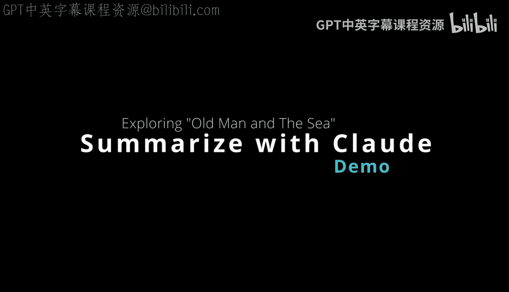

# 杜克大学《Rust编程4-5（Linux命令行工具、LLMOps）｜Rust programming》中英字幕 p143 55_04_03_使用Claude进行文本摘要.zh_en -BV1Hy411q7Zm_p143-

Here we have ClaD by Anthropic and it's a general purpose AI assistant and one of the things we can do with this is go to the old man in the Cbook by Ernest Hemmyway and ask it some questions about the text of this famous book。

 so let's go ahead and scroll down here and I'm going to copy everything inside so this's a good way to use Claud here is you can actually upload a document and it'll notice it actually is able to automatically put it into a paste。

 Txt file and what I can do is ask it for a small paragraph summary of this text so we can say summarize。

This book， in a small。Concise。Paragraph。And what's nice about this kind of technology is that it's able to use uploaded documents。

 which is a significant enhancement over just being able to chat because you can give it really a good context for what it is that you're trying to do and also you're able to really work with different formats。

 different styles of data then just beyond a chat only interface。

 so we can see here that it says here's a concise one paragraph summary of the old man in the sea。

 the old man of the sea tells a story of an aging Cuban fisherman who has gone 85 days without catching a fish。

 he eventually hooks a giant Marlin， which he battles for three days before killing it。

 on the way back to the shore， the shark attacks and devours the Marlin。

 leaving only its skeleton though the old man returns with no prize catch to show for a struggle。

 his fortitude through the ordeal demonstrates his heroic spirit despite physical defeat He emerges。

triumphmant。 So that's actually， I can't imagine actually a better summary of old man in the C。

 if I tried very hard。 I don't know if I could write one this good。

 So you can see how accurate certain kinds of capabilities are with these AI assistance。

 and we could even ask for， you know， three key short points So we can say as well， give。😊。

Give me three key lessons。And only use one word。For the lessons。So really。

 this is one of the ways to interact with an AI assistant is to really leverage the things it does best。

 which is summarization and also the ability to read large volumes of text and it's a great way to actually brainstorm them and really act as a coworkerer so to speak when you're dealing with generative AI and we can see here that it comes up with perseverance。

 fortitude and resilience and then what I could do is。

Maybe even expand that and ask it to use my own ideas now based on the information that I've got to go a little bit further and we can say。

 you know write a small，嗯。St。Synopsis。Based on。Sports。That is at most。You know。

 three lines and discusses。These traits。In a an American。H jumper。

Who goes to the Olympics right So it's really the combination of using the capabilities that are best at an AI assistant with the experience I have in life and the ideas I have and really a synergy which is what's going to come back next is one of the best ways to use these AI assistant。

 So you know also obviously we can do these things from an API we can do this on a cloud platform and we can actually really develop an emerging technology based on using cloud based machine learning solutions like generative AI along with my existing infrastructure and my existing user interfaces and command line tools so。

Here we say is the three lines summary after failing to clear seven feet for years。

 a high jumper finally succeeds after tireless training and heads to Olympics there he misses his first attempt but refuses to quit eventually clearing the bar to win gold his perseverance and brailience shine through。

 So I think this is a pretty good feedback loop to discuss and it really is one of the best ways to really get your hands wrapped around what is generative AI。

 how can I use it， and it's not magic， but it's actually a useful tool that we can use to build new solutions。

