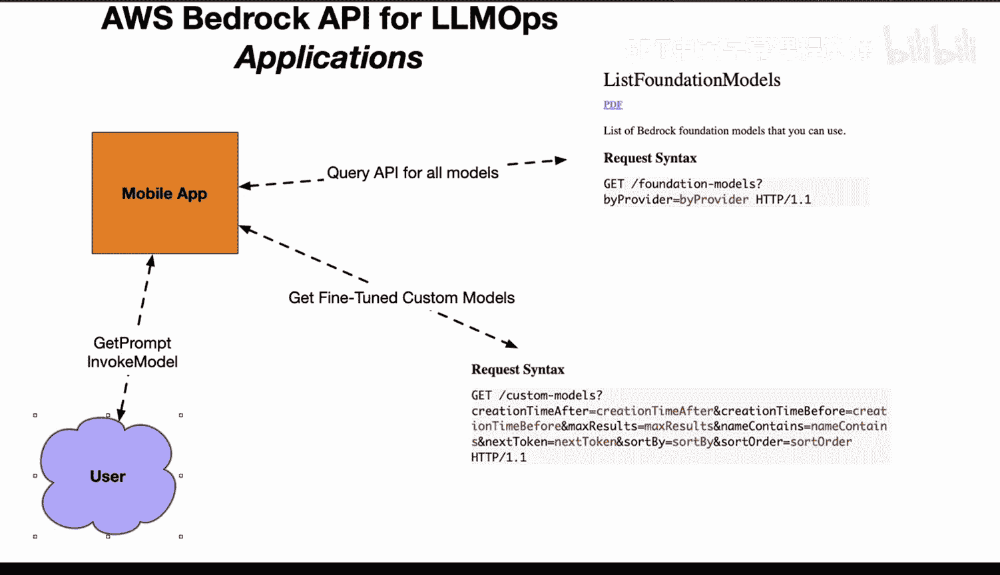

# 杜克大学《Rust编程4-5（Linux命令行工具、LLMOps）｜Rust programming》中英字幕 p144 56_04_04_使用AWS Bedrock API.zh_en -BV1Hy411q7Zm_p144-

What's better than going all in on one company's large language model Well doing something where you can use any range of large language models and that's what AWS bedrock API does for LLM ops you can build applications like in this case。

 a mobile application and it could query for example。

 all of the foundational models that are available from let's say five six different companies and your mobile app could even present that choice to a user Another thing you can do is you can also look at how to fine tuneune custom models as well so you could have your own customized models that are building off of the foundational models that are in the bedrock system and then you could give that really customized experience to a user and even it could be an enterprise only app where only your data is being used。

 only your models are actually being fine tuned and then finally the user can do things like get the prompt。

And invoke the models。 So what we're really seeing with the future of large language models is not just。

 you know blindly accepting some kind of regulated AI where there's one company that leads everything。

 we're going to see an emergence of competition an emergence of different capabilities and a cloud provider like AWS could be an amazing choice because of the fact that you can choose from not only a wide range of large language models。

But also you can have your own fine tune models available as well。

 so AWS Brock API is a very exciting new feature that is worth checking out。

